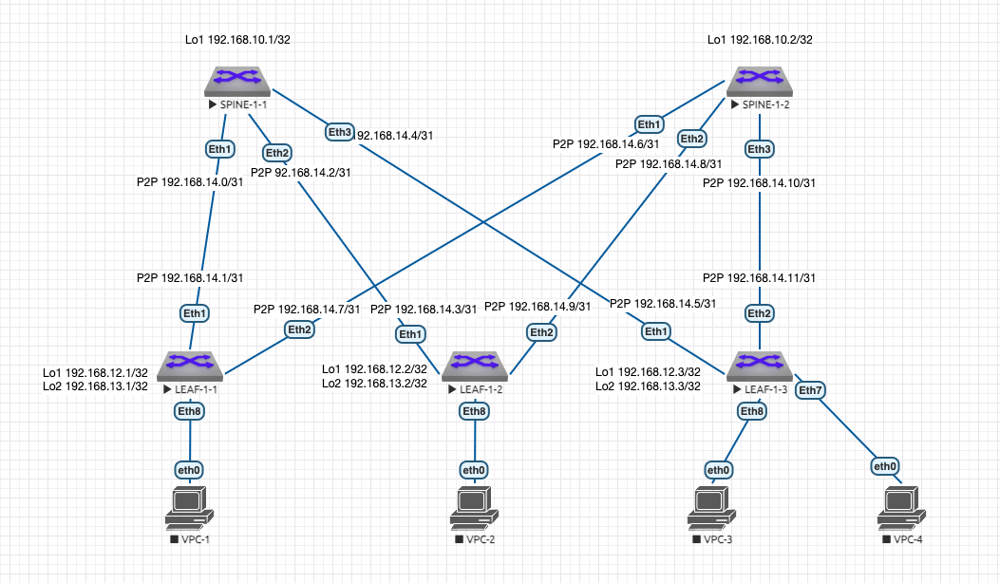

# Лабораторная работа 1 "Основы проектирования сети"
## Схема сети:



## Описание принципа выделения адресного пространства Underlay сети:
Порядковый номер Датацентра - DC N (Нумерация начинается с 1. "0" зарезервирован)
Loopback /32
P2P Subnets /31

loopbacks1 - Spine N-X 192.168.N0.X
loopbacks2 - Spine N-X 192.168.N1.X (зарезервирован для multicast или иных технических нужд)
loopbacks1 - Leaf N-X 192.168.N2.X
loopbacks2 - Leaf N-X 192.168.N3.X (для VTEP)
P2P 192.168.N[4-7].X/31 (Меньшее число всегда идет на Spine)
reserved 192.168.N[8-9] (зарезервированы для дальнейшего использования)


Overlay:
10.N.[0-1].0/24 - Reserved
10.N.2.0/24 - Prod Servers
10.N.4.0/24 - NonProd Servers
10.N.6.0/24 - Prod DMZ

## Таблица адресов:
| Подсеть ipv4 | Device/Port|    Описание   |
|--------------|:----------:| -----------------:|
| 192.168.10.1/32  | Spine-1-1/Lo1 |     Loopback1     |
| 192.168.10.2/32  | Spine-1-2/Lo1 |     Loopback1     |
| 192.168.12.1/32  |  Leaf-1-1/Lo1 |     Loopback1     |
| 192.168.13.1/32  |  Leaf-1-1/Lo2 |     Loopback2     |
| 192.168.12.2/32  |  Leaf-1-2/Lo1 |     Loopback1     |
| 192.168.13.2/32  |  Leaf-1-2/Lo2 |     Loopback2     |
| 192.168.12.3/32  |  Leaf-1-3/Lo1 |     Loopback1     |
| 192.168.13.3/32  |  Leaf-1-3/Lo2 |     Loopback2     |
| 192.168.14.0/31  |  Spine-1-1 Eth1 |     P2P Spine 1-1 to Leaf 1-1    |
| 192.168.14.1/31  |  Leaf-1-1 Eth1 |     P2P Spine 1-1 to Leaf 1-1    |
| 192.168.14.2/31  |  Spine-1-1 Eth2 |     P2P Spine 1-1 to Leaf 1-2    |
| 192.168.14.3/31  |  Leaf-1-2 Eth1 |     P2P Spine 1-1 to Leaf 1-2    |
| 192.168.14.4/31  |  Spine-1-1 Eth3 |     P2P Spine 1-1 to Leaf 1-3    |
| 192.168.14.5/31  |  Leaf-1-3 Eth1 |     P2P Spine 1-1 to Leaf 1-3    |
| 192.168.14.6/31  |  Spine-1-2 Eth1 |     P2P Spine 1-2 to Leaf 1-1    |
| 192.168.14.7/31  |  Leaf-1-1 Eth2 |     P2P Spine 1-2 to Leaf 1-1    |
| 192.168.14.8/31  |  Spine-1-2 Eth2 |     P2P Spine 1-2 to Leaf 1-2    |
| 192.168.14.9/31  |  Leaf-1-2 Eth2 |     P2P Spine 1-2 to Leaf 1-2    |
| 192.168.14.10/31  |  Spine-1-2 Eth3 |     P2P Spine 1-2 to Leaf 1-3    |
| 192.168.14.11/31  |  Leaf-1-3 Eth2 |     P2P Spine 1-2 to Leaf 1-3    |

## Настройки коммутаторов:
### SPINE-1-1:
```console
!
hostname SPINE-1-1
!
interface Ethernet1
   no switchport
   ip address 192.168.14.0/31
!
interface Ethernet2
   no switchport
   ip address 192.168.14.2/31
!
interface Ethernet3
   no switchport
   ip address 192.168.14.4/31
!
interface Loopback1
   ip address 192.168.10.1/32
!
```
### SPINE-1-2:
```console
!
hostname SPINE-1-2
!
interface Ethernet1
   no switchport
   ip address 192.168.14.6/31
!
interface Ethernet2
   no switchport
   ip address 192.168.14.8/31
!
interface Ethernet3
   no switchport
   ip address 192.168.14.10/31
!
interface Loopback1
   ip address 192.168.10.2/32
!
```
### LEAF-1-1:
```console
!
hostname LEAF-1-1
!
interface Ethernet1
   description SPINE-1-1 Eth1
   no switchport
   ip address 192.168.14.1/31
!
interface Ethernet2
   description SPINE-1-2 Eth1
   no switchport
   ip address 192.168.14.7/31
!
interface Loopback1
   ip address 192.168.12.1/32
!
interface Loopback2
   ip address 192.168.13.1/32
!
```
### LEAF-1-2:
```console
!
hostname LEAF-1-2
!
interface Ethernet1
   no switchport
   ip address 192.168.14.3/31
!
interface Ethernet2
   no switchport
   ip address 192.168.14.9/31
!
interface Loopback1
   ip address 192.168.12.2/32
!
interface Loopback3
   ip address 192.168.13.2/32
!
```
### LEAF-1-3:
```console
!
hostname LEAF-1-3
!
interface Ethernet1
   no switchport
   ip address 192.168.14.5/31
!
interface Ethernet2
   no switchport
   ip address 192.168.14.11/31
!
interface Loopback1
   ip address 192.168.12.3/32
!
interface Loopback2
   ip address 192.168.13.3/32
!
```