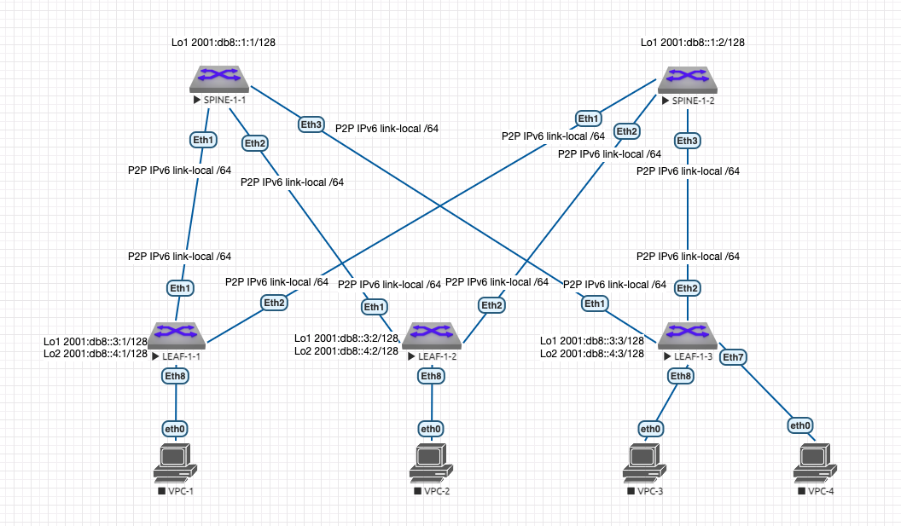

# Лабораторная работа 3 "Underlay. IS-IS"
## Описание принципа выделения адресного пространства Underlay сети:
Порядковый номер Датацентра - DC N (Нумерация начинается с 0.)

Loopback IPv6 /128

P2P Subnets Link-Local /64


loopbacks1 - Spine N-X 2001:db8::N1:X

loopbacks2 - Spine N-X 2001:db8::N2:X (зарезервирован для multicast или иных технических нужд)

loopbacks1 - Leaf N-X 2001:db8::N3:X

loopbacks2 - Leaf N-X 2001:db8::N4:X (для VTEP)

P2P LINK-LOCAL/64 (Используется SLAAC)

Идентификатр ISIS: 49.<Номер датацентра N дополненный до 4 знаков>.0000.<последние 8 цифр Loopback разделенные точкой>.
например для ЦОДа 1 SPINE-1-1 с Loopback1 2001:db8::1:1/128 - net 49.0001.0000.0001.0001

## Схема сети:



## Таблица адресов:
| Подсеть ipv6 | Device/Port|    Описание   |
|--------------|:----------:| -----------------:|
| 2001:db8::1:0001/128 | Spine-1-1/Lo1 |     Loopback1     |
| 2001:db8::1:0002/128 | Spine-1-2/Lo1 |     Loopback1     |
| 2001:db8::3:0001/128 |  Leaf-1-1/Lo1 |     Loopback1     |
| 2001:db8::4:0001/128 |  Leaf-1-1/Lo2 |     Loopback2     |
| 2001:db8::3:0002/128 |  Leaf-1-2/Lo1 |     Loopback1     |
| 2001:db8::4:0002/128 |  Leaf-1-2/Lo2 |     Loopback2     |
| 2001:db8::3:0003/128  |  Leaf-1-3/Lo1 |     Loopback1     |
| 2001:db8::4:0003/128  |  Leaf-1-3/Lo2 |     Loopback2     |
| Link-Local/64  |  Spine-1-1 Eth1 |     P2P Spine 1-1 to Leaf 1-1    |
| Link-Local/64  |  Leaf-1-1 Eth1 |     P2P Spine 1-1 to Leaf 1-1    |
| Link-Local/64  |  Spine-1-1 Eth2 |     P2P Spine 1-1 to Leaf 1-2    |
| Link-Local/64  |  Leaf-1-2 Eth1 |     P2P Spine 1-1 to Leaf 1-2    |
| Link-Local/64  |  Spine-1-1 Eth3 |     P2P Spine 1-1 to Leaf 1-3    |
| Link-Local/64  |  Leaf-1-3 Eth1 |     P2P Spine 1-1 to Leaf 1-3    |
| Link-Local/64  |  Spine-1-2 Eth1 |     P2P Spine 1-2 to Leaf 1-1    |
| Link-Local/64  |  Leaf-1-1 Eth2 |     P2P Spine 1-2 to Leaf 1-1    |
| Link-Local/64  |  Spine-1-2 Eth2 |     P2P Spine 1-2 to Leaf 1-2    |
| Link-Local/64  |  Leaf-1-2 Eth2 |     P2P Spine 1-2 to Leaf 1-2    |
| Link-Local/64  |  Spine-1-2 Eth3 |     P2P Spine 1-2 to Leaf 1-3    |
| Link-Local/64  |  Leaf-1-3 Eth2 |     P2P Spine 1-2 to Leaf 1-3    |

## Настройки коммутаторов:
### Типовая конфигурация процесса IS-IS:
```console
router isis 10
   net 49.0001.0000.<LAST 8 digits of Loopback IP in blocks by 4 separated by dot>.00
   is-type level1-2
   log-adjacency-changes
   address-family ipv6 unicast
```
### Типова конфигурация порта между коммутаторами:
```console
   no switchport
   ipv6 enable
   ipv6 address auto-config
   bfd interval 500 min-rx 500 multiplier 3
   isis bfd
   isis enable 10
   isis network point-to-point
   isis authentication mode md5
   isis authentication key test123
```
### SPINE-1-1:
```console
!
hostname SPINE-1-1
!
interface Ethernet1
   description LEAF-1-1 Eth1
   no switchport
   bfd interval 500 min-rx 500 multiplier 3
   ipv6 enable
   ipv6 address auto-config
   isis enable 10
   isis bfd
   isis network point-to-point
   isis authentication mode md5
   isis authentication key 7 uOQ+njFAZChiKiK5NHVvoA==
!
interface Ethernet2
   description LEAF-1-2 Eth1
   no switchport
   bfd interval 500 min-rx 500 multiplier 3
   ipv6 enable
   ipv6 address auto-config
   isis enable 10
   isis bfd
   isis network point-to-point
   isis authentication mode md5
   isis authentication key 7 uOQ+njFAZChiKiK5NHVvoA==
!
interface Ethernet3
   description LEAF-1-3
   no switchport
   bfd interval 500 min-rx 500 multiplier 3
   ipv6 enable
   ipv6 address auto-config
   isis enable 10
   isis bfd
   isis network point-to-point
   isis authentication mode md5
   isis authentication key 7 uOQ+njFAZChiKiK5NHVvoA==
!
interface Loopback1
   ipv6 enable
   ipv6 address 2001:db8::1:1/128
   isis enable 10
   isis passive
!
no ip routing
!
ipv6 unicast-routing
!
router isis 10
   net 49.0001.0000.0001.0001.00
   log-adjacency-changes
   !
   address-family ipv6 unicast
!
```
### SPINE-1-2:
```console
!
hostname SPINE-1-2
!
interface Ethernet1
   description L LEAF-1-1 Eth2
   no switchport
   bfd interval 500 min-rx 500 multiplier 3
   ipv6 enable
   ipv6 address auto-config
   isis enable 10
   isis bfd
   isis network point-to-point
   isis authentication mode md5
   isis authentication key 7 uOQ+njFAZChiKiK5NHVvoA==
!
interface Ethernet2
   description LEAF-1-2 Eth2
   no switchport
   bfd interval 500 min-rx 500 multiplier 3
   ipv6 enable
   ipv6 address auto-config
   isis enable 10
   isis bfd
   isis network point-to-point
   isis authentication mode md5
   isis authentication key 7 uOQ+njFAZChiKiK5NHVvoA==
!
interface Ethernet3
   description LEAF-1-3 Eth2
   no switchport
   bfd interval 500 min-rx 500 multiplier 3
   ipv6 enable
   ipv6 address auto-config
   isis enable 10
   isis bfd
   isis network point-to-point
   isis authentication mode md5
   isis authentication key 7 uOQ+njFAZChiKiK5NHVvoA==
!
interface Loopback1
   ipv6 enable
   ipv6 address 2001:db8::1:2/128
   isis enable 10
   isis passive
!
no ip routing
!
ipv6 unicast-routing
!
router isis 10
   net 49.0001.0000.0001.0002.00
   log-adjacency-changes
   !
   address-family ipv6 unicast
!
```
### LEAF-1-1:
```console
!
hostname LEAF-1-1
!
interface Ethernet1
   description SPINE-1-1 Eth1
   no switchport
   bfd interval 500 min-rx 500 multiplier 3
   ipv6 enable
   ipv6 address auto-config
   isis enable 10
   isis bfd
   isis network point-to-point
   isis authentication mode md5
   isis authentication key 7 uOQ+njFAZChiKiK5NHVvoA==
!
interface Ethernet2
   description SPINE-1-2 Eth1
   no switchport
   bfd interval 500 min-rx 500 multiplier 3
   ipv6 enable
   ipv6 address auto-config
   isis enable 10
   isis bfd
   isis network point-to-point
   isis authentication mode md5
   isis authentication key 7 uOQ+njFAZChiKiK5NHVvoA==
!
interface Loopback1
   ipv6 enable
   ipv6 address 2001:db8::3:1/128
   isis enable 10
   isis passive
!
interface Loopback2
   ipv6 enable
   ipv6 address 2001:db8::4:1/128
   isis enable 10
   isis passive
!
no ip routing
!
ipv6 unicast-routing
!
router isis 10
   net 49.0001.0000.0003.0001.00
   log-adjacency-changes
   !
   address-family ipv6 unicast
!
```
### LEAF-1-2:
```console
!
hostname LEAF-1-2
!
interface Ethernet1
   description SPINE-1-1 Eth2
   no switchport
   bfd interval 500 min-rx 500 multiplier 3
   ipv6 enable
   ipv6 address auto-config
   isis enable 10
   isis bfd
   isis network point-to-point
   isis authentication mode md5
   isis authentication key 7 uOQ+njFAZChiKiK5NHVvoA==
!
interface Ethernet2
   description SPINE1-2 Eth2
   no switchport
   bfd interval 500 min-rx 500 multiplier 3
   ipv6 enable
   ipv6 address auto-config
   isis enable 10
   isis bfd
   isis network point-to-point
   isis authentication mode md5
   isis authentication key 7 uOQ+njFAZChiKiK5NHVvoA==
!
!
interface Loopback1
   ipv6 enable
   ipv6 address 2001:db8::3:2/128
   isis enable 10
   isis passive
!
interface Loopback2
   ipv6 enable
   ipv6 address 2001:db8::4:2/128
   isis enable 10
   isis passive
!
no ip routing
!
ipv6 unicast-routing
!
router isis 10
   net 49.0001.0000.0003.0002.00
   log-adjacency-changes
   !
   address-family ipv6 unicast
!
```
### LEAF-1-3:
```console
!
hostname LEAF-1-3
!
interface Ethernet1
   description SPINE-1-1 Eth3
   no switchport
   bfd interval 500 min-rx 500 multiplier 3
   ipv6 enable
   ipv6 address auto-config
   isis enable 10
   isis bfd
   isis network point-to-point
   isis authentication mode md5
   isis authentication key 7 uOQ+njFAZChiKiK5NHVvoA==
!
interface Ethernet2
   description SPINE-1-2 Eth3
   no switchport
   bfd interval 500 min-rx 500 multiplier 3
   ipv6 enable
   ipv6 address auto-config
   isis enable 10
   isis bfd
   isis network point-to-point
   isis authentication mode md5
   isis authentication key 7 uOQ+njFAZChiKiK5NHVvoA==
!
interface Loopback1
   ipv6 enable
   ipv6 address 2001:db8::3:3/128
   isis enable 10
   isis passive
!
interface Loopback2
   ipv6 enable
   ipv6 address 2001:db8::4:3/128
   isis enable 10
   isis passive
!
interface Management1
!
no ip routing
!
ipv6 unicast-routing
!
router isis 10
   net 49.0001.0000.0003.0003.00
   log-adjacency-changes
   !
   address-family ipv6 unicast
!
```

## Вывод комманд маршрутизации
### SPINE-1-1:
```console
sh ipv6 route
 C        2001:db8::1:1/128 [0/0]
           via Loopback1, directly connected
 I L1     2001:db8::1:2/128 [115/30]
           via fe80::5200:ff:fed5:5dc0, Ethernet1
           via fe80::5200:ff:fe03:3766, Ethernet2
           via fe80::5200:ff:fe15:f4e8, Ethernet3
 I L1     2001:db8::3:1/128 [115/20]
           via fe80::5200:ff:fed5:5dc0, Ethernet1
 I L1     2001:db8::3:2/128 [115/20]
           via fe80::5200:ff:fe03:3766, Ethernet2
 I L1     2001:db8::3:3/128 [115/20]
           via fe80::5200:ff:fe15:f4e8, Ethernet3
 I L1     2001:db8::4:1/128 [115/20]
           via fe80::5200:ff:fed5:5dc0, Ethernet1
 I L1     2001:db8::4:2/128 [115/20]
           via fe80::5200:ff:fe03:3766, Ethernet2
 I L1     2001:db8::4:3/128 [115/20]
           via fe80::5200:ff:fe15:f4e8, Ethernet3
!
sh isis neighbors  
Instance  VRF      System Id        Type Interface          SNPA              State Hold time   Circuit Id          
10        default  LEAF-1-1         L1L2 Ethernet1          P2P               UP    24          0D                  
10        default  LEAF-1-2         L1L2 Ethernet2          P2P               UP    29          0D                  
10        default  LEAF-1-3         L1L2 Ethernet3          P2P               UP    28          0D 
!
ping 2001:db8::1:2
PING 2001:db8::1:2(2001:db8::1:2) 52 data bytes
60 bytes from 2001:db8::1:2: icmp_seq=1 ttl=63 time=38.1 ms
60 bytes from 2001:db8::1:2: icmp_seq=2 ttl=63 time=27.3 ms
60 bytes from 2001:db8::1:2: icmp_seq=3 ttl=63 time=32.8 ms
60 bytes from 2001:db8::1:2: icmp_seq=4 ttl=63 time=29.1 ms
60 bytes from 2001:db8::1:2: icmp_seq=5 ttl=63 time=27.7 ms

--- 2001:db8::1:2 ping statistics ---
5 packets transmitted, 5 received, 0% packet loss, time 99ms
rtt min/avg/max/mdev = 27.357/31.044/38.113/4.030 ms, pipe 3, ipg/ewma 24.893/34.433 ms
```
### SPINE-1-2:
```console
sh ipv6 route
 I L1     2001:db8::1:1/128 [115/30]
           via fe80::5200:ff:fed5:5dc0, Ethernet1
           via fe80::5200:ff:fe03:3766, Ethernet2
           via fe80::5200:ff:fe15:f4e8, Ethernet3
 C        2001:db8::1:2/128 [0/0]
           via Loopback1, directly connected
 I L1     2001:db8::3:1/128 [115/20]
           via fe80::5200:ff:fed5:5dc0, Ethernet1
 I L1     2001:db8::3:2/128 [115/20]
           via fe80::5200:ff:fe03:3766, Ethernet2
 I L1     2001:db8::3:3/128 [115/20]
           via fe80::5200:ff:fe15:f4e8, Ethernet3
 I L1     2001:db8::4:1/128 [115/20]
           via fe80::5200:ff:fed5:5dc0, Ethernet1
 I L1     2001:db8::4:2/128 [115/20]
           via fe80::5200:ff:fe03:3766, Ethernet2
 I L1     2001:db8::4:3/128 [115/20]
           via fe80::5200:ff:fe15:f4e8, Ethernet3
!
sh isis neighbors 
Instance  VRF      System Id        Type Interface          SNPA              State Hold time   Circuit Id          
10        default  LEAF-1-1         L1L2 Ethernet1          P2P               UP    28          0E                  
10        default  LEAF-1-2         L1L2 Ethernet2          P2P               UP    21          0E                  
10        default  LEAF-1-3         L1L2 Ethernet3          P2P               UP    25          0E 
!
ping 2001:db8::1:1
PING 2001:db8::1:1(2001:db8::1:1) 52 data bytes
60 bytes from 2001:db8::1:1: icmp_seq=1 ttl=63 time=26.0 ms
60 bytes from 2001:db8::1:1: icmp_seq=2 ttl=63 time=18.9 ms
60 bytes from 2001:db8::1:1: icmp_seq=3 ttl=63 time=22.6 ms
60 bytes from 2001:db8::1:1: icmp_seq=4 ttl=63 time=17.3 ms
60 bytes from 2001:db8::1:1: icmp_seq=5 ttl=63 time=25.5 ms

--- 2001:db8::1:1 ping statistics ---
5 packets transmitted, 5 received, 0% packet loss, time 74ms
rtt min/avg/max/mdev = 17.394/22.144/26.079/3.472 ms, pipe 3, ipg/ewma 18.605/24.148 ms
```
### LEAF-1-1:
```console
sh ipv6 route
 I L1     2001:db8::1:1/128 [115/20]
           via fe80::5200:ff:fed7:ee0b, Ethernet1
 I L1     2001:db8::1:2/128 [115/20]
           via fe80::5200:ff:fecb:38c2, Ethernet2
 C        2001:db8::3:1/128 [0/0]
           via Loopback1, directly connected
 I L1     2001:db8::3:2/128 [115/30]
           via fe80::5200:ff:fed7:ee0b, Ethernet1
           via fe80::5200:ff:fecb:38c2, Ethernet2
 I L1     2001:db8::3:3/128 [115/30]
           via fe80::5200:ff:fed7:ee0b, Ethernet1
           via fe80::5200:ff:fecb:38c2, Ethernet2
 C        2001:db8::4:1/128 [0/0]
           via Loopback2, directly connected
 I L1     2001:db8::4:2/128 [115/30]
           via fe80::5200:ff:fed7:ee0b, Ethernet1
           via fe80::5200:ff:fecb:38c2, Ethernet2
 I L1     2001:db8::4:3/128 [115/30]
           via fe80::5200:ff:fed7:ee0b, Ethernet1
           via fe80::5200:ff:fecb:38c2, Ethernet2
!
sh isis neighbors 
Instance  VRF      System Id        Type Interface          SNPA              State Hold time   Circuit Id          
10        default  SPINE-1-1        L1L2 Ethernet1          P2P               UP    27          0D                  
10        default  SPINE-1-2        L1L2 Ethernet2          P2P               UP    25          0D 
!
ping 2001:db8::3:2
PING 2001:db8::3:2(2001:db8::3:2) 52 data bytes
60 bytes from 2001:db8::3:2: icmp_seq=1 ttl=63 time=32.5 ms
60 bytes from 2001:db8::3:2: icmp_seq=2 ttl=63 time=26.0 ms
60 bytes from 2001:db8::3:2: icmp_seq=3 ttl=63 time=24.2 ms
60 bytes from 2001:db8::3:2: icmp_seq=4 ttl=63 time=19.4 ms
60 bytes from 2001:db8::3:2: icmp_seq=5 ttl=63 time=16.9 ms

--- 2001:db8::3:2 ping statistics ---
5 packets transmitted, 5 received, 0% packet loss, time 94ms
rtt min/avg/max/mdev = 16.964/23.846/32.537/5.435 ms, pipe 3, ipg/ewma 23.598/27.820 ms

ping 2001:db8::4:2
PING 2001:db8::4:2(2001:db8::4:2) 52 data bytes
60 bytes from 2001:db8::4:2: icmp_seq=1 ttl=63 time=24.7 ms
60 bytes from 2001:db8::4:2: icmp_seq=2 ttl=63 time=19.3 ms
60 bytes from 2001:db8::4:2: icmp_seq=3 ttl=63 time=14.9 ms
60 bytes from 2001:db8::4:2: icmp_seq=4 ttl=63 time=15.2 ms
60 bytes from 2001:db8::4:2: icmp_seq=5 ttl=63 time=15.8 ms

--- 2001:db8::4:2 ping statistics ---
5 packets transmitted, 5 received, 0% packet loss, time 83ms
rtt min/avg/max/mdev = 14.925/18.001/24.707/3.699 ms, pipe 2, ipg/ewma 20.902/21.173 ms

ping 2001:db8::3:3
PING 2001:db8::3:3(2001:db8::3:3) 52 data bytes
60 bytes from 2001:db8::3:3: icmp_seq=1 ttl=63 time=20.8 ms
60 bytes from 2001:db8::3:3: icmp_seq=2 ttl=63 time=18.6 ms
60 bytes from 2001:db8::3:3: icmp_seq=3 ttl=63 time=18.0 ms
60 bytes from 2001:db8::3:3: icmp_seq=4 ttl=63 time=17.4 ms
60 bytes from 2001:db8::3:3: icmp_seq=5 ttl=63 time=16.9 ms

--- 2001:db8::3:3 ping statistics ---
5 packets transmitted, 5 received, 0% packet loss, time 77ms
rtt min/avg/max/mdev = 16.941/18.376/20.815/1.348 ms, pipe 2, ipg/ewma 19.292/19.515 ms

ping 2001:db8::4:3
PING 2001:db8::4:3(2001:db8::4:3) 52 data bytes
60 bytes from 2001:db8::4:3: icmp_seq=1 ttl=63 time=19.4 ms
60 bytes from 2001:db8::4:3: icmp_seq=2 ttl=63 time=19.7 ms
60 bytes from 2001:db8::4:3: icmp_seq=3 ttl=63 time=22.1 ms
60 bytes from 2001:db8::4:3: icmp_seq=4 ttl=63 time=26.2 ms
60 bytes from 2001:db8::4:3: icmp_seq=5 ttl=63 time=17.0 ms

--- 2001:db8::4:3 ping statistics ---
5 packets transmitted, 5 received, 0% packet loss, time 80ms
rtt min/avg/max/mdev = 17.052/20.933/26.250/3.121 ms, pipe 2, ipg/ewma 20.041/20.189 ms
```
### LEAF-1-2:
```console
sh ipv6 route
 I L1     2001:db8::1:1/128 [115/20]
           via fe80::5200:ff:fed7:ee0b, Ethernet1
 I L1     2001:db8::1:2/128 [115/20]
           via fe80::5200:ff:fecb:38c2, Ethernet2
 I L1     2001:db8::3:1/128 [115/30]
           via fe80::5200:ff:fed7:ee0b, Ethernet1
           via fe80::5200:ff:fecb:38c2, Ethernet2
 C        2001:db8::3:2/128 [0/0]
           via Loopback1, directly connected
 I L1     2001:db8::3:3/128 [115/30]
           via fe80::5200:ff:fed7:ee0b, Ethernet1
           via fe80::5200:ff:fecb:38c2, Ethernet2
 I L1     2001:db8::4:1/128 [115/30]
           via fe80::5200:ff:fed7:ee0b, Ethernet1
           via fe80::5200:ff:fecb:38c2, Ethernet2
 C        2001:db8::4:2/128 [0/0]
           via Loopback2, directly connected
 I L1     2001:db8::4:3/128 [115/30]
           via fe80::5200:ff:fed7:ee0b, Ethernet1
           via fe80::5200:ff:fecb:38c2, Ethernet2
!
sh isis neighbors
Instance  VRF      System Id        Type Interface          SNPA              State Hold time   Circuit Id          
10        default  SPINE-1-1        L1L2 Ethernet1          P2P               UP    27          0E                  
10        default  SPINE-1-2        L1L2 Ethernet2          P2P               UP    28          0E
!
ping 2001:db8::3:1
PING 2001:db8::3:1(2001:db8::3:1) 52 data bytes
60 bytes from 2001:db8::3:1: icmp_seq=1 ttl=63 time=21.4 ms
60 bytes from 2001:db8::3:1: icmp_seq=2 ttl=63 time=20.3 ms
60 bytes from 2001:db8::3:1: icmp_seq=3 ttl=63 time=15.2 ms
60 bytes from 2001:db8::3:1: icmp_seq=4 ttl=63 time=16.9 ms
60 bytes from 2001:db8::3:1: icmp_seq=5 ttl=63 time=22.2 ms

--- 2001:db8::3:1 ping statistics ---
5 packets transmitted, 5 received, 0% packet loss, time 75ms
rtt min/avg/max/mdev = 15.265/19.259/22.271/2.696 ms, pipe 2, ipg/ewma 18.767/20.390 ms

ping 2001:db8::4:1
PING 2001:db8::4:1(2001:db8::4:1) 52 data bytes
60 bytes from 2001:db8::4:1: icmp_seq=1 ttl=63 time=36.8 ms
60 bytes from 2001:db8::4:1: icmp_seq=2 ttl=63 time=36.5 ms
60 bytes from 2001:db8::4:1: icmp_seq=3 ttl=63 time=119 ms
60 bytes from 2001:db8::4:1: icmp_seq=4 ttl=63 time=95.6 ms
60 bytes from 2001:db8::4:1: icmp_seq=5 ttl=63 time=60.5 ms

--- 2001:db8::4:1 ping statistics ---
5 packets transmitted, 5 received, 0% packet loss, time 101ms
rtt min/avg/max/mdev = 36.510/69.863/119.781/33.005 ms, pipe 3, ipg/ewma 25.499/54.152 ms

ping 2001:db8::3:3
PING 2001:db8::3:3(2001:db8::3:3) 52 data bytes
60 bytes from 2001:db8::3:3: icmp_seq=1 ttl=63 time=43.4 ms
60 bytes from 2001:db8::3:3: icmp_seq=2 ttl=63 time=42.9 ms
60 bytes from 2001:db8::3:3: icmp_seq=3 ttl=63 time=38.7 ms
60 bytes from 2001:db8::3:3: icmp_seq=4 ttl=63 time=33.4 ms
60 bytes from 2001:db8::3:3: icmp_seq=5 ttl=63 time=15.3 ms

--- 2001:db8::3:3 ping statistics ---
5 packets transmitted, 5 received, 0% packet loss, time 77ms
rtt min/avg/max/mdev = 15.328/34.771/43.451/10.369 ms, pipe 4, ipg/ewma 19.488/38.342 ms

ping 2001:db8::4:3
PING 2001:db8::4:3(2001:db8::4:3) 52 data bytes
60 bytes from 2001:db8::4:3: icmp_seq=1 ttl=63 time=23.6 ms
60 bytes from 2001:db8::4:3: icmp_seq=2 ttl=63 time=26.6 ms
60 bytes from 2001:db8::4:3: icmp_seq=3 ttl=63 time=15.9 ms
60 bytes from 2001:db8::4:3: icmp_seq=4 ttl=63 time=20.2 ms
60 bytes from 2001:db8::4:3: icmp_seq=5 ttl=63 time=20.9 ms

--- 2001:db8::4:3 ping statistics ---
5 packets transmitted, 5 received, 0% packet loss, time 92ms
rtt min/avg/max/mdev = 15.913/21.484/26.682/3.586 ms, pipe 2, ipg/ewma 23.170/22.433 ms
```
### LEAF-1-3:
```console
sh ipv6 route
 I L1     2001:db8::1:1/128 [115/20]
           via fe80::5200:ff:fed7:ee0b, Ethernet1
 I L1     2001:db8::1:2/128 [115/20]
           via fe80::5200:ff:fecb:38c2, Ethernet2
 I L1     2001:db8::3:1/128 [115/30]
           via fe80::5200:ff:fed7:ee0b, Ethernet1
           via fe80::5200:ff:fecb:38c2, Ethernet2
 I L1     2001:db8::3:2/128 [115/30]
           via fe80::5200:ff:fed7:ee0b, Ethernet1
           via fe80::5200:ff:fecb:38c2, Ethernet2
 C        2001:db8::3:3/128 [0/0]
           via Loopback1, directly connected
 I L1     2001:db8::4:1/128 [115/30]
           via fe80::5200:ff:fed7:ee0b, Ethernet1
           via fe80::5200:ff:fecb:38c2, Ethernet2
 I L1     2001:db8::4:2/128 [115/30]
           via fe80::5200:ff:fed7:ee0b, Ethernet1
           via fe80::5200:ff:fecb:38c2, Ethernet2
 C        2001:db8::4:3/128 [0/0]
           via Loopback2, directly connected
!
sh isis neighbors 
Instance  VRF      System Id        Type Interface          SNPA              State Hold time   Circuit Id          
10        default  SPINE-1-1        L1L2 Ethernet1          P2P               UP    24          0F                  
10        default  SPINE-1-2        L1L2 Ethernet2          P2P               UP    23          0F
!
ping 2001:db8::3:1
PING 2001:db8::3:1(2001:db8::3:1) 52 data bytes
60 bytes from 2001:db8::3:1: icmp_seq=1 ttl=63 time=20.2 ms
60 bytes from 2001:db8::3:1: icmp_seq=2 ttl=63 time=18.3 ms
60 bytes from 2001:db8::3:1: icmp_seq=3 ttl=63 time=21.6 ms
60 bytes from 2001:db8::3:1: icmp_seq=4 ttl=63 time=49.0 ms
60 bytes from 2001:db8::3:1: icmp_seq=5 ttl=63 time=33.2 ms

--- 2001:db8::3:1 ping statistics ---
5 packets transmitted, 5 received, 0% packet loss, time 77ms
rtt min/avg/max/mdev = 18.304/28.495/49.065/11.523 ms, pipe 2, ipg/ewma 19.385/25.004 ms

ping 2001:db8::4:1
PING 2001:db8::4:1(2001:db8::4:1) 52 data bytes
60 bytes from 2001:db8::4:1: icmp_seq=1 ttl=63 time=16.8 ms
60 bytes from 2001:db8::4:1: icmp_seq=2 ttl=63 time=21.6 ms
60 bytes from 2001:db8::4:1: icmp_seq=3 ttl=63 time=27.4 ms
60 bytes from 2001:db8::4:1: icmp_seq=4 ttl=63 time=16.3 ms
60 bytes from 2001:db8::4:1: icmp_seq=5 ttl=63 time=22.4 ms

--- 2001:db8::4:1 ping statistics ---
5 packets transmitted, 5 received, 0% packet loss, time 70ms
rtt min/avg/max/mdev = 16.331/20.928/27.451/4.083 ms, pipe 2, ipg/ewma 17.559/18.883 ms

ping 2001:db8::3:2
PING 2001:db8::3:2(2001:db8::3:2) 52 data bytes
60 bytes from 2001:db8::3:2: icmp_seq=1 ttl=63 time=21.4 ms
60 bytes from 2001:db8::3:2: icmp_seq=2 ttl=63 time=28.6 ms
60 bytes from 2001:db8::3:2: icmp_seq=3 ttl=63 time=17.6 ms
60 bytes from 2001:db8::3:2: icmp_seq=4 ttl=63 time=14.9 ms
60 bytes from 2001:db8::3:2: icmp_seq=5 ttl=63 time=15.5 ms

--- 2001:db8::3:2 ping statistics ---
5 packets transmitted, 5 received, 0% packet loss, time 91ms
rtt min/avg/max/mdev = 14.962/19.647/28.626/5.026 ms, pipe 2, ipg/ewma 22.805/20.225 ms

ping 2001:db8::4:2
PING 2001:db8::4:2(2001:db8::4:2) 52 data bytes
60 bytes from 2001:db8::4:2: icmp_seq=1 ttl=63 time=24.0 ms
60 bytes from 2001:db8::4:2: icmp_seq=2 ttl=63 time=21.5 ms
60 bytes from 2001:db8::4:2: icmp_seq=3 ttl=63 time=18.3 ms
60 bytes from 2001:db8::4:2: icmp_seq=4 ttl=63 time=20.5 ms
60 bytes from 2001:db8::4:2: icmp_seq=5 ttl=63 time=18.2 ms

--- 2001:db8::4:2 ping statistics ---
5 packets transmitted, 5 received, 0% packet loss, time 85ms
rtt min/avg/max/mdev = 18.230/20.557/24.065/2.171 ms, pipe 2, ipg/ewma 21.298/22.197 ms
```