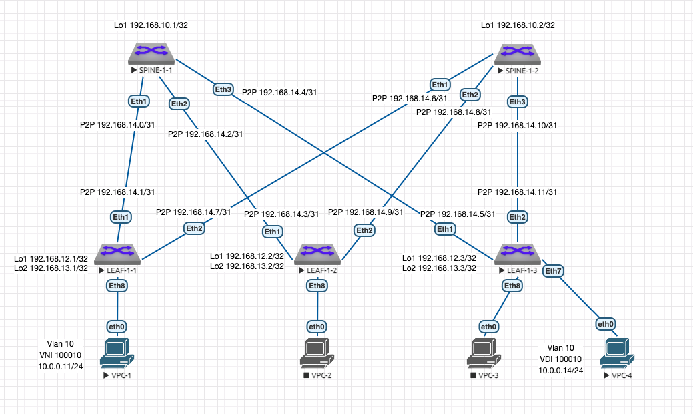

# Лабораторная работа 4 "VxLAN. L2 VNI"
## Описание принципа выделения адресного пространства Underlay сети:
Порядковый номер Датацентра - DC N (Нумерация начинается с 1. "0" зарезервирован)

Loopback /32

P2P Subnets /31

loopbacks1 - Spine N-X 192.168.N0.X

loopbacks2 - Spine N-X 192.168.N1.X (зарезервирован для multicast или иных технических нужд)

loopbacks1 - Leaf N-X 192.168.N2.X

loopbacks2 - Leaf N-X 192.168.N3.X (для VTEP)

P2P 192.168.N[4-7].X/31 (Меньшее число всегда идет на Spine)

reserved 192.168.N[8-9] (зарезервированы для дальнейшего использования)

## Описание VLAN, VNI, RD и RT:
VNI генерится на основе номера Влана в Датацентре: N0<VLAN ID в 4 значном формате>, где N это порядковый номер Датацентра.
RD генерится путем составления номера AS и VNI - AS:VNI
RT на импорт и экспорт по умолчанию генерится из номера AS и VNI - AS:VNI

## Описание адресного пространства Overlay сети:

Создан 1 Влан для серверов 1 Сервиса - Vlan 10 - Service1 - VNI 100010 10.0.0.0/24

Так как мы используем для Датацентра 1 iBGP с номером AS 65000 получаем:
RD - 65000:100010
RT - 65000:100010

## Схема сети:



## Таблица адресов:
| Подсеть ipv4 | Device/Port|    Описание   |
|--------------|:----------:| -----------------:|
| 192.168.10.1/32  | Spine-1-1/Lo1 |     Loopback1     |
| 192.168.10.2/32  | Spine-1-2/Lo1 |     Loopback1     |
| 192.168.12.1/32  |  Leaf-1-1/Lo1 |     Loopback1     |
| 192.168.13.1/32  |  Leaf-1-1/Lo2 |     Loopback2     |
| 192.168.12.2/32  |  Leaf-1-2/Lo1 |     Loopback1     |
| 192.168.13.2/32  |  Leaf-1-2/Lo2 |     Loopback2     |
| 192.168.12.3/32  |  Leaf-1-3/Lo1 |     Loopback1     |
| 192.168.13.3/32  |  Leaf-1-3/Lo2 |     Loopback2     |
| 192.168.14.0/31  |  Spine-1-1 Eth1 |     P2P Spine 1-1 to Leaf 1-1    |
| 192.168.14.1/31  |  Leaf-1-1 Eth1 |     P2P Spine 1-1 to Leaf 1-1    |
| 192.168.14.2/31  |  Spine-1-1 Eth2 |     P2P Spine 1-1 to Leaf 1-2    |
| 192.168.14.3/31  |  Leaf-1-2 Eth1 |     P2P Spine 1-1 to Leaf 1-2    |
| 192.168.14.4/31  |  Spine-1-1 Eth3 |     P2P Spine 1-1 to Leaf 1-3    |
| 192.168.14.5/31  |  Leaf-1-3 Eth1 |     P2P Spine 1-1 to Leaf 1-3    |
| 192.168.14.6/31  |  Spine-1-2 Eth1 |     P2P Spine 1-2 to Leaf 1-1    |
| 192.168.14.7/31  |  Leaf-1-1 Eth2 |     P2P Spine 1-2 to Leaf 1-1    |
| 192.168.14.8/31  |  Spine-1-2 Eth2 |     P2P Spine 1-2 to Leaf 1-2    |
| 192.168.14.9/31  |  Leaf-1-2 Eth2 |     P2P Spine 1-2 to Leaf 1-2    |
| 192.168.14.10/31  |  Spine-1-2 Eth3 |     P2P Spine 1-2 to Leaf 1-3    |
| 192.168.14.11/31  |  Leaf-1-3 Eth2 |     P2P Spine 1-2 to Leaf 1-3    |

## Настройки коммутаторов:
Использованы шаблоны для ускорения настройки:
SPINE - Underlay BGP на LEAF в сторону SPINE.
LEAFS - Underlay BGP на SPINE в торону LEAF.
OVERLAY - на LEAF и SPINE для настройки EVPN.

Для упрощения настрое SPINE использованы комманды bgp listen range. 
Что позволяет уйти от ручного указания IP всех соседствующих LEAF.

### Типовая конфигурация процесса BGP Spine UNDERLAY:
```console
router bgp 65000
   router-id <IP Loopback1>
   no bgp default ipv4-unicast
   distance bgp 20 200 200
   bgp listen range 192.168.14.0/24 peer-group LEAFS remote-as 65000
   neighbor LEAFS peer group
   neighbor LEAFS remote-as 65000
   neighbor LEAFS next-hop-self
   neighbor LEAFS bfd
   neighbor LEAFS rib-in pre-policy retain all
   neighbor LEAFS route-reflector-client
   neighbor LEAFS password 7 1RuAvIkzlaIS2dTpf+q14g==
   neighbor LEAFS send-community standard extended

   address-family ipv4
      neighbor LEAFS activate
      network <IP Loopback1>

```
### Типовая конфигурация процесса BGP Spine OVERLAY:
```console
service routing protocols model multi-agent

router bgp 65000
   bgp listen range 192.168.12.0/24 peer-group OVERLAY remote-as 65000
   neighbor OVERLAY peer group
   neighbor OVERLAY update-source Loopback1
   neighbor OVERLAY route-reflector-client
   neighbor OVERLAY password 7 rXi9hgRNfLyRVaxnuxy+/Q==
   neighbor OVERLAY send-community extended

   address-family evpn
      neighbor OVERLAY activate
   
```
### Типовая конфигурация процесса BGP Leaf UNDERLAY:
```console
router bgp 65000
   router-id <IP Loopback1>
   no bgp default ipv4-unicast
   distance bgp 20 200 200
   maximum-paths 4 ecmp 4
   neighbor SPINE peer group
   neighbor SPINE remote-as 65000
   neighbor SPINE next-hop-self
   neighbor SPINE bfd
   neighbor SPINE rib-in pre-policy retain all
   neighbor SPINE password 7 hFVifvPlyMlVDYT87k+lyg==
   neighbor SPINE send-community standard extended

   neighbor <SPINE1 PtP IP> peer group SPINE
   neighbor <SPINE2 PtP IP> peer group SPINE

   address-family ipv4
      neighbor SPINE activate
      network <IP Loopback1>
      network <IP Loopback2>
```

### Типовая конфигурация процесса BGP Leaf OVERLAY:
```console
service routing protocols model multi-agent

router bgp 65000
   neighbor OVERLAY peer group
   neighbor OVERLAY remote-as 65000
   neighbor OVERLAY update-source Loopback1
   neighbor OVERLAY password 7 rXi9hgRNfLyRVaxnuxy+/Q==
   neighbor OVERLAY send-community extended

   neighbor <SPINE IP Loopback1> peer group OVERLAY
   neighbor <SPINE IP Loopback2> peer group OVERLAY

   address-family evpn
      neighbor OVERLAY activate

```
### Типовая конфигурация процесса BGP Leaf VXLAN:
```console
interface Vxlan1
   vxlan source-interface Loopback2
   vxlan udp-port 4789
   vxlan vlan <VLAN ID> vni <VNI ID>
   vxlan learn-restrict any

router bgp 65000
  vlan <VLAN ID>
      rd <AS:VNI>
      route-target both <AS:VNI>
      redistribute learned

```
### SPINE-1-1:
```console
!
service routing protocols model multi-agent
!
hostname SPINE-1-1
!
interface Ethernet1
   description LEAF-1-1 Eth1
   no switchport
   ip address 192.168.14.0/31
   bfd interval 700 min-rx 500 multiplier 3
!
interface Ethernet2
   description LEAF-1-2 Eth1
   no switchport
   ip address 192.168.14.2/31
   bfd interval 700 min-rx 500 multiplier 3
!
interface Ethernet3
   description LEAF-1-3 Eth1
   no switchport
   ip address 192.168.14.4/31
   bfd interval 700 min-rx 500 multiplier 3
!
interface Loopback1
   ip address 192.168.10.1/32
!
ip routing
!
router bgp 65000
   router-id 192.168.10.1
   no bgp default ipv4-unicast
   distance bgp 20 200 200
   bgp listen range 192.168.14.0/24 peer-group LEAFS remote-as 65000
   bgp listen range 192.168.12.0/24 peer-group OVERLAY remote-as 65000
   neighbor LEAFS peer group
   neighbor LEAFS remote-as 65000
   neighbor LEAFS next-hop-self
   neighbor LEAFS bfd
   neighbor LEAFS rib-in pre-policy retain all
   neighbor LEAFS route-reflector-client
   neighbor LEAFS password 7 1RuAvIkzlaIS2dTpf+q14g==
   neighbor LEAFS send-community standard extended
   neighbor OVERLAY peer group
   neighbor OVERLAY update-source Loopback1
   neighbor OVERLAY route-reflector-client
   neighbor OVERLAY password 7 rXi9hgRNfLyRVaxnuxy+/Q==
   neighbor OVERLAY send-community extended
   !
   address-family evpn
      neighbor OVERLAY activate
   !
   address-family ipv4
      neighbor LEAFS activate
      network 192.168.10.1/32
!
```
### SPINE-1-2:
```console
!
service routing protocols model multi-agent
!
hostname SPINE-1-2
!
spanning-tree mode mstp
!
interface Ethernet1
   description LEAF-1-1 Eth2
   no switchport
   ip address 192.168.14.6/31
   bfd interval 700 min-rx 500 multiplier 3
!
interface Ethernet2
   description LEAF-1-2 Eth2
   no switchport
   ip address 192.168.14.8/31
   bfd interval 700 min-rx 500 multiplier 3
!
interface Ethernet3
   description LEAF-1-3 Eth2
   no switchport
   ip address 192.168.14.10/31
   bfd interval 700 min-rx 500 multiplier 3
!
interface Loopback1
   ip address 192.168.10.2/32
!
ip routing
!
router bgp 65000
   router-id 192.168.10.2
   no bgp default ipv4-unicast
   distance bgp 20 200 200
   bgp listen range 192.168.14.0/24 peer-group LEAFS remote-as 65000
   bgp listen range 192.168.12.0/24 peer-group OVERLAY remote-as 65000
   neighbor LEAFS peer group
   neighbor LEAFS remote-as 65000
   neighbor LEAFS next-hop-self
   neighbor LEAFS bfd
   neighbor LEAFS rib-in pre-policy retain all
   neighbor LEAFS route-reflector-client
   neighbor LEAFS password 7 1RuAvIkzlaIS2dTpf+q14g==
   neighbor LEAFS send-community standard extended
   neighbor OVERLAY peer group
   neighbor OVERLAY update-source Loopback1
   neighbor OVERLAY route-reflector-client
   neighbor OVERLAY password 7 rXi9hgRNfLyRVaxnuxy+/Q==
   neighbor OVERLAY send-community extended
   !
   address-family evpn
      neighbor OVERLAY activate
   !
   address-family ipv4
      neighbor LEAFS activate
      network 192.168.10.2/32
!
```
### LEAF-1-1:
```console
!
service routing protocols model multi-agent
!
hostname LEAF-1-1
!
vlan 10
   name Service1
!
interface Ethernet1
   description SPINE-1-1 Eth1
   no switchport
   ip address 192.168.14.1/31
   bfd interval 700 min-rx 500 multiplier 3
!
interface Ethernet2
   description SPINE-1-2 Eth1
   no switchport
   ip address 192.168.14.7/31
   bfd interval 700 min-rx 500 multiplier 3
!
interface Ethernet8
   description SERVICE1 SRV1
   switchport access vlan 10
!
interface Loopback1
   ip address 192.168.12.1/32
!
interface Loopback2
   ip address 192.168.13.1/32
!
interface Vxlan1
   vxlan source-interface Loopback2
   vxlan udp-port 4789
   vxlan vlan 10 vni 100010
   vxlan learn-restrict any
!
ip routing
!
router bgp 65000
   router-id 192.168.12.1
   no bgp default ipv4-unicast
   distance bgp 20 200 200
   maximum-paths 4 ecmp 4
   neighbor OVERLAY peer group
   neighbor OVERLAY remote-as 65000
   neighbor OVERLAY update-source Loopback1
   neighbor OVERLAY password 7 rXi9hgRNfLyRVaxnuxy+/Q==
   neighbor OVERLAY send-community extended
   neighbor SPINE peer group
   neighbor SPINE remote-as 65000
   neighbor SPINE next-hop-self
   neighbor SPINE bfd
   neighbor SPINE rib-in pre-policy retain all
   neighbor SPINE password 7 hFVifvPlyMlVDYT87k+lyg==
   neighbor SPINE send-community standard extended
   neighbor 192.168.10.1 peer group OVERLAY
   neighbor 192.168.10.2 peer group OVERLAY
   neighbor 192.168.14.0 peer group SPINE
   neighbor 192.168.14.6 peer group SPINE
   !
   vlan 10
      rd 65000:100010
      route-target both 65000:100010
      redistribute learned
   !
   address-family evpn
      neighbor OVERLAY activate
   !
   address-family ipv4
      neighbor SPINE activate
      network 192.168.12.1/32
      network 192.168.13.1/32
!
```
### LEAF-1-2:
```console
!
service routing protocols model multi-agent
!
hostname LEAF-1-2
!
interface Ethernet1
   description SPINE-1-1 Eth2
   no switchport
   ip address 192.168.14.3/31
   bfd interval 700 min-rx 500 multiplier 3
!
interface Ethernet2
   description SPINE-1-2 Eth2
   no switchport
   ip address 192.168.14.9/31
   bfd interval 700 min-rx 500 multiplier 3
!
interface Loopback1
   ip address 192.168.12.2/32
!
interface Loopback2
   ip address 192.168.13.2/32
!
interface Vxlan1
   vxlan source-interface Loopback2
   vxlan udp-port 4789
   vxlan vlan 10 vni 100010
   vxlan learn-restrict any
!
ip routing
!
router bgp 65000
   router-id 192.168.12.2
   no bgp default ipv4-unicast
   distance bgp 20 200 200
   maximum-paths 4 ecmp 4
   neighbor OVERLAY peer group
   neighbor OVERLAY remote-as 65000
   neighbor OVERLAY update-source Loopback1
   neighbor OVERLAY password 7 rXi9hgRNfLyRVaxnuxy+/Q==
   neighbor OVERLAY send-community extended
   neighbor SPINE peer group
   neighbor SPINE remote-as 65000
   neighbor SPINE next-hop-self
   neighbor SPINE bfd
   neighbor SPINE rib-in pre-policy retain all
   neighbor SPINE password 7 hFVifvPlyMlVDYT87k+lyg==
   neighbor SPINE send-community standard extended
   neighbor 192.168.10.1 peer group OVERLAY
   neighbor 192.168.10.2 peer group OVERLAY
   neighbor 192.168.14.2 peer group SPINE
   neighbor 192.168.14.8 peer group SPINE
   !
   address-family evpn
      neighbor OVERLAY activate
   !
   address-family ipv4
      neighbor SPINE activate
      network 192.168.12.2/32
      network 192.168.13.2/32
!
```
### LEAF-1-3:
```console
!
service routing protocols model multi-agent
!
hostname LEAF-1-3
!
vlan 10
   name Service1
!
interface Ethernet1
   description SPINE-1-1 Eth3
   no switchport
   ip address 192.168.14.5/31
   bfd interval 700 min-rx 500 multiplier 3
!
interface Ethernet2
   description SPINE-1-2 Eth3
   no switchport
   ip address 192.168.14.11/31
   bfd interval 700 min-rx 500 multiplier 3
!
interface Ethernet7
   description SERVICE1 SRV4
   switchport access vlan 10
!
interface Loopback1
   ip address 192.168.12.3/32
!
interface Loopback2
   ip address 192.168.13.3/32
!
interface Vxlan1
   vxlan source-interface Loopback2
   vxlan udp-port 4789
   vxlan vlan 10 vni 100010
   vxlan learn-restrict any
!
ip routing
!
router bgp 65000
   router-id 192.168.12.3
   no bgp default ipv4-unicast
   distance bgp 20 200 200
   maximum-paths 4 ecmp 4
   neighbor OVERLAY peer group
   neighbor OVERLAY remote-as 65000
   neighbor OVERLAY update-source Loopback1
   neighbor OVERLAY password 7 rXi9hgRNfLyRVaxnuxy+/Q==
   neighbor OVERLAY send-community extended
   neighbor SPINE peer group
   neighbor SPINE remote-as 65000
   neighbor SPINE next-hop-self
   neighbor SPINE bfd
   neighbor SPINE rib-in pre-policy retain all
   neighbor SPINE password 7 hFVifvPlyMlVDYT87k+lyg==
   neighbor SPINE send-community standard extended
   neighbor 192.168.10.1 peer group OVERLAY
   neighbor 192.168.10.2 peer group OVERLAY
   neighbor 192.168.14.4 peer group SPINE
   neighbor 192.168.14.10 peer group SPINE
   !
   vlan 10
      rd 65000:100010
      route-target both 65000:100010
      redistribute learned
   !
   address-family evpn
      neighbor OVERLAY activate
   !
   address-family ipv4
      neighbor SPINE activate
      network 192.168.12.3/32
      network 192.168.13.3/32
!
```

## Вывод комманд маршрутизации
### SPINE-1-1:
```console
sh bgp evpn summary 
BGP summary information for VRF default
Router identifier 192.168.10.1, local AS number 65000
Neighbor Status Codes: m - Under maintenance
  Neighbor     V AS           MsgRcvd   MsgSent  InQ OutQ  Up/Down State   PfxRcd PfxAcc
  192.168.12.1 4 65000             60        63    0    0 00:46:08 Estab   1      1
  192.168.12.2 4 65000             57        64    0    0 00:46:06 Estab   0      0
  192.168.12.3 4 65000             61        56    0    0 00:46:06 Estab   1      1
```
### SPINE-1-2:
```console
SPINE-1-2#sh bgp evpn summary 
BGP summary information for VRF default
Router identifier 192.168.10.2, local AS number 65000
Neighbor Status Codes: m - Under maintenance
  Neighbor     V AS           MsgRcvd   MsgSent  InQ OutQ  Up/Down State   PfxRcd PfxAcc
  192.168.12.1 4 65000             60        62    0    0 00:46:33 Estab   1      1
  192.168.12.2 4 65000             59        64    0    0 00:46:38 Estab   0      0
  192.168.12.3 4 65000             62        60    0    0 00:46:38 Estab   1      1
```
### LEAF-1-1:
```console
sh bgp evpn summary 
BGP summary information for VRF default
Router identifier 192.168.12.1, local AS number 65000
Neighbor Status Codes: m - Under maintenance
  Neighbor     V AS           MsgRcvd   MsgSent  InQ OutQ  Up/Down State   PfxRcd PfxAcc
  192.168.10.1 4 65000             65        62    0    0 00:47:56 Estab   1      1
  192.168.10.2 4 65000             64        61    0    0 00:47:47 Estab   1      1
!
sh interfaces vxlan 1
Vxlan1 is up, line protocol is up (connected)
  Hardware is Vxlan
  Source interface is Loopback2 and is active with 192.168.13.1
  Listening on UDP port 4789
  Replication/Flood Mode is headend with Flood List Source: EVPN
  Remote MAC learning via EVPN
  VNI mapping to VLANs
  Static VLAN to VNI mapping is 
    [10, 100010]     
  Note: All Dynamic VLANs used by VCS are internal VLANs.
        Use 'show vxlan vni' for details.
  Static VRF to VNI mapping is not configured
  Headend replication flood vtep list is:
    10 192.168.13.3   
  Shared Router MAC is 0000.0000.0000
!
sh vxlan vtep
Remote VTEPS for Vxlan1:

VTEP               Tunnel Type(s)
------------------ --------------
192.168.13.3       flood         

Total number of remote VTEPS:  1
!
#sh vxlan address-table
          Vxlan Mac Address Table
----------------------------------------------------------------------

VLAN  Mac Address     Type      Prt  VTEP             Moves   Last Move
----  -----------     ----      ---  ----             -----   ---------
  10  0050.7966.6809  EVPN      Vx1  192.168.13.3     1       0:00:05 ago
Total Remote Mac Addresses for this criterion: 1
!
sh bgp evpn route-type mac-ip 
BGP routing table information for VRF default
Router identifier 192.168.12.1, local AS number 65000
Route status codes: * - valid, > - active, S - Stale, E - ECMP head, e - ECMP
                    c - Contributing to ECMP, % - Pending BGP convergence
Origin codes: i - IGP, e - EGP, ? - incomplete
AS Path Attributes: Or-ID - Originator ID, C-LST - Cluster List, LL Nexthop - Link Local Nexthop

          Network                Next Hop              Metric  LocPref Weight  Path
 * >      RD: 65000:100010 mac-ip 0050.7966.6806
                                 -                     -       -       0       i
 * >Ec    RD: 65000:100010 mac-ip 0050.7966.6809
                                 192.168.13.3          -       100     0       i Or-ID: 192.168.12.3 C-LST: 192.168.10.1 
 *  ec    RD: 65000:100010 mac-ip 0050.7966.6809
                                 192.168.13.3          -       100     0       i Or-ID: 192.168.12.3 C-LST: 192.168.10.2 
!
```
### LEAF-1-2:
```console
sh bgp evpn summary 
BGP summary information for VRF default
Router identifier 192.168.12.2, local AS number 65000
Neighbor Status Codes: m - Under maintenance
  Neighbor     V AS           MsgRcvd   MsgSent  InQ OutQ  Up/Down State   PfxRcd PfxAcc
  192.168.10.1 4 65000             74        66    0    0 00:53:34 Estab   4      4
  192.168.10.2 4 65000             74        66    0    0 00:53:31 Estab   4      4
!
Vxlan1 is down, line protocol is down (notconnect)
  Hardware is Vxlan
  Source interface is Loopback2 and is active with 192.168.13.2
  Listening on UDP port 4789
  Replication/Flood Mode is not initialized yet
  Remote MAC learning via Datapath
  VNI mapping to VLANs
  Static VLAN to VNI mapping is not configured
  Static VRF to VNI mapping is not configured
  Shared Router MAC is 0000.0000.0000
!
sh vxla vtep 
Remote VTEPS for Vxlan1:

VTEP       Tunnel Type(s)
---------- --------------

Total number of remote VTEPS:  0
!
sh vxlan address-table 
          Vxlan Mac Address Table
----------------------------------------------------------------------

VLAN  Mac Address     Type      Prt  VTEP             Moves   Last Move
----  -----------     ----      ---  ----             -----   ---------
Total Remote Mac Addresses for this criterion: 0
!
sh bgp evpn route-type mac-ip 
BGP routing table information for VRF default
Router identifier 192.168.12.2, local AS number 65000
Route status codes: * - valid, > - active, S - Stale, E - ECMP head, e - ECMP
                    c - Contributing to ECMP, % - Pending BGP convergence
Origin codes: i - IGP, e - EGP, ? - incomplete
AS Path Attributes: Or-ID - Originator ID, C-LST - Cluster List, LL Nexthop - Link Local Nexthop

          Network                Next Hop              Metric  LocPref Weight  Path
 * >Ec    RD: 65000:100010 mac-ip 0050.7966.6806
                                 192.168.13.1          -       100     0       i Or-ID: 192.168.12.1 C-LST: 192.168.10.2 
 *  ec    RD: 65000:100010 mac-ip 0050.7966.6806
                                 192.168.13.1          -       100     0       i Or-ID: 192.168.12.1 C-LST: 192.168.10.1 
 * >Ec    RD: 65000:100010 mac-ip 0050.7966.6809
                                 192.168.13.3          -       100     0       i Or-ID: 192.168.12.3 C-LST: 192.168.10.2 
 *  ec    RD: 65000:100010 mac-ip 0050.7966.6809
                                 192.168.13.3          -       100     0       i Or-ID: 192.168.12.3 C-LST: 192.168.10.1 
!
```
### LEAF-1-3:
```console
sh bgp evpn summary 
BGP summary information for VRF default
Router identifier 192.168.12.3, local AS number 65000
Neighbor Status Codes: m - Under maintenance
  Neighbor     V AS           MsgRcvd   MsgSent  InQ OutQ  Up/Down State   PfxRcd PfxAcc
  192.168.10.1 4 65000             68        74    0    0 00:55:40 Estab   2      2
  192.168.10.2 4 65000             70        74    0    0 00:55:38 Estab   2      2
!
sh interfaces vxlan 1
Vxlan1 is up, line protocol is up (connected)
  Hardware is Vxlan
  Source interface is Loopback2 and is active with 192.168.13.3
  Listening on UDP port 4789
  Replication/Flood Mode is headend with Flood List Source: EVPN
  Remote MAC learning via EVPN
  VNI mapping to VLANs
  Static VLAN to VNI mapping is 
    [10, 100010]     
  Note: All Dynamic VLANs used by VCS are internal VLANs.
        Use 'show vxlan vni' for details.
  Static VRF to VNI mapping is not configured
  Headend replication flood vtep list is:
    10 192.168.13.1   
  Shared Router MAC is 0000.0000.0000
!
sh vxlan vtep 
Remote VTEPS for Vxlan1:

VTEP               Tunnel Type(s)
------------------ --------------
192.168.13.1       unicast, flood

Total number of remote VTEPS:  1
!
sh vxlan address-table 
          Vxlan Mac Address Table
----------------------------------------------------------------------

VLAN  Mac Address     Type      Prt  VTEP             Moves   Last Move
----  -----------     ----      ---  ----             -----   ---------
  10  0050.7966.6806  EVPN      Vx1  192.168.13.1     1       0:04:47 ago
Total Remote Mac Addresses for this criterion: 1
!
sh bgp evpn route-type mac-ip 
BGP routing table information for VRF default
Router identifier 192.168.12.3, local AS number 65000
Route status codes: * - valid, > - active, S - Stale, E - ECMP head, e - ECMP
                    c - Contributing to ECMP, % - Pending BGP convergence
Origin codes: i - IGP, e - EGP, ? - incomplete
AS Path Attributes: Or-ID - Originator ID, C-LST - Cluster List, LL Nexthop - Link Local Nexthop

          Network                Next Hop              Metric  LocPref Weight  Path
 * >Ec    RD: 65000:100010 mac-ip 0050.7966.6806
                                 192.168.13.1          -       100     0       i Or-ID: 192.168.12.1 C-LST: 192.168.10.2 
 *  ec    RD: 65000:100010 mac-ip 0050.7966.6806
                                 192.168.13.1          -       100     0       i Or-ID: 192.168.12.1 C-LST: 192.168.10.1 
 * >      RD: 65000:100010 mac-ip 0050.7966.6809
                                 -                     -       -       0       i
!
```
### VPC1:
```console
VPC1> ping 10.0.0.14   

84 bytes from 10.0.0.14 icmp_seq=1 ttl=64 time=36.250 ms
84 bytes from 10.0.0.14 icmp_seq=2 ttl=64 time=33.159 ms
84 bytes from 10.0.0.14 icmp_seq=3 ttl=64 time=33.556 ms
84 bytes from 10.0.0.14 icmp_seq=4 ttl=64 time=43.787 ms
84 bytes from 10.0.0.14 icmp_seq=5 ttl=64 time=37.648 ms
```

### VPC4:
```console
VPC4> ping 10.0.0.11

84 bytes from 10.0.0.11 icmp_seq=1 ttl=64 time=37.108 ms
84 bytes from 10.0.0.11 icmp_seq=2 ttl=64 time=32.512 ms
84 bytes from 10.0.0.11 icmp_seq=3 ttl=64 time=36.826 ms
84 bytes from 10.0.0.11 icmp_seq=4 ttl=64 time=36.060 ms
84 bytes from 10.0.0.11 icmp_seq=5 ttl=64 time=37.045 ms
```