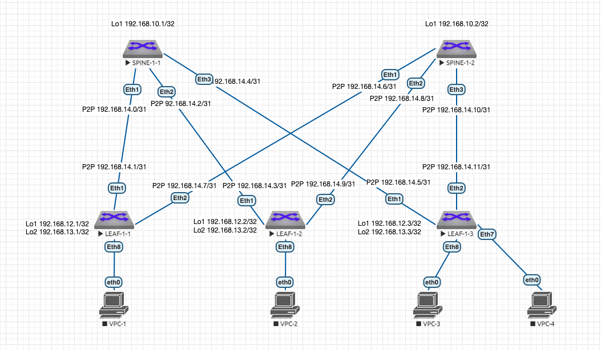

# Лабораторная работа 4 "Underlay. BGP"
## Описание принципа выделения адресного пространства Underlay сети:
Порядковый номер Датацентра - DC N (Нумерация начинается с 1. "0" зарезервирован)

Loopback /32

P2P Subnets /31

loopbacks1 - Spine N-X 192.168.N0.X

loopbacks2 - Spine N-X 192.168.N1.X (зарезервирован для multicast или иных технических нужд)

loopbacks1 - Leaf N-X 192.168.N2.X

loopbacks2 - Leaf N-X 192.168.N3.X (для VTEP)

P2P 192.168.N[4-7].X/31 (Меньшее число всегда идет на Spine)

reserved 192.168.N[8-9] (зарезервированы для дальнейшего использования)

## Схема сети:



## Таблица адресов:
| Подсеть ipv4 | Device/Port|    Описание   |
|--------------|:----------:| -----------------:|
| 192.168.10.1/32  | Spine-1-1/Lo1 |     Loopback1     |
| 192.168.10.2/32  | Spine-1-2/Lo1 |     Loopback1     |
| 192.168.12.1/32  |  Leaf-1-1/Lo1 |     Loopback1     |
| 192.168.13.1/32  |  Leaf-1-1/Lo2 |     Loopback2     |
| 192.168.12.2/32  |  Leaf-1-2/Lo1 |     Loopback1     |
| 192.168.13.2/32  |  Leaf-1-2/Lo2 |     Loopback2     |
| 192.168.12.3/32  |  Leaf-1-3/Lo1 |     Loopback1     |
| 192.168.13.3/32  |  Leaf-1-3/Lo2 |     Loopback2     |
| 192.168.14.0/31  |  Spine-1-1 Eth1 |     P2P Spine 1-1 to Leaf 1-1    |
| 192.168.14.1/31  |  Leaf-1-1 Eth1 |     P2P Spine 1-1 to Leaf 1-1    |
| 192.168.14.2/31  |  Spine-1-1 Eth2 |     P2P Spine 1-1 to Leaf 1-2    |
| 192.168.14.3/31  |  Leaf-1-2 Eth1 |     P2P Spine 1-1 to Leaf 1-2    |
| 192.168.14.4/31  |  Spine-1-1 Eth3 |     P2P Spine 1-1 to Leaf 1-3    |
| 192.168.14.5/31  |  Leaf-1-3 Eth1 |     P2P Spine 1-1 to Leaf 1-3    |
| 192.168.14.6/31  |  Spine-1-2 Eth1 |     P2P Spine 1-2 to Leaf 1-1    |
| 192.168.14.7/31  |  Leaf-1-1 Eth2 |     P2P Spine 1-2 to Leaf 1-1    |
| 192.168.14.8/31  |  Spine-1-2 Eth2 |     P2P Spine 1-2 to Leaf 1-2    |
| 192.168.14.9/31  |  Leaf-1-2 Eth2 |     P2P Spine 1-2 to Leaf 1-2    |
| 192.168.14.10/31  |  Spine-1-2 Eth3 |     P2P Spine 1-2 to Leaf 1-3    |
| 192.168.14.11/31  |  Leaf-1-3 Eth2 |     P2P Spine 1-2 to Leaf 1-3    |

## Настройки коммутаторов:
### Типовая конфигурация процесса BGP Spine:
```console
router bgp 65000
   router-id <IP loopback1>
   no bgp default ipv4-unicast
   no bgp default ipv6-unicast
   bgp log-neighbor-changes
   distance bgp 20 200 200
  
   neighbor LEAFS peer group
   neighbor LEAFS next-hop-self
   neighbor LEAFS bfd
   neighbor LEAFS remote-as 65000
   neighbor LEAFS route-reflector-client
   neighbor LEAFS rib-in pre-policy retain all
   neighbor LEAFS password 0 test123
   neighbor LEAFS send-community standard extended

   neighbor <LEAF PtP IP> peer group LEAFS

   address-family ipv4
   network <Loopback1>
   neighbor <LEAF PtP IP> activate
   
```
### Типовая конфигурация процесса BGP Leaf:
```console
router bgp 65000
   router-id <IP loopback1>
   no bgp default ipv4-unicast
   no bgp default ipv6-unicast
   bgp log-neighbor-changes
   distance bgp 20 200 200
   maximum-paths 4 ecmp 4

   neighbor SPINE peer group
   neighbor SPINE next-hop-self
   neighbor SPINE bfd
   neighbor SPINE remote-as 65000
   neighbor SPINE rib-in pre-policy retain all
   neighbor SPINE password 0 test123
   neighbor SPINE send-community standard extended

   neighbor <SPINE PtP IP> peer group SPINE

   address-family ipv4 
   network <Loopback1>
   neighbor <SPINE PtP IP> activate
```
### SPINE-1-1:
```console
!
hostname SPINE-1-1
!
interface Ethernet1
   description LEAF-1-1 Eth1
   no switchport
   ip address 192.168.14.0/31
   bfd interval 700 min-rx 500 multiplier 3
!
interface Ethernet2
   description LEAF-1-2 Eth1
   no switchport
   ip address 192.168.14.2/31
   bfd interval 700 min-rx 500 multiplier 3
!
interface Ethernet3
   description LEAF-1-3 Eth1
   no switchport
   ip address 192.168.14.4/31
   bfd interval 700 min-rx 500 multiplier 3
!
interface Loopback1
   ip address 192.168.10.1/32
!
ip routing
!
router bgp 65000
   router-id 192.168.10.1
   no bgp default ipv4-unicast
   distance bgp 20 200 200
   neighbor LEAFS peer group
   neighbor LEAFS remote-as 65000
   neighbor LEAFS next-hop-self
   neighbor LEAFS bfd
   neighbor LEAFS rib-in pre-policy retain all
   neighbor LEAFS route-reflector-client
   neighbor LEAFS password 7 1RuAvIkzlaIS2dTpf+q14g==
   neighbor LEAFS send-community standard extended
   neighbor 192.168.14.1 peer group LEAFS
   neighbor 192.168.14.3 peer group LEAFS
   neighbor 192.168.14.5 peer group LEAFS
   !
   address-family ipv4
      neighbor 192.168.14.1 activate
      neighbor 192.168.14.3 activate
      neighbor 192.168.14.5 activate
      network 192.168.10.1/32
!
```
### SPINE-1-2:
```console
!
hostname SPINE-1-2
!
spanning-tree mode mstp
!
interface Ethernet1
   description LEAF-1-1 Eth2
   no switchport
   ip address 192.168.14.6/31
   bfd interval 700 min-rx 500 multiplier 3
!
interface Ethernet2
   description LEAF-1-2 Eth2
   no switchport
   ip address 192.168.14.8/31
   bfd interval 700 min-rx 500 multiplier 3
!
interface Ethernet3
   description LEAF-1-3 Eth2
   no switchport
   ip address 192.168.14.10/31
   bfd interval 700 min-rx 500 multiplier 3
!
interface Loopback1
   ip address 192.168.10.2/32
!
ip routing
!
router bgp 65000
   router-id 192.168.10.2
   no bgp default ipv4-unicast
   distance bgp 20 200 200
   neighbor LEAFS peer group
   neighbor LEAFS remote-as 65000
   neighbor LEAFS next-hop-self
   neighbor LEAFS bfd
   neighbor LEAFS rib-in pre-policy retain all
   neighbor LEAFS route-reflector-client
   neighbor LEAFS password 7 1RuAvIkzlaIS2dTpf+q14g==
   neighbor LEAFS send-community standard extended
   neighbor 192.168.14.7 peer group LEAFS
   neighbor 192.168.14.9 peer group LEAFS
   neighbor 192.168.14.11 peer group LEAFS
   !
   address-family ipv4
      neighbor 192.168.14.7 activate
      neighbor 192.168.14.9 activate
      neighbor 192.168.14.11 activate
      network 192.168.10.2/32
!
```
### LEAF-1-1:
```console
!
hostname LEAF-1-1
!
interface Ethernet1
   description SPINE-1-1 Eth1
   no switchport
   ip address 192.168.14.1/31
   bfd interval 700 min-rx 500 multiplier 3
!
interface Ethernet2
   description SPINE-1-2 Eth1
   no switchport
   ip address 192.168.14.7/31
   bfd interval 700 min-rx 500 multiplier 3
!
interface Loopback1
   ip address 192.168.12.1/32
!
interface Loopback2
   ip address 192.168.13.1/32
!
ip routing
!
router bgp 65000
   router-id 192.168.12.1
   no bgp default ipv4-unicast
   distance bgp 20 200 200
   maximum-paths 4 ecmp 4
   neighbor SPINE peer group
   neighbor SPINE remote-as 65000
   neighbor SPINE next-hop-self
   neighbor SPINE bfd
   neighbor SPINE rib-in pre-policy retain all
   neighbor SPINE password 7 hFVifvPlyMlVDYT87k+lyg==
   neighbor SPINE send-community standard extended
   neighbor 192.168.14.0 peer group SPINE
   neighbor 192.168.14.6 peer group SPINE
   !
   address-family ipv4
      neighbor 192.168.14.0 activate
      neighbor 192.168.14.6 activate
      network 192.168.12.1/32
      network 192.168.13.1/32
!
```
### LEAF-1-2:
```console
!
hostname LEAF-1-2
!
interface Ethernet1
   description SPINE-1-1 Eth2
   no switchport
   ip address 192.168.14.3/31
   bfd interval 700 min-rx 500 multiplier 3
!
interface Ethernet2
   description SPINE-1-2 Eth2
   no switchport
   ip address 192.168.14.9/31
   bfd interval 700 min-rx 500 multiplier 3
!
interface Loopback1
   ip address 192.168.12.2/32
!
interface Loopback2
   ip address 192.168.13.2/32
!
ip routing
!
router bgp 65000
   router-id 192.168.12.2
   no bgp default ipv4-unicast
   distance bgp 20 200 200
   maximum-paths 4 ecmp 4
   neighbor SPINE peer group
   neighbor SPINE remote-as 65000
   neighbor SPINE next-hop-self
   neighbor SPINE bfd
   neighbor SPINE rib-in pre-policy retain all
   neighbor SPINE password 7 hFVifvPlyMlVDYT87k+lyg==
   neighbor SPINE send-community standard extended
   neighbor 192.168.14.2 peer group SPINE
   neighbor 192.168.14.8 peer group SPINE
   !
   address-family ipv4
      neighbor 192.168.14.2 activate
      neighbor 192.168.14.8 activate
      network 192.168.12.2/32
      network 192.168.13.2/32
!
```
### LEAF-1-3:
```console
!
hostname LEAF-1-3
!
interface Ethernet1
   description SPINE-1-1 Eth3
   no switchport
   ip address 192.168.14.5/31
   bfd interval 700 min-rx 500 multiplier 3
!
interface Ethernet2
   description SPINE-1-2 Eth3
   no switchport
   ip address 192.168.14.11/31
   bfd interval 700 min-rx 500 multiplier 3
!
interface Loopback1
   ip address 192.168.12.3/32
!
interface Loopback2
   ip address 192.168.13.3/32
!
ip routing
!
router bgp 65000
   router-id 192.168.12.3
   no bgp default ipv4-unicast
   distance bgp 20 200 200
   maximum-paths 4 ecmp 4
   neighbor SPINE peer group
   neighbor SPINE remote-as 65000
   neighbor SPINE next-hop-self
   neighbor SPINE bfd
   neighbor SPINE rib-in pre-policy retain all
   neighbor SPINE password 7 hFVifvPlyMlVDYT87k+lyg==
   neighbor SPINE send-community standard extended
   neighbor 192.168.14.4 peer group SPINE
   neighbor 192.168.14.10 peer group SPINE
   !
   address-family ipv4
      neighbor 192.168.14.4 activate
      neighbor 192.168.14.10 activate
      network 192.168.12.3/32
      network 192.168.13.3/32
!
```

## Вывод комманд маршрутизации
### SPINE-1-1:
```console
sh ip route
 C        192.168.10.1/32 is directly connected, Loopback1
 B I      192.168.12.1/32 [200/0] via 192.168.14.1, Ethernet1
 B I      192.168.12.2/32 [200/0] via 192.168.14.3, Ethernet2
 B I      192.168.12.3/32 [200/0] via 192.168.14.5, Ethernet3
 B I      192.168.13.1/32 [200/0] via 192.168.14.1, Ethernet1
 B I      192.168.13.2/32 [200/0] via 192.168.14.3, Ethernet2
 B I      192.168.13.3/32 [200/0] via 192.168.14.5, Ethernet3
 C        192.168.14.0/31 is directly connected, Ethernet1
 C        192.168.14.2/31 is directly connected, Ethernet2
 C        192.168.14.4/31 is directly connected, Ethernet3
!
sh ip bgp summary 
Router identifier 192.168.10.1, local AS number 65000
Neighbor Status Codes: m - Under maintenance
  Neighbor         V  AS           MsgRcvd   MsgSent  InQ OutQ  Up/Down State   PfxRcd PfxAcc
  192.168.14.1     4  65000             34        36    0    0 00:29:08 Estab   2      2
  192.168.14.3     4  65000             23        27    0    0 00:16:34 Estab   2      2
  192.168.14.5     4  65000             19        22    0    0 00:13:51 Estab   2      2
!
ping 192.168.12.1 source 192.168.10.1
PING 192.168.12.1 (192.168.12.1) from 192.168.10.1 : 72(100) bytes of data.
80 bytes from 192.168.12.1: icmp_seq=1 ttl=64 time=8.79 ms
80 bytes from 192.168.12.1: icmp_seq=2 ttl=64 time=6.13 ms
80 bytes from 192.168.12.1: icmp_seq=3 ttl=64 time=8.65 ms
80 bytes from 192.168.12.1: icmp_seq=4 ttl=64 time=6.79 ms
80 bytes from 192.168.12.1: icmp_seq=5 ttl=64 time=11.9 ms

--- 192.168.12.1 ping statistics ---
5 packets transmitted, 5 received, 0% packet loss, time 46ms
rtt min/avg/max/mdev = 6.131/8.468/11.969/2.033 ms, ipg/ewma 11.621/8.736 ms
```
### SPINE-1-2:
```console
sh ip route
 C        192.168.10.2/32 is directly connected, Loopback1
 B I      192.168.12.1/32 [200/0] via 192.168.14.7, Ethernet1
 B I      192.168.12.2/32 [200/0] via 192.168.14.9, Ethernet2
 B I      192.168.12.3/32 [200/0] via 192.168.14.11, Ethernet3
 B I      192.168.13.1/32 [200/0] via 192.168.14.7, Ethernet1
 B I      192.168.13.2/32 [200/0] via 192.168.14.9, Ethernet2
 B I      192.168.13.3/32 [200/0] via 192.168.14.11, Ethernet3
 C        192.168.14.6/31 is directly connected, Ethernet1
 C        192.168.14.8/31 is directly connected, Ethernet2
 C        192.168.14.10/31 is directly connected, Ethernet3
!
sh ip bgp summary 
Router identifier 192.168.10.2, local AS number 65000
Neighbor Status Codes: m - Under maintenance
  Neighbor         V  AS           MsgRcvd   MsgSent  InQ OutQ  Up/Down State   PfxRcd PfxAcc
  192.168.14.7     4  65000             30        35    0    0 00:22:04 Estab   2      2
  192.168.14.9     4  65000             24        27    0    0 00:18:29 Estab   2      2
  192.168.14.11    4  65000             20        22    0    0 00:15:43 Estab   2      2
!
ping 192.168.12.3 source 192.168.10.2
PING 192.168.12.3 (192.168.12.3) from 192.168.10.2 : 72(100) bytes of data.
80 bytes from 192.168.12.3: icmp_seq=1 ttl=64 time=8.64 ms
80 bytes from 192.168.12.3: icmp_seq=2 ttl=64 time=6.53 ms
80 bytes from 192.168.12.3: icmp_seq=3 ttl=64 time=6.10 ms
80 bytes from 192.168.12.3: icmp_seq=4 ttl=64 time=7.00 ms
80 bytes from 192.168.12.3: icmp_seq=5 ttl=64 time=7.72 ms

--- 192.168.12.3 ping statistics ---
5 packets transmitted, 5 received, 0% packet loss, time 47ms
rtt min/avg/max/mdev = 6.101/7.200/8.647/0.906 ms, ipg/ewma 11.785/7.930 ms
```
### LEAF-1-1:
```console
sh ip route
 B I      192.168.10.1/32 [200/0] via 192.168.14.0, Ethernet1
 B I      192.168.10.2/32 [200/0] via 192.168.14.6, Ethernet2
 C        192.168.12.1/32 is directly connected, Loopback1
 B I      192.168.12.2/32 [200/0] via 192.168.14.0, Ethernet1
                                  via 192.168.14.6, Ethernet2
 B I      192.168.12.3/32 [200/0] via 192.168.14.0, Ethernet1
                                  via 192.168.14.6, Ethernet2
 C        192.168.13.1/32 is directly connected, Loopback2
 B I      192.168.13.2/32 [200/0] via 192.168.14.0, Ethernet1
                                  via 192.168.14.6, Ethernet2
 B I      192.168.13.3/32 [200/0] via 192.168.14.0, Ethernet1
                                  via 192.168.14.6, Ethernet2
 C        192.168.14.0/31 is directly connected, Ethernet1
 C        192.168.14.6/31 is directly connected, Ethernet2
!
sh ip bgp summary 
BGP summary information for VRF default
Router identifier 192.168.12.1, local AS number 65000
Neighbor Status Codes: m - Under maintenance
  Neighbor         V  AS           MsgRcvd   MsgSent  InQ OutQ  Up/Down State   PfxRcd PfxAcc
  192.168.14.0     4  65000             40        39    0    0 00:32:27 Estab   5      5
  192.168.14.6     4  65000             30        28    0    0 00:23:28 Estab   5      5
!
sh ip bgp 192.168.13.3
BGP routing table information for VRF default
Router identifier 192.168.12.1, local AS number 65000
BGP routing table entry for 192.168.13.3/32
 Paths: 2 available
  Local
    192.168.14.0 from 192.168.14.0 (192.168.10.1)
      Origin IGP, metric 0, localpref 100, IGP metric 1, weight 0, received 00:18:31 ago, valid, internal, ECMP head, ECMP, best, ECMP contributor
      Originator: 192.168.12.3, Cluster list: 192.168.10.1
      Rx SAFI: Unicast
  Local
    192.168.14.6 from 192.168.14.6 (192.168.10.2)
      Origin IGP, metric 0, localpref 100, IGP metric 1, weight 0, received 00:18:28 ago, valid, internal, ECMP, ECMP contributor
      Originator: 192.168.12.3, Cluster list: 192.168.10.2
      Rx SAFI: Unicast
!
ping 192.168.12.3 source 192.168.12.1
PING 192.168.12.3 (192.168.12.3) from 192.168.12.1 : 72(100) bytes of data.
80 bytes from 192.168.12.3: icmp_seq=1 ttl=63 time=24.5 ms
80 bytes from 192.168.12.3: icmp_seq=2 ttl=63 time=24.9 ms
80 bytes from 192.168.12.3: icmp_seq=3 ttl=63 time=20.5 ms
80 bytes from 192.168.12.3: icmp_seq=4 ttl=63 time=21.7 ms
80 bytes from 192.168.12.3: icmp_seq=5 ttl=63 time=15.0 ms

--- 192.168.12.3 ping statistics ---
5 packets transmitted, 5 received, 0% packet loss, time 95ms
rtt min/avg/max/mdev = 15.001/21.358/24.902/3.583 ms, pipe 2, ipg/ewma 23.964/22.718 ms

ping 192.168.13.3 source 192.168.13.1
PING 192.168.13.3 (192.168.13.3) from 192.168.13.1 : 72(100) bytes of data.
80 bytes from 192.168.13.3: icmp_seq=1 ttl=63 time=27.9 ms
80 bytes from 192.168.13.3: icmp_seq=2 ttl=63 time=18.0 ms
80 bytes from 192.168.13.3: icmp_seq=3 ttl=63 time=22.0 ms
80 bytes from 192.168.13.3: icmp_seq=4 ttl=63 time=35.7 ms
80 bytes from 192.168.13.3: icmp_seq=5 ttl=63 time=20.0 ms

--- 192.168.13.3 ping statistics ---
5 packets transmitted, 5 received, 0% packet loss, time 92ms
rtt min/avg/max/mdev = 18.080/24.776/35.734/6.409 ms, pipe 2, ipg/ewma 23.121/26.439 ms
```
### LEAF-1-2:
```console
sh ip route
 B I      192.168.10.1/32 [200/0] via 192.168.14.2, Ethernet1
 B I      192.168.10.2/32 [200/0] via 192.168.14.8, Ethernet2
 B I      192.168.12.1/32 [200/0] via 192.168.14.2, Ethernet1
                                  via 192.168.14.8, Ethernet2
 C        192.168.12.2/32 is directly connected, Loopback1
 B I      192.168.12.3/32 [200/0] via 192.168.14.2, Ethernet1
                                  via 192.168.14.8, Ethernet2
 B I      192.168.13.1/32 [200/0] via 192.168.14.2, Ethernet1
                                  via 192.168.14.8, Ethernet2
 C        192.168.13.2/32 is directly connected, Loopback2
 B I      192.168.13.3/32 [200/0] via 192.168.14.2, Ethernet1
                                  via 192.168.14.8, Ethernet2
 C        192.168.14.2/31 is directly connected, Ethernet1
 C        192.168.14.8/31 is directly connected, Ethernet2
!
sh ip bgp summary 
Router identifier 192.168.12.2, local AS number 65000
Neighbor Status Codes: m - Under maintenance
  Neighbor         V  AS           MsgRcvd   MsgSent  InQ OutQ  Up/Down State   PfxRcd PfxAcc
  192.168.14.2     4  65000             31        29    0    0 00:22:00 Estab   5      5
  192.168.14.8     4  65000             29        27    0    0 00:22:00 Estab   5      5
!
sh ip bgp neighbors 192.168.14.2 received-routes 
Router identifier 192.168.12.2, local AS number 65000
         Network                Next Hop            Metric  LocPref Weight  Path
 * >     192.168.10.1/32        192.168.14.2          -       100     -       i
 * >Ec   192.168.12.1/32        192.168.14.2          -       100     -       i Or-ID: 192.168.12.1 C-LST: 192.168.10.1
 * >Ec   192.168.12.3/32        192.168.14.2          -       100     -       i Or-ID: 192.168.12.3 C-LST: 192.168.10.1
 * >Ec   192.168.13.1/32        192.168.14.2          -       100     -       i Or-ID: 192.168.12.1 C-LST: 192.168.10.1
 * >Ec   192.168.13.3/32        192.168.14.2          -       100     -       i Or-ID: 192.168.12.3 C-LST: 192.168.10.1
!
sh ip bgp 192.168.13.3
Router identifier 192.168.12.2, local AS number 65000
BGP routing table entry for 192.168.13.3/32
 Paths: 2 available
  Local
    192.168.14.2 from 192.168.14.2 (192.168.10.1)
      Origin IGP, metric 0, localpref 100, IGP metric 1, weight 0, received 00:21:18 ago, valid, internal, ECMP head, ECMP, best, ECMP contributor
      Originator: 192.168.12.3, Cluster list: 192.168.10.1
      Rx SAFI: Unicast
  Local
    192.168.14.8 from 192.168.14.8 (192.168.10.2)
      Origin IGP, metric 0, localpref 100, IGP metric 1, weight 0, received 00:21:15 ago, valid, internal, ECMP, ECMP contributor
      Originator: 192.168.12.3, Cluster list: 192.168.10.2
      Rx SAFI: Unicast
!
ping 192.168.12.1 source 192.168.12.2
PING 192.168.12.1 (192.168.12.1) from 192.168.12.2 : 72(100) bytes of data.
80 bytes from 192.168.12.1: icmp_seq=1 ttl=63 time=18.9 ms
80 bytes from 192.168.12.1: icmp_seq=2 ttl=63 time=39.3 ms
80 bytes from 192.168.12.1: icmp_seq=3 ttl=63 time=23.4 ms
80 bytes from 192.168.12.1: icmp_seq=4 ttl=63 time=17.7 ms
80 bytes from 192.168.12.1: icmp_seq=5 ttl=63 time=14.7 ms

--- 192.168.12.1 ping statistics ---
5 packets transmitted, 5 received, 0% packet loss, time 77ms
rtt min/avg/max/mdev = 14.711/22.834/39.346/8.724 ms, pipe 2, ipg/ewma 19.425/20.409 ms

ping 192.168.13.3 source 192.168.13.2
PING 192.168.13.3 (192.168.13.3) from 192.168.13.2 : 72(100) bytes of data.
80 bytes from 192.168.13.3: icmp_seq=1 ttl=63 time=20.8 ms
80 bytes from 192.168.13.3: icmp_seq=2 ttl=63 time=19.1 ms
80 bytes from 192.168.13.3: icmp_seq=3 ttl=63 time=19.7 ms
80 bytes from 192.168.13.3: icmp_seq=4 ttl=63 time=22.5 ms
80 bytes from 192.168.13.3: icmp_seq=5 ttl=63 time=25.4 ms

--- 192.168.13.3 ping statistics ---
5 packets transmitted, 5 received, 0% packet loss, time 78ms
rtt min/avg/max/mdev = 19.156/21.546/25.422/2.257 ms, pipe 2, ipg/ewma 19.620/21.358 ms
```
### LEAF-1-3:
```console
sh ip route
 B I      192.168.10.1/32 [200/0] via 192.168.14.4, Ethernet1
 B I      192.168.10.2/32 [200/0] via 192.168.14.10, Ethernet2
 B I      192.168.12.1/32 [200/0] via 192.168.14.4, Ethernet1
                                  via 192.168.14.10, Ethernet2
 B I      192.168.12.2/32 [200/0] via 192.168.14.4, Ethernet1
                                  via 192.168.14.10, Ethernet2
 C        192.168.12.3/32 is directly connected, Loopback1
 B I      192.168.13.1/32 [200/0] via 192.168.14.4, Ethernet1
                                  via 192.168.14.10, Ethernet2
 B I      192.168.13.2/32 [200/0] via 192.168.14.4, Ethernet1
                                  via 192.168.14.10, Ethernet2
 C        192.168.13.3/32 is directly connected, Loopback2
 C        192.168.14.4/31 is directly connected, Ethernet1
 C        192.168.14.10/31 is directly connected, Ethernet2
!
sh ip bgp summary 
Router identifier 192.168.12.3, local AS number 65000
Neighbor Status Codes: m - Under maintenance
  Neighbor         V  AS           MsgRcvd   MsgSent  InQ OutQ  Up/Down State   PfxRcd PfxAcc
  192.168.14.4     4  65000             30        28    0    0 00:23:50 Estab   5      5
  192.168.14.10    4  65000             30        28    0    0 00:23:47 Estab   5      5
!
sh ip bgp 192.168.13.1
Router identifier 192.168.12.3, local AS number 65000
BGP routing table entry for 192.168.13.1/32
 Paths: 2 available
  Local
    192.168.14.4 from 192.168.14.4 (192.168.10.1)
      Origin IGP, metric 0, localpref 100, IGP metric 1, weight 0, received 00:24:09 ago, valid, internal, ECMP head, ECMP, best, ECMP contributor
      Originator: 192.168.12.1, Cluster list: 192.168.10.1
      Rx SAFI: Unicast
  Local
    192.168.14.10 from 192.168.14.10 (192.168.10.2)
      Origin IGP, metric 0, localpref 100, IGP metric 1, weight 0, received 00:24:06 ago, valid, internal, ECMP, ECMP contributor
      Originator: 192.168.12.1, Cluster list: 192.168.10.2
      Rx SAFI: Unicast
!
ping 192.168.12.1 source 192.168.12.3
PING 192.168.12.1 (192.168.12.1) from 192.168.12.3 : 72(100) bytes of data.
80 bytes from 192.168.12.1: icmp_seq=1 ttl=63 time=16.7 ms
80 bytes from 192.168.12.1: icmp_seq=2 ttl=63 time=74.3 ms

--- 192.168.12.1 ping statistics ---
5 packets transmitted, 2 received, 60% packet loss, time 66ms
rtt min/avg/max/mdev = 16.793/45.588/74.384/28.796 ms, pipe 4, ipg/ewma 16.744/23.991 ms

ping 192.168.13.1 source 192.168.13.3
PING 192.168.13.1 (192.168.13.1) from 192.168.13.3 : 72(100) bytes of data.
80 bytes from 192.168.13.1: icmp_seq=1 ttl=63 time=21.0 ms
80 bytes from 192.168.13.1: icmp_seq=2 ttl=63 time=19.3 ms
80 bytes from 192.168.13.1: icmp_seq=3 ttl=63 time=16.3 ms
80 bytes from 192.168.13.1: icmp_seq=4 ttl=63 time=25.5 ms
80 bytes from 192.168.13.1: icmp_seq=5 ttl=63 time=22.8 ms

--- 192.168.13.1 ping statistics ---
5 packets transmitted, 5 received, 0% packet loss, time 77ms
rtt min/avg/max/mdev = 16.350/21.035/25.562/3.115 ms, pipe 2, ipg/ewma 19.295/21.182 ms
```