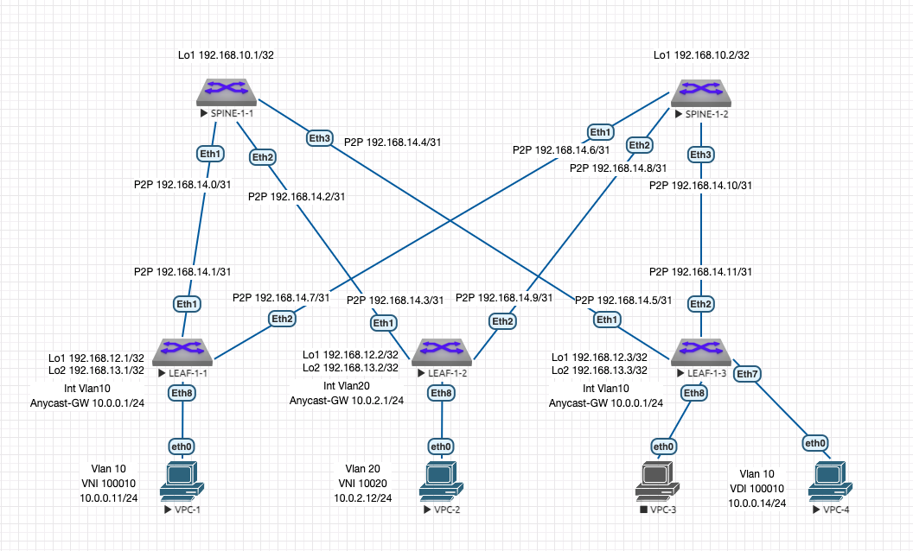

# Лабораторная работа 6 "VxLAN. L3 VNI"
## Описание принципа выделения адресного пространства Underlay сети:
Порядковый номер Датацентра - DC N (Нумерация начинается с 1. "0" зарезервирован)

Loopback /32

P2P Subnets /31

loopbacks1 - Spine N-X 192.168.N0.X

loopbacks2 - Spine N-X 192.168.N1.X (зарезервирован для multicast или иных технических нужд)

loopbacks1 - Leaf N-X 192.168.N2.X

loopbacks2 - Leaf N-X 192.168.N3.X (для VTEP)

P2P 192.168.N[4-7].X/31 (Меньшее число всегда идет на Spine)

reserved 192.168.N[8-9] (зарезервированы для дальнейшего использования)

## Описание VLAN, VNI, RD и RT:
VNI генерится на основе номера Влана в Датацентре: N0<VLAN ID в 4 значном формате>, где N это порядковый номер Датацентра.

RD генерится путем составления номера AS и VNI - AS:VNI

RT на импорт и экспорт по умолчанию генерится из номера AS и VNI - AS:VNI

VRF нумеруются в соответсвии с подразделениями по порядку начиная с 1.

Им присваивается VNI для L3 маршрутиазции по формуле 1<Номер подразделения дополненный до трехзначного значения>.

Например для подразделения 1 - L3 VNI 1001

RD - 65000:1001

RT - 65000:1001

## Описание адресного пространства Overlay сети:

Создан 1 Влан для серверов 1 Сервиса - Vlan 10 - Service1 - VNI 100010 10.0.0.0/24

Создан 2 Влан для серверов 2 Сервиса - Vlan 20 - Service1 - VNI 100020 10.0.2.0/24

Так как мы используем для Датацентра 1 iBGP с номером AS 65000 получаем:

RD - 65000:100010

RT - 65000:100010

## Схема сети:



## Таблица адресов:
| Подсеть ipv4 | Device/Port|    Описание   |
|--------------|:----------:| -----------------:|
| 192.168.10.1/32  | Spine-1-1/Lo1 |     Loopback1     |
| 192.168.10.2/32  | Spine-1-2/Lo1 |     Loopback1     |
| 192.168.12.1/32  |  Leaf-1-1/Lo1 |     Loopback1     |
| 192.168.13.1/32  |  Leaf-1-1/Lo2 |     Loopback2     |
| 192.168.12.2/32  |  Leaf-1-2/Lo1 |     Loopback1     |
| 192.168.13.2/32  |  Leaf-1-2/Lo2 |     Loopback2     |
| 192.168.12.3/32  |  Leaf-1-3/Lo1 |     Loopback1     |
| 192.168.13.3/32  |  Leaf-1-3/Lo2 |     Loopback2     |
| 192.168.14.0/31  |  Spine-1-1 Eth1 |     P2P Spine 1-1 to Leaf 1-1    |
| 192.168.14.1/31  |  Leaf-1-1 Eth1 |     P2P Spine 1-1 to Leaf 1-1    |
| 192.168.14.2/31  |  Spine-1-1 Eth2 |     P2P Spine 1-1 to Leaf 1-2    |
| 192.168.14.3/31  |  Leaf-1-2 Eth1 |     P2P Spine 1-1 to Leaf 1-2    |
| 192.168.14.4/31  |  Spine-1-1 Eth3 |     P2P Spine 1-1 to Leaf 1-3    |
| 192.168.14.5/31  |  Leaf-1-3 Eth1 |     P2P Spine 1-1 to Leaf 1-3    |
| 192.168.14.6/31  |  Spine-1-2 Eth1 |     P2P Spine 1-2 to Leaf 1-1    |
| 192.168.14.7/31  |  Leaf-1-1 Eth2 |     P2P Spine 1-2 to Leaf 1-1    |
| 192.168.14.8/31  |  Spine-1-2 Eth2 |     P2P Spine 1-2 to Leaf 1-2    |
| 192.168.14.9/31  |  Leaf-1-2 Eth2 |     P2P Spine 1-2 to Leaf 1-2    |
| 192.168.14.10/31  |  Spine-1-2 Eth3 |     P2P Spine 1-2 to Leaf 1-3    |
| 192.168.14.11/31  |  Leaf-1-3 Eth2 |     P2P Spine 1-2 to Leaf 1-3    |

## Настройки коммутаторов:
Использованы шаблоны для ускорения настройки:

SPINE - Underlay BGP на LEAF в сторону SPINE.

LEAFS - Underlay BGP на SPINE в торону LEAF.

OVERLAY - на LEAF и SPINE для настройки EVPN.

Для упрощения настройки SPINE использованы комманды bgp listen range. 
Что позволяет уйти от ручного указания IP всех соседствующих LEAF.

### Типовая конфигурация процесса BGP Spine UNDERLAY:
```console
router bgp 65000
   router-id <IP Loopback1>
   no bgp default ipv4-unicast
   distance bgp 20 200 200
   bgp listen range 192.168.14.0/24 peer-group LEAFS remote-as 65000
   neighbor LEAFS peer group
   neighbor LEAFS remote-as 65000
   neighbor LEAFS next-hop-self
   neighbor LEAFS bfd
   neighbor LEAFS rib-in pre-policy retain all
   neighbor LEAFS route-reflector-client
   neighbor LEAFS password 7 1RuAvIkzlaIS2dTpf+q14g==
   neighbor LEAFS send-community standard extended

   address-family ipv4
      neighbor LEAFS activate
      network <IP Loopback1>

```
### Типовая конфигурация процесса BGP Spine OVERLAY:
```console
service routing protocols model multi-agent

router bgp 65000
   bgp listen range 192.168.12.0/24 peer-group OVERLAY remote-as 65000
   neighbor OVERLAY peer group
   neighbor OVERLAY update-source Loopback1
   neighbor OVERLAY route-reflector-client
   neighbor OVERLAY password 7 rXi9hgRNfLyRVaxnuxy+/Q==
   neighbor OVERLAY send-community extended

   address-family evpn
      neighbor OVERLAY activate
   
```
### Типовая конфигурация процесса BGP Leaf UNDERLAY:
```console
router bgp 65000
   router-id <IP Loopback1>
   no bgp default ipv4-unicast
   distance bgp 20 200 200
   maximum-paths 4 ecmp 4
   neighbor SPINE peer group
   neighbor SPINE remote-as 65000
   neighbor SPINE next-hop-self
   neighbor SPINE bfd
   neighbor SPINE rib-in pre-policy retain all
   neighbor SPINE password 7 hFVifvPlyMlVDYT87k+lyg==
   neighbor SPINE send-community standard extended

   neighbor <SPINE1 PtP IP> peer group SPINE
   neighbor <SPINE2 PtP IP> peer group SPINE

   address-family ipv4
      neighbor SPINE activate
      network <IP Loopback1>
      network <IP Loopback2>
```

### Типовая конфигурация процесса BGP Leaf OVERLAY:
```console
service routing protocols model multi-agent

router bgp 65000
   neighbor OVERLAY peer group
   neighbor OVERLAY remote-as 65000
   neighbor OVERLAY update-source Loopback1
   neighbor OVERLAY password 7 rXi9hgRNfLyRVaxnuxy+/Q==
   neighbor OVERLAY send-community extended

   neighbor <SPINE IP Loopback1> peer group OVERLAY
   neighbor <SPINE IP Loopback2> peer group OVERLAY

   address-family evpn
      neighbor OVERLAY activate

```
### Типовая конфигурация процесса BGP Leaf VXLAN:
```console
interface Vxlan1
   vxlan source-interface Loopback2
   vxlan udp-port 4789
   vxlan vlan <VLAN ID> vni <VNI ID>
   vxlan learn-restrict any

router bgp 65000
  vlan <VLAN ID>
      rd <AS:VNI>
      route-target both <AS:VNI>
      redistribute learned

```
### Типовая конфигурация VRF и SVI под Подразделение:
```console
!
vrf instance <TENANT1>
!
ip routing vrf <TENANT1>
!
interface Vxlan1
   vxlan vrf <TENANT1> vni <номер VNI>
!
router bgp 65000
   vrf <TENANT1>
      rd <AS:VNI>
      route-target import evpn <AS:VNI>
      route-target export evpn <AS:VNI>
      redistribute connected
!
interface Vlan <Номер VLAN>
   description <TENANT1_SERVICE1>
   vrf <TENANT1>
   ip address virtual <IP>

```

### SPINE-1-1:
```console
!
service routing protocols model multi-agent
!
hostname SPINE-1-1
!
interface Ethernet1
   description LEAF-1-1 Eth1
   no switchport
   ip address 192.168.14.0/31
   bfd interval 700 min-rx 500 multiplier 3
!
interface Ethernet2
   description LEAF-1-2 Eth1
   no switchport
   ip address 192.168.14.2/31
   bfd interval 700 min-rx 500 multiplier 3
!
interface Ethernet3
   description LEAF-1-3 Eth1
   no switchport
   ip address 192.168.14.4/31
   bfd interval 700 min-rx 500 multiplier 3
!
interface Loopback1
   ip address 192.168.10.1/32
!
ip routing
!
router bgp 65000
   router-id 192.168.10.1
   no bgp default ipv4-unicast
   distance bgp 20 200 200
   bgp listen range 192.168.14.0/24 peer-group LEAFS remote-as 65000
   bgp listen range 192.168.12.0/24 peer-group OVERLAY remote-as 65000
   neighbor LEAFS peer group
   neighbor LEAFS remote-as 65000
   neighbor LEAFS next-hop-self
   neighbor LEAFS bfd
   neighbor LEAFS rib-in pre-policy retain all
   neighbor LEAFS route-reflector-client
   neighbor LEAFS password 7 1RuAvIkzlaIS2dTpf+q14g==
   neighbor LEAFS send-community standard extended
   neighbor OVERLAY peer group
   neighbor OVERLAY update-source Loopback1
   neighbor OVERLAY route-reflector-client
   neighbor OVERLAY password 7 rXi9hgRNfLyRVaxnuxy+/Q==
   neighbor OVERLAY send-community extended
   !
   address-family evpn
      neighbor OVERLAY activate
   !
   address-family ipv4
      neighbor LEAFS activate
      network 192.168.10.1/32
!
```
### SPINE-1-2:
```console
!
service routing protocols model multi-agent
!
hostname SPINE-1-2
!
spanning-tree mode mstp
!
interface Ethernet1
   description LEAF-1-1 Eth2
   no switchport
   ip address 192.168.14.6/31
   bfd interval 700 min-rx 500 multiplier 3
!
interface Ethernet2
   description LEAF-1-2 Eth2
   no switchport
   ip address 192.168.14.8/31
   bfd interval 700 min-rx 500 multiplier 3
!
interface Ethernet3
   description LEAF-1-3 Eth2
   no switchport
   ip address 192.168.14.10/31
   bfd interval 700 min-rx 500 multiplier 3
!
interface Loopback1
   ip address 192.168.10.2/32
!
ip routing
!
router bgp 65000
   router-id 192.168.10.2
   no bgp default ipv4-unicast
   distance bgp 20 200 200
   bgp listen range 192.168.14.0/24 peer-group LEAFS remote-as 65000
   bgp listen range 192.168.12.0/24 peer-group OVERLAY remote-as 65000
   neighbor LEAFS peer group
   neighbor LEAFS remote-as 65000
   neighbor LEAFS next-hop-self
   neighbor LEAFS bfd
   neighbor LEAFS rib-in pre-policy retain all
   neighbor LEAFS route-reflector-client
   neighbor LEAFS password 7 1RuAvIkzlaIS2dTpf+q14g==
   neighbor LEAFS send-community standard extended
   neighbor OVERLAY peer group
   neighbor OVERLAY update-source Loopback1
   neighbor OVERLAY route-reflector-client
   neighbor OVERLAY password 7 rXi9hgRNfLyRVaxnuxy+/Q==
   neighbor OVERLAY send-community extended
   !
   address-family evpn
      neighbor OVERLAY activate
   !
   address-family ipv4
      neighbor LEAFS activate
      network 192.168.10.2/32
!
```
### LEAF-1-1:
```console
!
service routing protocols model multi-agent
!
hostname LEAF-1-1
!
vlan 10
   name Service1
!
vrf instance TENANT1
!
interface Ethernet1
   description SPINE-1-1 Eth1
   no switchport
   ip address 192.168.14.1/31
   bfd interval 700 min-rx 500 multiplier 3
!
interface Ethernet2
   description SPINE-1-2 Eth1
   no switchport
   ip address 192.168.14.7/31
   bfd interval 700 min-rx 500 multiplier 3
!
interface Ethernet8
   description SERVICE1 SRV1
   switchport access vlan 10
!
interface Loopback1
   ip address 192.168.12.1/32
!
interface Loopback2
   ip address 192.168.13.1/32
!
interface Vlan10
   description TENANT1_SERVICE1
   vrf TENANT1
   ip address virtual 10.0.0.1/24
!
interface Vxlan1
   vxlan source-interface Loopback2
   vxlan udp-port 4789
   vxlan vlan 10 vni 100010
   vxlan vrf TENANT1 vni 1001
   vxlan learn-restrict any
!
ip routing
ip routing vrf TENANT1
!
router bgp 65000
   router-id 192.168.12.1
   no bgp default ipv4-unicast
   distance bgp 20 200 200
   maximum-paths 4 ecmp 4
   neighbor OVERLAY peer group
   neighbor OVERLAY remote-as 65000
   neighbor OVERLAY update-source Loopback1
   neighbor OVERLAY password 7 rXi9hgRNfLyRVaxnuxy+/Q==
   neighbor OVERLAY send-community extended
   neighbor SPINE peer group
   neighbor SPINE remote-as 65000
   neighbor SPINE next-hop-self
   neighbor SPINE bfd
   neighbor SPINE rib-in pre-policy retain all
   neighbor SPINE password 7 hFVifvPlyMlVDYT87k+lyg==
   neighbor SPINE send-community standard extended
   neighbor 192.168.10.1 peer group OVERLAY
   neighbor 192.168.10.2 peer group OVERLAY
   neighbor 192.168.14.0 peer group SPINE
   neighbor 192.168.14.6 peer group SPINE
   !
   vlan 10
      rd 65000:100010
      route-target both 65000:100010
      redistribute learned
   !
   address-family evpn
      neighbor OVERLAY activate
   !
   address-family ipv4
      neighbor SPINE activate
      network 192.168.12.1/32
      network 192.168.13.1/32
   !
   vrf TENANT1
      rd 65000:1001
      route-target import evpn 65000:1001
      route-target export evpn 65000:1001
      redistribute connected
!
```
### LEAF-1-2:
```console
!
service routing protocols model multi-agent
!
hostname LEAF-1-2
!
vlan 20
   name Service2
!
vrf instance TENANT1
!
interface Ethernet1
   description SPINE-1-1 Eth2
   no switchport
   ip address 192.168.14.3/31
   bfd interval 700 min-rx 500 multiplier 3
!
interface Ethernet2
   description SPINE-1-2 Eth2
   no switchport
   ip address 192.168.14.9/31
   bfd interval 700 min-rx 500 multiplier 3
!
interface Ethernet8
   description SERVICE2 SRV1
   switchport access vlan 20
!
interface Loopback1
   ip address 192.168.12.2/32
!
interface Loopback2
   ip address 192.168.13.2/32
!
interface Vlan20
   description TENANTANT1_SERVICE2
   vrf TENANT1
   ip address virtual 10.0.2.1/24
!
interface Vxlan1
   vxlan source-interface Loopback2
   vxlan udp-port 4789
   vxlan vlan 10 vni 100010
   vxlan vrf TENANT1 vni 1001
   vxlan learn-restrict any
!
ip routing
ip routing vrf TENANT1
!
router bgp 65000
   router-id 192.168.12.2
   no bgp default ipv4-unicast
   distance bgp 20 200 200
   maximum-paths 4 ecmp 4
   neighbor OVERLAY peer group
   neighbor OVERLAY remote-as 65000
   neighbor OVERLAY update-source Loopback1
   neighbor OVERLAY password 7 rXi9hgRNfLyRVaxnuxy+/Q==
   neighbor OVERLAY send-community extended
   neighbor SPINE peer group
   neighbor SPINE remote-as 65000
   neighbor SPINE next-hop-self
   neighbor SPINE bfd
   neighbor SPINE rib-in pre-policy retain all
   neighbor SPINE password 7 hFVifvPlyMlVDYT87k+lyg==
   neighbor SPINE send-community standard extended
   neighbor 192.168.10.1 peer group OVERLAY
   neighbor 192.168.10.2 peer group OVERLAY
   neighbor 192.168.14.2 peer group SPINE
   neighbor 192.168.14.8 peer group SPINE
   !
   vlan 20
      rd 65000:100020
      route-target both 65000:100020
      redistribute learned
   !
   address-family evpn
      neighbor OVERLAY activate
   !
   address-family ipv4
      neighbor SPINE activate
      network 192.168.12.2/32
      network 192.168.13.2/32
   !
   vrf TENANT1
      rd 65000:1001
      route-target import evpn 65000:1001
      route-target export evpn 65000:1001
      redistribute connected
!
```
### LEAF-1-3:
```console
!
service routing protocols model multi-agent
!
hostname LEAF-1-3
!
vlan 10
   name Service1
!
vrf instance TENANT1
!
interface Ethernet1
   description SPINE-1-1 Eth3
   no switchport
   ip address 192.168.14.5/31
   bfd interval 700 min-rx 500 multiplier 3
!
interface Ethernet2
   description SPINE-1-2 Eth3
   no switchport
   ip address 192.168.14.11/31
   bfd interval 700 min-rx 500 multiplier 3
!
interface Ethernet7
   description SERVICE1 SRV4
   switchport access vlan 10
!
interface Loopback1
   ip address 192.168.12.3/32
!
interface Loopback2
   ip address 192.168.13.3/32
!
interface Vlan10
   description TENANT1_SERVICE1
   vrf TENANT1
   ip address virtual 10.0.0.1/24
!
interface Vxlan1
   vxlan source-interface Loopback2
   vxlan udp-port 4789
   vxlan vlan 10 vni 100010
   vxlan vrf TENANT1 vni 1001
   vxlan learn-restrict any
!
ip routing
ip routing vrf TENANT1
!
router bgp 65000
   router-id 192.168.12.3
   no bgp default ipv4-unicast
   distance bgp 20 200 200
   maximum-paths 4 ecmp 4
   neighbor OVERLAY peer group
   neighbor OVERLAY remote-as 65000
   neighbor OVERLAY update-source Loopback1
   neighbor OVERLAY password 7 rXi9hgRNfLyRVaxnuxy+/Q==
   neighbor OVERLAY send-community extended
   neighbor SPINE peer group
   neighbor SPINE remote-as 65000
   neighbor SPINE next-hop-self
   neighbor SPINE bfd
   neighbor SPINE rib-in pre-policy retain all
   neighbor SPINE password 7 hFVifvPlyMlVDYT87k+lyg==
   neighbor SPINE send-community standard extended
   neighbor 192.168.10.1 peer group OVERLAY
   neighbor 192.168.10.2 peer group OVERLAY
   neighbor 192.168.14.4 peer group SPINE
   neighbor 192.168.14.10 peer group SPINE
   !
   vlan 10
      rd 65000:100010
      route-target both 65000:100010
      redistribute learned
   !
   address-family evpn
      neighbor OVERLAY activate
   !
   address-family ipv4
      neighbor SPINE activate
      network 192.168.12.3/32
      network 192.168.13.3/32
   !
   vrf TENANT1
      rd 65000:1001
      route-target import evpn 65000:1001
      route-target export evpn 65000:1001
      redistribute connected
!
```

## Вывод комманд маршрутизации
### SPINE-1-1:
```console
sh bgp evpn summary
BGP summary information for VRF default
Router identifier 192.168.10.1, local AS number 65000
Neighbor Status Codes: m - Under maintenance
  Neighbor     V AS           MsgRcvd   MsgSent  InQ OutQ  Up/Down State   PfxRcd PfxAcc
  192.168.12.1 4 65000             84        83    0    0 00:56:03 Estab   4      4
  192.168.12.2 4 65000             75        90    0    0 00:55:55 Estab   4      4
  192.168.12.3 4 65000             76        93    0    0 00:55:59 Estab   4      4
```
### SPINE-1-2:
```console
sh bgp evpn summary 
BGP summary information for VRF default
Router identifier 192.168.10.2, local AS number 65000
Neighbor Status Codes: m - Under maintenance
  Neighbor     V AS           MsgRcvd   MsgSent  InQ OutQ  Up/Down State   PfxRcd PfxAcc
  192.168.12.1 4 65000             86        85    0    0 00:56:17 Estab   4      4
  192.168.12.2 4 65000             76        88    0    0 00:56:21 Estab   4      4
  192.168.12.3 4 65000             78        93    0    0 00:56:20 Estab   4      4
```
### LEAF-1-1:
```console
sh vxlan address-table 
          Vxlan Mac Address Table
----------------------------------------------------------------------

VLAN  Mac Address     Type      Prt  VTEP             Moves   Last Move
----  -----------     ----      ---  ----             -----   ---------
  10  0050.7966.6809  EVPN      Vx1  192.168.13.3     1       0:01:21 ago
4094  5000.0003.3766  EVPN      Vx1  192.168.13.2     1       0:09:59 ago
4094  5000.0015.f4e8  EVPN      Vx1  192.168.13.3     1       0:01:21 ago
Total Remote Mac Addresses for this criterion: 3
!
sh bgp evpn 
BGP routing table information for VRF default
Router identifier 192.168.12.1, local AS number 65000
Route status codes: * - valid, > - active, S - Stale, E - ECMP head, e - ECMP
                    c - Contributing to ECMP, % - Pending BGP convergence
Origin codes: i - IGP, e - EGP, ? - incomplete
AS Path Attributes: Or-ID - Originator ID, C-LST - Cluster List, LL Nexthop - Link Local Nexthop

          Network                Next Hop              Metric  LocPref Weight  Path
 * >      RD: 65000:100010 mac-ip 0050.7966.6806
                                 -                     -       -       0       i
 * >      RD: 65000:100010 mac-ip 0050.7966.6806 10.0.0.11
                                 -                     -       -       0       i
 * >Ec    RD: 65000:100020 mac-ip 0050.7966.6807
                                 192.168.13.2          -       100     0       i Or-ID: 192.168.12.2 C-LST: 192.168.10.2 
 *  ec    RD: 65000:100020 mac-ip 0050.7966.6807
                                 192.168.13.2          -       100     0       i Or-ID: 192.168.12.2 C-LST: 192.168.10.1 
 * >Ec    RD: 65000:100020 mac-ip 0050.7966.6807 10.0.2.12
                                 192.168.13.2          -       100     0       i Or-ID: 192.168.12.2 C-LST: 192.168.10.1 
 *  ec    RD: 65000:100020 mac-ip 0050.7966.6807 10.0.2.12
                                 192.168.13.2          -       100     0       i Or-ID: 192.168.12.2 C-LST: 192.168.10.2 
 * >Ec    RD: 65000:100010 mac-ip 0050.7966.6809
                                 192.168.13.3          -       100     0       i Or-ID: 192.168.12.3 C-LST: 192.168.10.2 
 *  ec    RD: 65000:100010 mac-ip 0050.7966.6809
                                 192.168.13.3          -       100     0       i Or-ID: 192.168.12.3 C-LST: 192.168.10.1 
 * >Ec    RD: 65000:100010 mac-ip 0050.7966.6809 10.0.0.14
                                 192.168.13.3          -       100     0       i Or-ID: 192.168.12.3 C-LST: 192.168.10.2 
 *  ec    RD: 65000:100010 mac-ip 0050.7966.6809 10.0.0.14
                                 192.168.13.3          -       100     0       i Or-ID: 192.168.12.3 C-LST: 192.168.10.1 
 * >      RD: 65000:100010 imet 192.168.13.1
                                 -                     -       -       0       i
 * >Ec    RD: 65000:100020 imet 192.168.13.2
                                 192.168.13.2          -       100     0       i Or-ID: 192.168.12.2 C-LST: 192.168.10.1 
 *  ec    RD: 65000:100020 imet 192.168.13.2
                                 192.168.13.2          -       100     0       i Or-ID: 192.168.12.2 C-LST: 192.168.10.2 
 * >Ec    RD: 65000:100010 imet 192.168.13.3
                                 192.168.13.3          -       100     0       i Or-ID: 192.168.12.3 C-LST: 192.168.10.1 
 *  ec    RD: 65000:100010 imet 192.168.13.3
                                 192.168.13.3          -       100     0       i Or-ID: 192.168.12.3 C-LST: 192.168.10.2 
 * >      RD: 65000:1001 ip-prefix 10.0.0.0/24
                                 -                     -       -       0       i
 * >Ec    RD: 65000:1001 ip-prefix 10.0.2.0/24
                                 192.168.13.2          -       100     0       i Or-ID: 192.168.12.2 C-LST: 192.168.10.1 
 *  ec    RD: 65000:1001 ip-prefix 10.0.2.0/24
                                 192.168.13.2          -       100     0       i Or-ID: 192.168.12.2 C-LST: 192.168.10.2 
!
sh ip route vrf TENANT1 

 B I      10.0.0.14/32 [200/0] via VTEP 192.168.13.3 VNI 1001 router-mac 50:00:00:15:f4:e8 local-interface Vxlan1
 C        10.0.0.0/24 is directly connected, Vlan10
 B I      10.0.2.12/32 [200/0] via VTEP 192.168.13.2 VNI 1001 router-mac 50:00:00:03:37:66 local-interface Vxlan1
 B I      10.0.2.0/24 [200/0] via VTEP 192.168.13.2 VNI 1001 router-mac 50:00:00:03:37:66 local-interface Vxlan1
!
```
### LEAF-1-2:
```console
sh vxlan address-table 
          Vxlan Mac Address Table
----------------------------------------------------------------------

VLAN  Mac Address     Type      Prt  VTEP             Moves   Last Move
----  -----------     ----      ---  ----             -----   ---------
4091  5000.0015.f4e8  EVPN      Vx1  192.168.13.3     1       0:03:32 ago
4091  5000.00d5.5dc0  EVPN      Vx1  192.168.13.1     1       0:16:36 ago
Total Remote Mac Addresses for this criterion: 2
!
sh vxlan address-table 
          Vxlan Mac Address Table
----------------------------------------------------------------------

VLAN  Mac Address     Type      Prt  VTEP             Moves   Last Move
----  -----------     ----      ---  ----             -----   ---------
4091  5000.0015.f4e8  EVPN      Vx1  192.168.13.3     1       0:03:32 ago
4091  5000.00d5.5dc0  EVPN      Vx1  192.168.13.1     1       0:16:36 ago
Total Remote Mac Addresses for this criterion: 2
!
sh ip route vrf TENANT1 

 B I      10.0.0.11/32 [200/0] via VTEP 192.168.13.1 VNI 1001 router-mac 50:00:00:d5:5d:c0 local-interface Vxlan1
 B I      10.0.0.14/32 [200/0] via VTEP 192.168.13.3 VNI 1001 router-mac 50:00:00:15:f4:e8 local-interface Vxlan1
 B I      10.0.0.0/24 [200/0] via VTEP 192.168.13.1 VNI 1001 router-mac 50:00:00:d5:5d:c0 local-interface Vxlan1
 C        10.0.2.0/24 is directly connected, Vlan20
!
```
### LEAF-1-3:
```console
sh vxlan address-table 
          Vxlan Mac Address Table
----------------------------------------------------------------------

VLAN  Mac Address     Type      Prt  VTEP             Moves   Last Move
----  -----------     ----      ---  ----             -----   ---------
  10  0050.7966.6806  EVPN      Vx1  192.168.13.1     1       0:05:15 ago
4092  5000.0003.3766  EVPN      Vx1  192.168.13.2     1       0:13:46 ago
4092  5000.00d5.5dc0  EVPN      Vx1  192.168.13.1     1       0:18:13 ago
Total Remote Mac Addresses for this criterion: 3
!
sh bgp evpn 
BGP routing table information for VRF default
Router identifier 192.168.12.3, local AS number 65000
Route status codes: * - valid, > - active, S - Stale, E - ECMP head, e - ECMP
                    c - Contributing to ECMP, % - Pending BGP convergence
Origin codes: i - IGP, e - EGP, ? - incomplete
AS Path Attributes: Or-ID - Originator ID, C-LST - Cluster List, LL Nexthop - Link Local Nexthop

          Network                Next Hop              Metric  LocPref Weight  Path
 * >Ec    RD: 65000:100010 mac-ip 0050.7966.6806
                                 192.168.13.1          -       100     0       i Or-ID: 192.168.12.1 C-LST: 192.168.10.2 
 *  ec    RD: 65000:100010 mac-ip 0050.7966.6806
                                 192.168.13.1          -       100     0       i Or-ID: 192.168.12.1 C-LST: 192.168.10.1 
 * >Ec    RD: 65000:100010 mac-ip 0050.7966.6806 10.0.0.11
                                 192.168.13.1          -       100     0       i Or-ID: 192.168.12.1 C-LST: 192.168.10.2 
 *  ec    RD: 65000:100010 mac-ip 0050.7966.6806 10.0.0.11
                                 192.168.13.1          -       100     0       i Or-ID: 192.168.12.1 C-LST: 192.168.10.1 
 * >Ec    RD: 65000:100020 mac-ip 0050.7966.6807
                                 192.168.13.2          -       100     0       i Or-ID: 192.168.12.2 C-LST: 192.168.10.1 
 *  ec    RD: 65000:100020 mac-ip 0050.7966.6807
                                 192.168.13.2          -       100     0       i Or-ID: 192.168.12.2 C-LST: 192.168.10.2 
 * >Ec    RD: 65000:100020 mac-ip 0050.7966.6807 10.0.2.12
                                 192.168.13.2          -       100     0       i Or-ID: 192.168.12.2 C-LST: 192.168.10.1 
 *  ec    RD: 65000:100020 mac-ip 0050.7966.6807 10.0.2.12
                                 192.168.13.2          -       100     0       i Or-ID: 192.168.12.2 C-LST: 192.168.10.2 
 * >      RD: 65000:100010 mac-ip 0050.7966.6809
                                 -                     -       -       0       i
 * >      RD: 65000:100010 mac-ip 0050.7966.6809 10.0.0.14
                                 -                     -       -       0       i
 * >Ec    RD: 65000:100010 imet 192.168.13.1
                                 192.168.13.1          -       100     0       i Or-ID: 192.168.12.1 C-LST: 192.168.10.1 
 *  ec    RD: 65000:100010 imet 192.168.13.1
                                 192.168.13.1          -       100     0       i Or-ID: 192.168.12.1 C-LST: 192.168.10.2 
 * >Ec    RD: 65000:100020 imet 192.168.13.2
                                 192.168.13.2          -       100     0       i Or-ID: 192.168.12.2 C-LST: 192.168.10.1 
 *  ec    RD: 65000:100020 imet 192.168.13.2
                                 192.168.13.2          -       100     0       i Or-ID: 192.168.12.2 C-LST: 192.168.10.2 
 * >      RD: 65000:100010 imet 192.168.13.3
                                 -                     -       -       0       i
 * >      RD: 65000:1001 ip-prefix 10.0.0.0/24
                                 -                     -       -       0       i
 *        RD: 65000:1001 ip-prefix 10.0.0.0/24
                                 192.168.13.1          -       100     0       i Or-ID: 192.168.12.1 C-LST: 192.168.10.2 
 *        RD: 65000:1001 ip-prefix 10.0.0.0/24
                                 192.168.13.1          -       100     0       i Or-ID: 192.168.12.1 C-LST: 192.168.10.1 
 * >Ec    RD: 65000:1001 ip-prefix 10.0.2.0/24
                                 192.168.13.2          -       100     0       i Or-ID: 192.168.12.2 C-LST: 192.168.10.1 
 *  ec    RD: 65000:1001 ip-prefix 10.0.2.0/24
                                 192.168.13.2          -       100     0       i Or-ID: 192.168.12.2 C-LST: 192.168.10.2 
!
sh ip route vrf TENANT1 

 B I      10.0.0.11/32 [200/0] via VTEP 192.168.13.1 VNI 1001 router-mac 50:00:00:d5:5d:c0 local-interface Vxlan1
 C        10.0.0.0/24 is directly connected, Vlan10
 B I      10.0.2.12/32 [200/0] via VTEP 192.168.13.2 VNI 1001 router-mac 50:00:00:03:37:66 local-interface Vxlan1
 B I      10.0.2.0/24 [200/0] via VTEP 192.168.13.2 VNI 1001 router-mac 50:00:00:03:37:66 local-interface Vxlan1
!
```
### VPC1:
```console
VPC1> ping 10.0.0.14

84 bytes from 10.0.0.14 icmp_seq=1 ttl=64 time=40.823 ms
84 bytes from 10.0.0.14 icmp_seq=2 ttl=64 time=32.356 ms
84 bytes from 10.0.0.14 icmp_seq=3 ttl=64 time=33.944 ms
84 bytes from 10.0.0.14 icmp_seq=4 ttl=64 time=35.097 ms
84 bytes from 10.0.0.14 icmp_seq=5 ttl=64 time=30.357 ms

VPC1> ping 10.0.2.12

84 bytes from 10.0.2.12 icmp_seq=1 ttl=62 time=41.117 ms
84 bytes from 10.0.2.12 icmp_seq=2 ttl=62 time=35.985 ms
84 bytes from 10.0.2.12 icmp_seq=3 ttl=62 time=36.146 ms
84 bytes from 10.0.2.12 icmp_seq=4 ttl=62 time=35.042 ms
84 bytes from 10.0.2.12 icmp_seq=5 ttl=62 time=47.257 ms
```

### VPC2:
```console
VPC2> ping 10.0.0.11

84 bytes from 10.0.0.11 icmp_seq=1 ttl=62 time=41.303 ms
84 bytes from 10.0.0.11 icmp_seq=2 ttl=62 time=39.307 ms
84 bytes from 10.0.0.11 icmp_seq=3 ttl=62 time=35.440 ms
84 bytes from 10.0.0.11 icmp_seq=4 ttl=62 time=40.511 ms
84 bytes from 10.0.0.11 icmp_seq=5 ttl=62 time=36.922 ms

VPC2> ping 10.0.0.14

84 bytes from 10.0.0.14 icmp_seq=1 ttl=62 time=52.668 ms
84 bytes from 10.0.0.14 icmp_seq=2 ttl=62 time=36.185 ms
84 bytes from 10.0.0.14 icmp_seq=3 ttl=62 time=34.696 ms
84 bytes from 10.0.0.14 icmp_seq=4 ttl=62 time=45.612 ms
84 bytes from 10.0.0.14 icmp_seq=5 ttl=62 time=33.873 ms
```

### VPC4:
```console
VPC4> ping 10.0.0.11

84 bytes from 10.0.0.11 icmp_seq=1 ttl=64 time=30.603 ms
84 bytes from 10.0.0.11 icmp_seq=2 ttl=64 time=32.443 ms
84 bytes from 10.0.0.11 icmp_seq=3 ttl=64 time=30.433 ms
84 bytes from 10.0.0.11 icmp_seq=4 ttl=64 time=34.874 ms
84 bytes from 10.0.0.11 icmp_seq=5 ttl=64 time=32.705 ms

VPC4> ping 10.0.2.12

84 bytes from 10.0.2.12 icmp_seq=1 ttl=62 time=35.837 ms
84 bytes from 10.0.2.12 icmp_seq=2 ttl=62 time=37.072 ms
84 bytes from 10.0.2.12 icmp_seq=3 ttl=62 time=36.749 ms
84 bytes from 10.0.2.12 icmp_seq=4 ttl=62 time=36.254 ms
84 bytes from 10.0.2.12 icmp_seq=5 ttl=62 time=51.852 ms
```