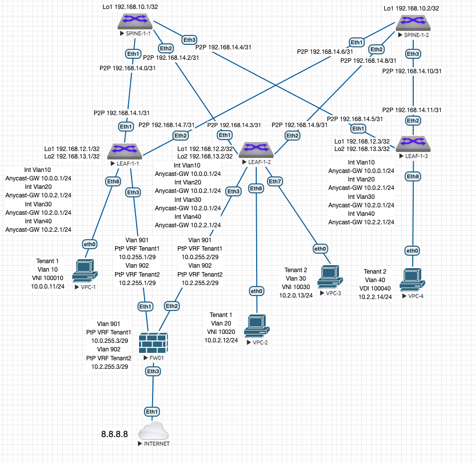

# Лабораторная работа 8 "VxLAN. Routing."
## Описание принципа выделения адресного пространства Underlay сети:
Порядковый номер Датацентра - DC N (Нумерация начинается с 1. "0" зарезервирован)

Loopback /32

P2P Subnets /31

loopbacks1 - Spine N-X 192.168.N0.X

loopbacks2 - Spine N-X 192.168.N1.X (зарезервирован для multicast или иных технических нужд)

loopbacks1 - Leaf N-X 192.168.N2.X

loopbacks2 - Leaf N-X 192.168.N3.X (для VTEP)

P2P 192.168.N[4-7].X/31 (Меньшее число всегда идет на Spine)

reserved 192.168.N[8-9] (зарезервированы для дальнейшего использования)

## Описание VLAN, VNI, RD и RT:
VNI генерится на основе номера Влана в Датацентре: N0<VLAN ID в 4 значном формате>, где N это порядковый номер Датацентра.

RD VLAN генерится путем составления номера AS и VNI - AS:VNI

RT VLAN на импорт и экспорт по умолчанию генерится из номера AS и VNI - AS:VNI

VRF нумеруются в соответсвии с подразделениями по порядку начиная с 1.

Им присваивается VNI для L3 маршрутиазции по формуле 1<Номер подразделения дополненный до трехзначного значения>.

Например для подразделения 1 - L3 VNI 1001

RD VRF - 65000:1001

RT VRF - 65000:1001

## Описание адресного пространства Overlay сети:
Создан VRF TENANT1 и TENANT2.

Создан 1 Влан для серверов 1 Сервиса Tenant1 - Vlan 10 - Service1 - VNI 100010 10.0.0.0/24

Создан 2 Влан для серверов 2 Сервиса Tenant1 - Vlan 20 - Service2 - VNI 100020 10.0.2.0/24

Создан 3 Влан для серверов 1 Сервиса Tenant2 - Vlan 40 - Service1 - VNI 100040 10.2.0.0/24

Так как мы используем для Датацентра 1 iBGP с номером AS 65000 получаем:

RD - 65000:100010

RT - 65000:100010

## Описание взаимодействия VRF и правил суммаризации:

По требованиям "IT Security" взаимодействие между сервисами подразделений должно происходить через внешний Фаервол.

Каждому подразделению выдана 1 своя большая сеть:

Tenant1 - 10.0.0.0/16

Tenant2 - 10.2.0.0/16

Граничный LEAF взаимодействуем с внешним Фаерволом по протоколу .... в процессе

## Схема сети:



## Таблица адресов:
| Подсеть ipv4 | Device/Port|    Описание   |
|--------------|:----------:| -----------------:|
| 192.168.10.1/32  | Spine-1-1/Lo1 |     Loopback1     |
| 192.168.10.2/32  | Spine-1-2/Lo1 |     Loopback1     |
| 192.168.12.1/32  |  Leaf-1-1/Lo1 |     Loopback1     |
| 192.168.13.1/32  |  Leaf-1-1/Lo2 |     Loopback2     |
| 192.168.12.2/32  |  Leaf-1-2/Lo1 |     Loopback1     |
| 192.168.13.2/32  |  Leaf-1-2/Lo2 |     Loopback2     |
| 192.168.12.3/32  |  Leaf-1-3/Lo1 |     Loopback1     |
| 192.168.13.3/32  |  Leaf-1-3/Lo2 |     Loopback2     |
| 192.168.14.0/31  |  Spine-1-1 Eth1 |     P2P Spine 1-1 to Leaf 1-1    |
| 192.168.14.1/31  |  Leaf-1-1 Eth1 |     P2P Spine 1-1 to Leaf 1-1    |
| 192.168.14.2/31  |  Spine-1-1 Eth2 |     P2P Spine 1-1 to Leaf 1-2    |
| 192.168.14.3/31  |  Leaf-1-2 Eth1 |     P2P Spine 1-1 to Leaf 1-2    |
| 192.168.14.4/31  |  Spine-1-1 Eth3 |     P2P Spine 1-1 to Leaf 1-3    |
| 192.168.14.5/31  |  Leaf-1-3 Eth1 |     P2P Spine 1-1 to Leaf 1-3    |
| 192.168.14.6/31  |  Spine-1-2 Eth1 |     P2P Spine 1-2 to Leaf 1-1    |
| 192.168.14.7/31  |  Leaf-1-1 Eth2 |     P2P Spine 1-2 to Leaf 1-1    |
| 192.168.14.8/31  |  Spine-1-2 Eth2 |     P2P Spine 1-2 to Leaf 1-2    |
| 192.168.14.9/31  |  Leaf-1-2 Eth2 |     P2P Spine 1-2 to Leaf 1-2    |
| 192.168.14.10/31  |  Spine-1-2 Eth3 |     P2P Spine 1-2 to Leaf 1-3    |
| 192.168.14.11/31  |  Leaf-1-3 Eth2 |     P2P Spine 1-2 to Leaf 1-3    |

## Настройки коммутаторов:
Использованы шаблоны для ускорения настройки:

SPINE - Underlay BGP на LEAF в сторону SPINE.

LEAFS - Underlay BGP на SPINE в торону LEAF.

OVERLAY - на LEAF и SPINE для настройки EVPN.

Для упрощения настройки SPINE использованы комманды bgp listen range. 
Что позволяет уйти от ручного указания IP всех соседствующих LEAF.

### Типовая конфигурация процесса BGP Spine UNDERLAY:
```console
router bgp 65000
   router-id <IP Loopback1>
   no bgp default ipv4-unicast
   distance bgp 20 200 200
   bgp listen range 192.168.14.0/24 peer-group LEAFS remote-as 65000
   neighbor LEAFS peer group
   neighbor LEAFS remote-as 65000
   neighbor LEAFS next-hop-self
   neighbor LEAFS bfd
   neighbor LEAFS rib-in pre-policy retain all
   neighbor LEAFS route-reflector-client
   neighbor LEAFS password 7 1RuAvIkzlaIS2dTpf+q14g==
   neighbor LEAFS send-community standard extended

   address-family ipv4
      neighbor LEAFS activate
      network <IP Loopback1>

```
### Типовая конфигурация процесса BGP Spine OVERLAY:
```console
service routing protocols model multi-agent

router bgp 65000
   bgp listen range 192.168.12.0/24 peer-group OVERLAY remote-as 65000
   neighbor OVERLAY peer group
   neighbor OVERLAY update-source Loopback1
   neighbor OVERLAY route-reflector-client
   neighbor OVERLAY password 7 rXi9hgRNfLyRVaxnuxy+/Q==
   neighbor OVERLAY send-community extended

   address-family evpn
      neighbor OVERLAY activate
   
```
### Типовая конфигурация процесса BGP Leaf UNDERLAY:
```console
router bgp 65000
   router-id <IP Loopback1>
   no bgp default ipv4-unicast
   distance bgp 20 200 200
   maximum-paths 4 ecmp 4
   neighbor SPINE peer group
   neighbor SPINE remote-as 65000
   neighbor SPINE next-hop-self
   neighbor SPINE bfd
   neighbor SPINE rib-in pre-policy retain all
   neighbor SPINE password 7 hFVifvPlyMlVDYT87k+lyg==
   neighbor SPINE send-community standard extended

   neighbor <SPINE1 PtP IP> peer group SPINE
   neighbor <SPINE2 PtP IP> peer group SPINE

   address-family ipv4
      neighbor SPINE activate
      network <IP Loopback1>
      network <IP Loopback2>
```

### Типовая конфигурация процесса BGP Leaf OVERLAY:
```console
service routing protocols model multi-agent

router bgp 65000
   neighbor OVERLAY peer group
   neighbor OVERLAY remote-as 65000
   neighbor OVERLAY update-source Loopback1
   neighbor OVERLAY password 7 rXi9hgRNfLyRVaxnuxy+/Q==
   neighbor OVERLAY send-community extended

   neighbor <SPINE1 IP Loopback1> peer group OVERLAY
   neighbor <SPINE2 IP Loopback1> peer group OVERLAY

   address-family evpn
      neighbor OVERLAY activate

```
### Типовая конфигурация процесса BGP Leaf VXLAN:
```console
interface Vxlan1
   vxlan source-interface Loopback2
   vxlan udp-port 4789
   vxlan vlan <VLAN ID> vni <VNI ID>
   vxlan learn-restrict any

router bgp 65000
  vlan <VLAN ID>
      rd <AS:VNI>
      route-target both <AS:VNI>
      redistribute learned

```
### Типовая конфигурация VRF и SVI под Подразделение:
```console
!
vrf instance <TENANT1>
!
ip routing vrf <TENANT1>
!
interface Vxlan1
   vxlan vrf <TENANT1> vni <номер VNI>
!
router bgp 65000
   vrf <TENANT1>
      rd <AS:VNI>
      route-target import evpn <AS:VNI>
      route-target export evpn <AS:VNI>
      redistribute connected
!
interface Vlan <Номер VLAN>
   description <TENANT1_SERVICE1>
   vrf <TENANT1>
   ip address virtual <IP>

```

### Типовая конфигурация ESI на Port-channel:
```console
!
interface Port-Channel <X>
   evpn ethernet-segment
      identifier XXXX:XXXX:XXXX:XXXX:XXXX
      route-target import XX:XX:XX:XX:XX:XX
   lacp system-id XX:XX:XX:XX:XX:XX
```

### SPINE-1-1:
```console
!
service routing protocols model multi-agent
!
hostname SPINE-1-1
!
interface Ethernet1
   description LEAF-1-1 Eth1
   no switchport
   ip address 192.168.14.0/31
   bfd interval 700 min-rx 500 multiplier 3
!
interface Ethernet2
   description LEAF-1-2 Eth1
   no switchport
   ip address 192.168.14.2/31
   bfd interval 700 min-rx 500 multiplier 3
!
interface Ethernet3
   description LEAF-1-3 Eth1
   no switchport
   ip address 192.168.14.4/31
   bfd interval 700 min-rx 500 multiplier 3
!
interface Loopback1
   ip address 192.168.10.1/32
!
ip routing
!
router bgp 65000
   router-id 192.168.10.1
   no bgp default ipv4-unicast
   distance bgp 20 200 200
   bgp listen range 192.168.14.0/24 peer-group LEAFS remote-as 65000
   bgp listen range 192.168.12.0/24 peer-group OVERLAY remote-as 65000
   neighbor LEAFS peer group
   neighbor LEAFS remote-as 65000
   neighbor LEAFS next-hop-self
   neighbor LEAFS bfd
   neighbor LEAFS rib-in pre-policy retain all
   neighbor LEAFS route-reflector-client
   neighbor LEAFS password 7 1RuAvIkzlaIS2dTpf+q14g==
   neighbor LEAFS send-community standard extended
   neighbor OVERLAY peer group
   neighbor OVERLAY update-source Loopback1
   neighbor OVERLAY route-reflector-client
   neighbor OVERLAY password 7 rXi9hgRNfLyRVaxnuxy+/Q==
   neighbor OVERLAY send-community extended
   !
   address-family evpn
      neighbor OVERLAY activate
   !
   address-family ipv4
      neighbor LEAFS activate
      network 192.168.10.1/32
!
```
### SPINE-1-2:
```console
!
service routing protocols model multi-agent
!
hostname SPINE-1-2
!
spanning-tree mode mstp
!
interface Ethernet1
   description LEAF-1-1 Eth2
   no switchport
   ip address 192.168.14.6/31
   bfd interval 700 min-rx 500 multiplier 3
!
interface Ethernet2
   description LEAF-1-2 Eth2
   no switchport
   ip address 192.168.14.8/31
   bfd interval 700 min-rx 500 multiplier 3
!
interface Ethernet3
   description LEAF-1-3 Eth2
   no switchport
   ip address 192.168.14.10/31
   bfd interval 700 min-rx 500 multiplier 3
!
interface Loopback1
   ip address 192.168.10.2/32
!
ip routing
!
router bgp 65000
   router-id 192.168.10.2
   no bgp default ipv4-unicast
   distance bgp 20 200 200
   bgp listen range 192.168.14.0/24 peer-group LEAFS remote-as 65000
   bgp listen range 192.168.12.0/24 peer-group OVERLAY remote-as 65000
   neighbor LEAFS peer group
   neighbor LEAFS remote-as 65000
   neighbor LEAFS next-hop-self
   neighbor LEAFS bfd
   neighbor LEAFS rib-in pre-policy retain all
   neighbor LEAFS route-reflector-client
   neighbor LEAFS password 7 1RuAvIkzlaIS2dTpf+q14g==
   neighbor LEAFS send-community standard extended
   neighbor OVERLAY peer group
   neighbor OVERLAY update-source Loopback1
   neighbor OVERLAY route-reflector-client
   neighbor OVERLAY password 7 rXi9hgRNfLyRVaxnuxy+/Q==
   neighbor OVERLAY send-community extended
   !
   address-family evpn
      neighbor OVERLAY activate
   !
   address-family ipv4
      neighbor LEAFS activate
      network 192.168.10.2/32
!
```
### LEAF-1-1:
```console
!
service routing protocols model multi-agent
!
hostname LEAF-1-1
!
vlan 10
   name Service1
!
vrf instance TENANT1
!
interface Ethernet1
   description SPINE-1-1 Eth1
   no switchport
   ip address 192.168.14.1/31
   bfd interval 700 min-rx 500 multiplier 3
!
interface Ethernet2
   description SPINE-1-2 Eth1
   no switchport
   ip address 192.168.14.7/31
   bfd interval 700 min-rx 500 multiplier 3
!
interface Ethernet8
   description SERVICE1 SRV1
   switchport access vlan 10
!
interface Loopback1
   ip address 192.168.12.1/32
!
interface Loopback2
   ip address 192.168.13.1/32
!
interface Vlan10
   description TENANT1_SERVICE1
   vrf TENANT1
   ip address virtual 10.0.0.1/24
!
interface Vxlan1
   vxlan source-interface Loopback2
   vxlan udp-port 4789
   vxlan vlan 10 vni 100010
   vxlan vrf TENANT1 vni 1001
   vxlan learn-restrict any
!
ip routing
ip routing vrf TENANT1
!
router bgp 65000
   router-id 192.168.12.1
   no bgp default ipv4-unicast
   distance bgp 20 200 200
   maximum-paths 4 ecmp 4
   neighbor OVERLAY peer group
   neighbor OVERLAY remote-as 65000
   neighbor OVERLAY update-source Loopback1
   neighbor OVERLAY password 7 rXi9hgRNfLyRVaxnuxy+/Q==
   neighbor OVERLAY send-community extended
   neighbor SPINE peer group
   neighbor SPINE remote-as 65000
   neighbor SPINE next-hop-self
   neighbor SPINE bfd
   neighbor SPINE rib-in pre-policy retain all
   neighbor SPINE password 7 hFVifvPlyMlVDYT87k+lyg==
   neighbor SPINE send-community standard extended
   neighbor 192.168.10.1 peer group OVERLAY
   neighbor 192.168.10.2 peer group OVERLAY
   neighbor 192.168.14.0 peer group SPINE
   neighbor 192.168.14.6 peer group SPINE
   !
   vlan 10
      rd 65000:100010
      route-target both 65000:100010
      redistribute learned
   !
   address-family evpn
      neighbor OVERLAY activate
   !
   address-family ipv4
      neighbor SPINE activate
      network 192.168.12.1/32
      network 192.168.13.1/32
   !
   vrf TENANT1
      rd 65000:1001
      route-target import evpn 65000:1001
      route-target export evpn 65000:1001
      redistribute connected
!
```
### LEAF-1-2:
```console
!
service routing protocols model multi-agent
!
hostname LEAF-1-2
!
vlan 20
   name Service2
!
vrf instance TENANT1
!
interface Port-Channel3
   description SW01 Po1
   switchport trunk allowed vlan 20
   switchport mode trunk
   !
   evpn ethernet-segment
      identifier 0000:0001:0001:0002:0001
      route-target import 00:01:00:02:00:01
   lacp system-id 0001.0002.0001
!
interface Ethernet1
   description SPINE-1-1 Eth2
   no switchport
   ip address 192.168.14.3/31
   bfd interval 700 min-rx 500 multiplier 3
!
interface Ethernet2
   description SPINE-1-2 Eth2
   no switchport
   ip address 192.168.14.9/31
   bfd interval 700 min-rx 500 multiplier 3
!
interface Ethernet3
   description SW01 Eth1
   channel-group 3 mode active
!
interface Ethernet8
   description SERVICE2 SRV1
   switchport access vlan 20
!
interface Loopback1
   ip address 192.168.12.2/32
!
interface Loopback2
   ip address 192.168.13.2/32
!
interface Vlan20
   description TENANTANT1_SERVICE2
   vrf TENANT1
   ip address virtual 10.0.2.1/24
!
interface Vxlan1
   vxlan source-interface Loopback2
   vxlan udp-port 4789
   vxlan vlan 10 vni 100010
   vxlan vrf TENANT1 vni 1001
   vxlan learn-restrict any
!
ip routing
ip routing vrf TENANT1
!
router bgp 65000
   router-id 192.168.12.2
   no bgp default ipv4-unicast
   distance bgp 20 200 200
   maximum-paths 4 ecmp 4
   neighbor OVERLAY peer group
   neighbor OVERLAY remote-as 65000
   neighbor OVERLAY update-source Loopback1
   neighbor OVERLAY password 7 rXi9hgRNfLyRVaxnuxy+/Q==
   neighbor OVERLAY send-community extended
   neighbor SPINE peer group
   neighbor SPINE remote-as 65000
   neighbor SPINE next-hop-self
   neighbor SPINE bfd
   neighbor SPINE rib-in pre-policy retain all
   neighbor SPINE password 7 hFVifvPlyMlVDYT87k+lyg==
   neighbor SPINE send-community standard extended
   neighbor 192.168.10.1 peer group OVERLAY
   neighbor 192.168.10.2 peer group OVERLAY
   neighbor 192.168.14.2 peer group SPINE
   neighbor 192.168.14.8 peer group SPINE
   !
   vlan 20
      rd 65000:100020
      route-target both 65000:100020
      redistribute learned
   !
   address-family evpn
      neighbor OVERLAY activate
   !
   address-family ipv4
      neighbor SPINE activate
      network 192.168.12.2/32
      network 192.168.13.2/32
   !
   vrf TENANT1
      rd 65000:1001
      route-target import evpn 65000:1001
      route-target export evpn 65000:1001
      redistribute connected
!
```
### LEAF-1-3:
```console
!
service routing protocols model multi-agent
!
hostname LEAF-1-3
!
vlan 10
   name Service1
!
vlan 20
   name Service2
!
vrf instance TENANT1
!
interface Port-Channel3
   description SW01 Po1
   switchport trunk allowed vlan 20
   switchport mode trunk
   !
   evpn ethernet-segment
      identifier 0000:0001:0001:0002:0001
      route-target import 00:01:00:02:00:01
   lacp system-id 0001.0002.0001
!
interface Ethernet1
   description SPINE-1-1 Eth3
   no switchport
   ip address 192.168.14.5/31
   bfd interval 700 min-rx 500 multiplier 3
!
interface Ethernet2
   description SPINE-1-2 Eth3
   no switchport
   ip address 192.168.14.11/31
   bfd interval 700 min-rx 500 multiplier 3
!
interface Ethernet3
   description SW01 Eth2
   channel-group 3 mode active
!
interface Ethernet8
   description SERVICE1 SRV4
   switchport access vlan 10
!
interface Loopback1
   ip address 192.168.12.3/32
!
interface Loopback2
   ip address 192.168.13.3/32
!
interface Vlan10
   description TENANT1_SERVICE1
   vrf TENANT1
   ip address virtual 10.0.0.1/24
!
interface Vlan20
   description TENANT1_SERVICE2
   vrf TENANT1
   ip address virtual 10.0.2.1/24
!
interface Vxlan1
   vxlan source-interface Loopback2
   vxlan udp-port 4789
   vxlan vlan 10 vni 100010
   vxlan vlan 20 vni 100020
   vxlan vrf TENANT1 vni 1001
   vxlan learn-restrict any
!
ip routing
ip routing vrf TENANT1
!
router bgp 65000
   router-id 192.168.12.3
   no bgp default ipv4-unicast
   distance bgp 20 200 200
   maximum-paths 4 ecmp 4
   neighbor OVERLAY peer group
   neighbor OVERLAY remote-as 65000
   neighbor OVERLAY update-source Loopback1
   neighbor OVERLAY password 7 rXi9hgRNfLyRVaxnuxy+/Q==
   neighbor OVERLAY send-community extended
   neighbor SPINE peer group
   neighbor SPINE remote-as 65000
   neighbor SPINE next-hop-self
   neighbor SPINE bfd
   neighbor SPINE rib-in pre-policy retain all
   neighbor SPINE password 7 hFVifvPlyMlVDYT87k+lyg==
   neighbor SPINE send-community standard extended
   neighbor 192.168.10.1 peer group OVERLAY
   neighbor 192.168.10.2 peer group OVERLAY
   neighbor 192.168.14.4 peer group SPINE
   neighbor 192.168.14.10 peer group SPINE
   !
   vlan 10
      rd 65000:100010
      route-target both 65000:100010
      redistribute learned
   !
   vlan 20
      rd 65000:100020
      route-target both 65000:100020
      redistribute learned
   address-family evpn
      neighbor OVERLAY activate
   !
   address-family ipv4
      neighbor SPINE activate
      network 192.168.12.3/32
      network 192.168.13.3/32
   !
   vrf TENANT1
      rd 65000:1001
      route-target import evpn 65000:1001
      route-target export evpn 65000:1001
      redistribute connected
!
```

### SW01:
```console
!
hostname SW01
!
vlan 20
   name Service2
!
interface Port-Channel1
   description LEAF-1-2/3 Po3
   switchport trunk allowed vlan 20
   switchport mode trunk
!
interface Ethernet1
   description LEAF-1-2 Eth3
   channel-group 1 mode active
!
interface Ethernet2
   description LEAF-1-3 Eth3
   channel-group 1 mode active
!
interface Ethernet8
   description SERVICE2 SRV3
   switchport access vlan 20
!
no ip routing
!
```

## Вывод комманд маршрутизации
### SPINE-1-1:
```console
sh bgp evpn summary
BGP summary information for VRF default
Router identifier 192.168.10.1, local AS number 65000
Neighbor Status Codes: m - Under maintenance
  Neighbor     V AS           MsgRcvd   MsgSent  InQ OutQ  Up/Down State   PfxRcd PfxAcc
  192.168.12.1 4 65000            111       190    0    0 01:19:47 Estab   4      4
  192.168.12.2 4 65000            157       148    0    0 01:19:36 Estab   9      9
  192.168.12.3 4 65000            140       170    0    0 01:19:39 Estab   9      9
!
sh bgp evpn route-type ethernet-segment 
BGP routing table information for VRF default
Router identifier 192.168.10.1, local AS number 65000
          Network                Next Hop              Metric  LocPref Weight  Path
 * >      RD: 192.168.13.2:1 ethernet-segment 0000:0001:0001:0002:0001 192.168.13.2
                                 192.168.13.2          -       100     0       i
 * >      RD: 192.168.13.3:1 ethernet-segment 0000:0001:0001:0002:0001 192.168.13.3
                                 192.168.13.3          -       100     0       i
```
### SPINE-1-2:
```console
sh bgp evpn summary 
BGP summary information for VRF default
Router identifier 192.168.10.2, local AS number 65000
Neighbor Status Codes: m - Under maintenance
  Neighbor     V AS           MsgRcvd   MsgSent  InQ OutQ  Up/Down State   PfxRcd PfxAcc
  192.168.12.1 4 65000            111       187    0    0 01:20:05 Estab   4      4
  192.168.12.2 4 65000            153       148    0    0 01:19:54 Estab   9      9
  192.168.12.3 4 65000            141       169    0    0 01:19:57 Estab   9      9
!
sh bgp evpn route-type ethernet-segment 
BGP routing table information for VRF default
Router identifier 192.168.10.2, local AS number 65000
          Network                Next Hop              Metric  LocPref Weight  Path
 * >      RD: 192.168.13.2:1 ethernet-segment 0000:0001:0001:0002:0001 192.168.13.2
                                 192.168.13.2          -       100     0       i
 * >      RD: 192.168.13.3:1 ethernet-segment 0000:0001:0001:0002:0001 192.168.13.3
                                 192.168.13.3          -       100     0       i
```
### LEAF-1-1:
```console
sh vxlan address-table 
          Vxlan Mac Address Table
----------------------------------------------------------------------

VLAN  Mac Address     Type      Prt  VTEP             Moves   Last Move
----  -----------     ----      ---  ----             -----   ---------
4094  5000.0003.3766  EVPN      Vx1  192.168.13.2     1       1:21:42 ago
4094  5000.0015.f4e8  EVPN      Vx1  192.168.13.3     1       0:04:50 ago
Total Remote Mac Addresses for this criterion: 2
!
sh bgp evpn 
BGP routing table information for VRF default
Router identifier 192.168.12.1, local AS number 65000
Route status codes: * - valid, > - active, S - Stale, E - ECMP head, e - ECMP
                    c - Contributing to ECMP, % - Pending BGP convergence
Origin codes: i - IGP, e - EGP, ? - incomplete
AS Path Attributes: Or-ID - Originator ID, C-LST - Cluster List, LL Nexthop - Link Local Nexthop

          Network                Next Hop              Metric  LocPref Weight  Path
 * >Ec    RD: 65000:100020 auto-discovery 0 0000:0001:0001:0002:0001
                                 192.168.13.2          -       100     0       i Or-ID: 192.168.12.2 C-LST: 192.168.10.1 
 *  ec    RD: 65000:100020 auto-discovery 0 0000:0001:0001:0002:0001
                                 192.168.13.2          -       100     0       i Or-ID: 192.168.12.2 C-LST: 192.168.10.2 
 * >Ec    RD: 192.168.13.2:1 auto-discovery 0000:0001:0001:0002:0001
                                 192.168.13.2          -       100     0       i Or-ID: 192.168.12.2 C-LST: 192.168.10.2 
 *  ec    RD: 192.168.13.2:1 auto-discovery 0000:0001:0001:0002:0001
                                 192.168.13.2          -       100     0       i Or-ID: 192.168.12.2 C-LST: 192.168.10.1 
 * >Ec    RD: 192.168.13.3:1 auto-discovery 0000:0001:0001:0002:0001
                                 192.168.13.3          -       100     0       i Or-ID: 192.168.12.3 C-LST: 192.168.10.1 
 *  ec    RD: 192.168.13.3:1 auto-discovery 0000:0001:0001:0002:0001
                                 192.168.13.3          -       100     0       i Or-ID: 192.168.12.3 C-LST: 192.168.10.2 
 * >      RD: 65000:100010 mac-ip 0050.7966.6806
                                 -                     -       -       0       i
 * >      RD: 65000:100010 mac-ip 0050.7966.6806 10.0.0.11
                                 -                     -       -       0       i
 * >Ec    RD: 65000:100020 mac-ip 0050.7966.6807
                                 192.168.13.2          -       100     0       i Or-ID: 192.168.12.2 C-LST: 192.168.10.2 
 *  ec    RD: 65000:100020 mac-ip 0050.7966.6807
                                 192.168.13.2          -       100     0       i Or-ID: 192.168.12.2 C-LST: 192.168.10.1 
 * >Ec    RD: 65000:100020 mac-ip 0050.7966.6807 10.0.2.12
                                 192.168.13.2          -       100     0       i Or-ID: 192.168.12.2 C-LST: 192.168.10.2 
 *  ec    RD: 65000:100020 mac-ip 0050.7966.6807 10.0.2.12
                                 192.168.13.2          -       100     0       i Or-ID: 192.168.12.2 C-LST: 192.168.10.1 
 * >Ec    RD: 65000:100020 mac-ip 0050.7966.6808
                                 192.168.13.3          -       100     0       i Or-ID: 192.168.12.3 C-LST: 192.168.10.2 
 *  ec    RD: 65000:100020 mac-ip 0050.7966.6808
                                 192.168.13.3          -       100     0       i Or-ID: 192.168.12.3 C-LST: 192.168.10.1 
 * >Ec    RD: 65000:100020 mac-ip 0050.7966.6808 10.0.2.13
                                 192.168.13.3          -       100     0       i Or-ID: 192.168.12.3 C-LST: 192.168.10.2 
 *  ec    RD: 65000:100020 mac-ip 0050.7966.6808 10.0.2.13
                                 192.168.13.3          -       100     0       i Or-ID: 192.168.12.3 C-LST: 192.168.10.1 
 * >      RD: 65000:100010 imet 192.168.13.1
                                 -                     -       -       0       i
 * >Ec    RD: 65000:100020 imet 192.168.13.2
                                 192.168.13.2          -       100     0       i Or-ID: 192.168.12.2 C-LST: 192.168.10.2 
 *  ec    RD: 65000:100020 imet 192.168.13.2
                                 192.168.13.2          -       100     0       i Or-ID: 192.168.12.2 C-LST: 192.168.10.1 
 * >Ec    RD: 65000:100010 imet 192.168.13.3
                                 192.168.13.3          -       100     0       i Or-ID: 192.168.12.3 C-LST: 192.168.10.1 
 *  ec    RD: 65000:100010 imet 192.168.13.3
                                 192.168.13.3          -       100     0       i Or-ID: 192.168.12.3 C-LST: 192.168.10.2 
 * >Ec    RD: 65000:100020 imet 192.168.13.3
                                 192.168.13.3          -       100     0       i Or-ID: 192.168.12.3 C-LST: 192.168.10.2 
 *  ec    RD: 65000:100020 imet 192.168.13.3
                                 192.168.13.3          -       100     0       i Or-ID: 192.168.12.3 C-LST: 192.168.10.1 
 * >Ec    RD: 192.168.13.2:1 ethernet-segment 0000:0001:0001:0002:0001 192.168.13.2
                                 192.168.13.2          -       100     0       i Or-ID: 192.168.12.2 C-LST: 192.168.10.2 
 *  ec    RD: 192.168.13.2:1 ethernet-segment 0000:0001:0001:0002:0001 192.168.13.2
                                 192.168.13.2          -       100     0       i Or-ID: 192.168.12.2 C-LST: 192.168.10.1 
 * >Ec    RD: 192.168.13.3:1 ethernet-segment 0000:0001:0001:0002:0001 192.168.13.3
                                 192.168.13.3          -       100     0       i Or-ID: 192.168.12.3 C-LST: 192.168.10.2 
 *  ec    RD: 192.168.13.3:1 ethernet-segment 0000:0001:0001:0002:0001 192.168.13.3
                                 192.168.13.3          -       100     0       i Or-ID: 192.168.12.3 C-LST: 192.168.10.1 
 * >      RD: 65000:1001 ip-prefix 10.0.0.0/24
                                 -                     -       -       0       i
 * >Ec    RD: 65000:1001 ip-prefix 10.0.2.0/24
                                 192.168.13.2          -       100     0       i Or-ID: 192.168.12.2 C-LST: 192.168.10.2 
 *  ec    RD: 65000:1001 ip-prefix 10.0.2.0/24
                                 192.168.13.2          -       100     0       i Or-ID: 192.168.12.2 C-LST: 192.168.10.1       
!
sh ip route vrf TENANT1 
 C        10.0.0.0/24 is directly connected, Vlan10
 B I      10.0.2.12/32 [200/0] via VTEP 192.168.13.2 VNI 1001 router-mac 50:00:00:03:37:66 local-interface Vxlan1
 B I      10.0.2.13/32 [200/0] via VTEP 192.168.13.3 VNI 1001 router-mac 50:00:00:15:f4:e8 local-interface Vxlan1
 B I      10.0.2.0/24 [200/0] via VTEP 192.168.13.2 VNI 1001 router-mac 50:00:00:03:37:66 local-interface Vxlan1
!
```
### LEAF-1-2:
```console
sh vxlan address-table 
          Vxlan Mac Address Table
----------------------------------------------------------------------

VLAN  Mac Address     Type      Prt  VTEP             Moves   Last Move
----  -----------     ----      ---  ----             -----   ---------
4094  5000.0015.f4e8  EVPN      Vx1  192.168.13.3     1       0:05:03 ago
4094  5000.00d5.5dc0  EVPN      Vx1  192.168.13.1     1       1:21:54 ago
Total Remote Mac Addresses for this criterion: 2
!
sh bgp evpn
BGP routing table information for VRF default
Router identifier 192.168.12.2, local AS number 65000
Route status codes: * - valid, > - active, S - Stale, E - ECMP head, e - ECMP
                    c - Contributing to ECMP, % - Pending BGP convergence
Origin codes: i - IGP, e - EGP, ? - incomplete
AS Path Attributes: Or-ID - Originator ID, C-LST - Cluster List, LL Nexthop - Link Local Nexthop

          Network                Next Hop              Metric  LocPref Weight  Path
 * >      RD: 65000:100020 auto-discovery 0 0000:0001:0001:0002:0001
                                 -                     -       -       0       i
 * >      RD: 192.168.13.2:1 auto-discovery 0000:0001:0001:0002:0001
                                 -                     -       -       0       i
 * >Ec    RD: 192.168.13.3:1 auto-discovery 0000:0001:0001:0002:0001
                                 192.168.13.3          -       100     0       i Or-ID: 192.168.12.3 C-LST: 192.168.10.1 
 *  ec    RD: 192.168.13.3:1 auto-discovery 0000:0001:0001:0002:0001
                                 192.168.13.3          -       100     0       i Or-ID: 192.168.12.3 C-LST: 192.168.10.2 
 * >Ec    RD: 65000:100010 mac-ip 0050.7966.6806
                                 192.168.13.1          -       100     0       i Or-ID: 192.168.12.1 C-LST: 192.168.10.1 
 *  ec    RD: 65000:100010 mac-ip 0050.7966.6806
                                 192.168.13.1          -       100     0       i Or-ID: 192.168.12.1 C-LST: 192.168.10.2 
 * >Ec    RD: 65000:100010 mac-ip 0050.7966.6806 10.0.0.11
                                 192.168.13.1          -       100     0       i Or-ID: 192.168.12.1 C-LST: 192.168.10.1 
 *  ec    RD: 65000:100010 mac-ip 0050.7966.6806 10.0.0.11
                                 192.168.13.1          -       100     0       i Or-ID: 192.168.12.1 C-LST: 192.168.10.2 
 * >      RD: 65000:100020 mac-ip 0050.7966.6807
                                 -                     -       -       0       i
 * >      RD: 65000:100020 mac-ip 0050.7966.6807 10.0.2.12
                                 -                     -       -       0       i
 * >      RD: 65000:100020 mac-ip 0050.7966.6808
                                 -                     -       -       0       i
 *        RD: 65000:100020 mac-ip 0050.7966.6808
                                 192.168.13.3          -       100     0       i Or-ID: 192.168.12.3 C-LST: 192.168.10.2 
 *        RD: 65000:100020 mac-ip 0050.7966.6808
                                 192.168.13.3          -       100     0       i Or-ID: 192.168.12.3 C-LST: 192.168.10.1 
 * >      RD: 65000:100020 mac-ip 0050.7966.6808 10.0.2.13
                                 -                     -       -       0       i
 *        RD: 65000:100020 mac-ip 0050.7966.6808 10.0.2.13
                                 192.168.13.3          -       100     0       i Or-ID: 192.168.12.3 C-LST: 192.168.10.2 
 *        RD: 65000:100020 mac-ip 0050.7966.6808 10.0.2.13
                                 192.168.13.3          -       100     0       i Or-ID: 192.168.12.3 C-LST: 192.168.10.1 
 * >Ec    RD: 65000:100010 imet 192.168.13.1
                                 192.168.13.1          -       100     0       i Or-ID: 192.168.12.1 C-LST: 192.168.10.2 
 *  ec    RD: 65000:100010 imet 192.168.13.1
                                 192.168.13.1          -       100     0       i Or-ID: 192.168.12.1 C-LST: 192.168.10.1 
 * >      RD: 65000:100020 imet 192.168.13.2
                                 -                     -       -       0       i
 * >Ec    RD: 65000:100010 imet 192.168.13.3
                                 192.168.13.3          -       100     0       i Or-ID: 192.168.12.3 C-LST: 192.168.10.2 
 *  ec    RD: 65000:100010 imet 192.168.13.3
                                 192.168.13.3          -       100     0       i Or-ID: 192.168.12.3 C-LST: 192.168.10.1 
 * >Ec    RD: 65000:100020 imet 192.168.13.3
                                 192.168.13.3          -       100     0       i Or-ID: 192.168.12.3 C-LST: 192.168.10.2 
 *  ec    RD: 65000:100020 imet 192.168.13.3
                                 192.168.13.3          -       100     0       i Or-ID: 192.168.12.3 C-LST: 192.168.10.1 
 * >      RD: 192.168.13.2:1 ethernet-segment 0000:0001:0001:0002:0001 192.168.13.2
                                 -                     -       -       0       i
 * >Ec    RD: 192.168.13.3:1 ethernet-segment 0000:0001:0001:0002:0001 192.168.13.3
                                 192.168.13.3          -       100     0       i Or-ID: 192.168.12.3 C-LST: 192.168.10.2 
 *  ec    RD: 192.168.13.3:1 ethernet-segment 0000:0001:0001:0002:0001 192.168.13.3
                                 192.168.13.3          -       100     0       i Or-ID: 192.168.12.3 C-LST: 192.168.10.1 
 * >Ec    RD: 65000:1001 ip-prefix 10.0.0.0/24
                                 192.168.13.1          -       100     0       i Or-ID: 192.168.12.1 C-LST: 192.168.10.2 
 *  ec    RD: 65000:1001 ip-prefix 10.0.0.0/24
                                 192.168.13.1          -       100     0       i Or-ID: 192.168.12.1 C-LST: 192.168.10.1 
 * >      RD: 65000:1001 ip-prefix 10.0.2.0/24
                                 -                     -       -       0       i
!
sh ip route vrf TENANT1 
 B I      10.0.0.11/32 [200/0] via VTEP 192.168.13.1 VNI 1001 router-mac 50:00:00:d5:5d:c0 local-interface Vxlan1
 B I      10.0.0.0/24 [200/0] via VTEP 192.168.13.1 VNI 1001 router-mac 50:00:00:d5:5d:c0 local-interface Vxlan1
 C        10.0.2.0/24 is directly connected, Vlan20
!
```
### LEAF-1-3:
```console
sh vxlan address-table 
          Vxlan Mac Address Table
----------------------------------------------------------------------

VLAN  Mac Address     Type      Prt  VTEP             Moves   Last Move
----  -----------     ----      ---  ----             -----   ---------
  10  0050.7966.6806  EVPN      Vx1  192.168.13.1     1       0:02:42 ago
  20  0050.7966.6807  EVPN      Vx1  192.168.13.2     1       0:02:40 ago
4094  5000.0003.3766  EVPN      Vx1  192.168.13.2     1       1:22:09 ago
4094  5000.00d5.5dc0  EVPN      Vx1  192.168.13.1     1       1:22:11 ago
Total Remote Mac Addresses for this criterion: 4
!
sh bgp evpn 
BGP routing table information for VRF default
Router identifier 192.168.12.3, local AS number 65000
Route status codes: * - valid, > - active, S - Stale, E - ECMP head, e - ECMP
                    c - Contributing to ECMP, % - Pending BGP convergence
Origin codes: i - IGP, e - EGP, ? - incomplete
AS Path Attributes: Or-ID - Originator ID, C-LST - Cluster List, LL Nexthop - Link Local Nexthop

          Network                Next Hop              Metric  LocPref Weight  Path
 * >      RD: 65000:100020 auto-discovery 0 0000:0001:0001:0002:0001
                                 -                     -       -       0       i
 *        RD: 65000:100020 auto-discovery 0 0000:0001:0001:0002:0001
                                 192.168.13.2          -       100     0       i Or-ID: 192.168.12.2 C-LST: 192.168.10.1 
 *        RD: 65000:100020 auto-discovery 0 0000:0001:0001:0002:0001
                                 192.168.13.2          -       100     0       i Or-ID: 192.168.12.2 C-LST: 192.168.10.2 
 * >Ec    RD: 192.168.13.2:1 auto-discovery 0000:0001:0001:0002:0001
                                 192.168.13.2          -       100     0       i Or-ID: 192.168.12.2 C-LST: 192.168.10.2 
 *  ec    RD: 192.168.13.2:1 auto-discovery 0000:0001:0001:0002:0001
                                 192.168.13.2          -       100     0       i Or-ID: 192.168.12.2 C-LST: 192.168.10.1 
 * >      RD: 192.168.13.3:1 auto-discovery 0000:0001:0001:0002:0001
                                 -                     -       -       0       i
 * >Ec    RD: 65000:100010 mac-ip 0050.7966.6806
                                 192.168.13.1          -       100     0       i Or-ID: 192.168.12.1 C-LST: 192.168.10.1 
 *  ec    RD: 65000:100010 mac-ip 0050.7966.6806
                                 192.168.13.1          -       100     0       i Or-ID: 192.168.12.1 C-LST: 192.168.10.2 
 * >Ec    RD: 65000:100010 mac-ip 0050.7966.6806 10.0.0.11
                                 192.168.13.1          -       100     0       i Or-ID: 192.168.12.1 C-LST: 192.168.10.2 
 *  ec    RD: 65000:100010 mac-ip 0050.7966.6806 10.0.0.11
                                 192.168.13.1          -       100     0       i Or-ID: 192.168.12.1 C-LST: 192.168.10.1 
 * >Ec    RD: 65000:100020 mac-ip 0050.7966.6807
                                 192.168.13.2          -       100     0       i Or-ID: 192.168.12.2 C-LST: 192.168.10.2 
 *  ec    RD: 65000:100020 mac-ip 0050.7966.6807
                                 192.168.13.2          -       100     0       i Or-ID: 192.168.12.2 C-LST: 192.168.10.1 
 * >Ec    RD: 65000:100020 mac-ip 0050.7966.6807 10.0.2.12
                                 192.168.13.2          -       100     0       i Or-ID: 192.168.12.2 C-LST: 192.168.10.2 
 *  ec    RD: 65000:100020 mac-ip 0050.7966.6807 10.0.2.12
                                 192.168.13.2          -       100     0       i Or-ID: 192.168.12.2 C-LST: 192.168.10.1 
 * >      RD: 65000:100020 mac-ip 0050.7966.6808
                                 -                     -       -       0       i
 * >      RD: 65000:100020 mac-ip 0050.7966.6808 10.0.2.13
                                 -                     -       -       0       i
 * >Ec    RD: 65000:100010 imet 192.168.13.1
                                 192.168.13.1          -       100     0       i Or-ID: 192.168.12.1 C-LST: 192.168.10.2 
 *  ec    RD: 65000:100010 imet 192.168.13.1
                                 192.168.13.1          -       100     0       i Or-ID: 192.168.12.1 C-LST: 192.168.10.1 
 * >Ec    RD: 65000:100020 imet 192.168.13.2
                                 192.168.13.2          -       100     0       i Or-ID: 192.168.12.2 C-LST: 192.168.10.2 
 *  ec    RD: 65000:100020 imet 192.168.13.2
                                 192.168.13.2          -       100     0       i Or-ID: 192.168.12.2 C-LST: 192.168.10.1 
 * >      RD: 65000:100010 imet 192.168.13.3
                                 -                     -       -       0       i
 * >      RD: 65000:100020 imet 192.168.13.3
                                 -                     -       -       0       i
 * >Ec    RD: 192.168.13.2:1 ethernet-segment 0000:0001:0001:0002:0001 192.168.13.2
                                 192.168.13.2          -       100     0       i Or-ID: 192.168.12.2 C-LST: 192.168.10.2 
 *  ec    RD: 192.168.13.2:1 ethernet-segment 0000:0001:0001:0002:0001 192.168.13.2
                                 192.168.13.2          -       100     0       i Or-ID: 192.168.12.2 C-LST: 192.168.10.1 
 * >      RD: 192.168.13.3:1 ethernet-segment 0000:0001:0001:0002:0001 192.168.13.3
                                 -                     -       -       0       i
 * >      RD: 65000:1001 ip-prefix 10.0.0.0/24
                                 -                     -       -       0       i
 *        RD: 65000:1001 ip-prefix 10.0.0.0/24
                                 192.168.13.1          -       100     0       i Or-ID: 192.168.12.1 C-LST: 192.168.10.2 
 *        RD: 65000:1001 ip-prefix 10.0.0.0/24
                                 192.168.13.1          -       100     0       i Or-ID: 192.168.12.1 C-LST: 192.168.10.1 
 * >      RD: 65000:1001 ip-prefix 10.0.2.0/24
                                 -                     -       -       0       i
 *        RD: 65000:1001 ip-prefix 10.0.2.0/24
                                 192.168.13.2          -       100     0       i Or-ID: 192.168.12.2 C-LST: 192.168.10.2 
 *        RD: 65000:1001 ip-prefix 10.0.2.0/24
                                 192.168.13.2          -       100     0       i Or-ID: 192.168.12.2 C-LST: 192.168.10.1 
!
sh ip route vrf TENANT1 
 B I      10.0.0.11/32 [200/0] via VTEP 192.168.13.1 VNI 1001 router-mac 50:00:00:d5:5d:c0 local-interface Vxlan1
 C        10.0.0.0/24 is directly connected, Vlan10
 B I      10.0.2.12/32 [200/0] via VTEP 192.168.13.2 VNI 1001 router-mac 50:00:00:03:37:66 local-interface Vxlan1
 C        10.0.2.0/24 is directly connected, Vlan20
!
```
### VPC1:
```console
VPC1> ping 10.0.2.13

84 bytes from 10.0.2.13 icmp_seq=1 ttl=62 time=55.934 ms
84 bytes from 10.0.2.13 icmp_seq=2 ttl=62 time=69.504 ms
84 bytes from 10.0.2.13 icmp_seq=3 ttl=62 time=62.200 ms
84 bytes from 10.0.2.13 icmp_seq=4 ttl=62 time=133.431 ms
84 bytes from 10.0.2.13 icmp_seq=5 ttl=62 time=62.341 ms

```

### VPC2:
```console
VPC2> ping 10.0.2.13

84 bytes from 10.0.2.13 icmp_seq=1 ttl=64 time=27.473 ms
84 bytes from 10.0.2.13 icmp_seq=2 ttl=64 time=19.971 ms
84 bytes from 10.0.2.13 icmp_seq=3 ttl=64 time=21.362 ms
84 bytes from 10.0.2.13 icmp_seq=4 ttl=64 time=17.636 ms
84 bytes from 10.0.2.13 icmp_seq=5 ttl=64 time=28.892 ms

```

### VPC3:
```console
VPC3> ping 10.0.0.11   

84 bytes from 10.0.0.11 icmp_seq=1 ttl=62 time=57.323 ms
84 bytes from 10.0.0.11 icmp_seq=2 ttl=62 time=95.205 ms
84 bytes from 10.0.0.11 icmp_seq=3 ttl=62 time=111.977 ms
84 bytes from 10.0.0.11 icmp_seq=4 ttl=62 time=57.570 ms
84 bytes from 10.0.0.11 icmp_seq=5 ttl=62 time=70.186 ms

VPC3> ping 10.0.2.12

84 bytes from 10.0.2.12 icmp_seq=1 ttl=64 time=27.668 ms
84 bytes from 10.0.2.12 icmp_seq=2 ttl=64 time=20.973 ms
84 bytes from 10.0.2.12 icmp_seq=3 ttl=64 time=18.698 ms
84 bytes from 10.0.2.12 icmp_seq=4 ttl=64 time=20.750 ms
84 bytes from 10.0.2.12 icmp_seq=5 ttl=64 time=22.588 ms
```
## Статистика пинга при выключении Port-Channel3 на Leaf-1-2 и выводы EVPN ROUTE-TYPE 4:

### LEAF-1-2:
```console
interface Po3
shutdown
end
```

### LEAF-1-1:
```console
sh bgp evpn route-type ethernet-segment 
BGP routing table information for VRF default
Router identifier 192.168.12.1, local AS number 65000
Route status codes: * - valid, > - active, S - Stale, E - ECMP head, e - ECMP
                    c - Contributing to ECMP, % - Pending BGP convergence
Origin codes: i - IGP, e - EGP, ? - incomplete
AS Path Attributes: Or-ID - Originator ID, C-LST - Cluster List, LL Nexthop - Link Local Nexthop

          Network                Next Hop              Metric  LocPref Weight  Path
 * >Ec    RD: 192.168.13.3:1 ethernet-segment 0000:0001:0001:0002:0001 192.168.13.3
                                 192.168.13.3          -       100     0       i Or-ID: 192.168.12.3 C-LST: 192.168.10.2 
 *  ec    RD: 192.168.13.3:1 ethernet-segment 0000:0001:0001:0002:0001 192.168.13.3
                                 192.168.13.3          -       100     0       i Or-ID: 192.168.12.3 C-LST: 192.168.10.1
```

### LEAF-1-2:
```console
sh bgp evpn route-type ethernet-segment 
BGP routing table information for VRF default
Router identifier 192.168.12.2, local AS number 65000
Route status codes: * - valid, > - active, S - Stale, E - ECMP head, e - ECMP
                    c - Contributing to ECMP, % - Pending BGP convergence
Origin codes: i - IGP, e - EGP, ? - incomplete
AS Path Attributes: Or-ID - Originator ID, C-LST - Cluster List, LL Nexthop - Link Local Nexthop

          Network                Next Hop              Metric  LocPref Weight  Path
 * >Ec    RD: 192.168.13.3:1 ethernet-segment 0000:0001:0001:0002:0001 192.168.13.3
                                 192.168.13.3          -       100     0       i Or-ID: 192.168.12.3 C-LST: 192.168.10.2 
 *  ec    RD: 192.168.13.3:1 ethernet-segment 0000:0001:0001:0002:0001 192.168.13.3
                                 192.168.13.3          -       100     0       i Or-ID: 192.168.12.3 C-LST: 192.168.10.1 
```
### LEAF-1-2:
```console
BGP routing table information for VRF default
Router identifier 192.168.12.3, local AS number 65000
Route status codes: * - valid, > - active, S - Stale, E - ECMP head, e - ECMP
                    c - Contributing to ECMP, % - Pending BGP convergence
Origin codes: i - IGP, e - EGP, ? - incomplete
AS Path Attributes: Or-ID - Originator ID, C-LST - Cluster List, LL Nexthop - Link Local Nexthop

          Network                Next Hop              Metric  LocPref Weight  Path
 * >      RD: 192.168.13.3:1 ethernet-segment 0000:0001:0001:0002:0001 192.168.13.3
                                 -                     -       -       0       i
```

### VPC1:
```console
VPC1> ping 10.0.2.13 -t
84 bytes from 10.0.2.13 icmp_seq=1 ttl=62 time=58.311 ms
84 bytes from 10.0.2.13 icmp_seq=2 ttl=62 time=57.858 ms
84 bytes from 10.0.2.13 icmp_seq=3 ttl=62 time=68.981 ms
84 bytes from 10.0.2.13 icmp_seq=4 ttl=62 time=59.535 ms
84 bytes from 10.0.2.13 icmp_seq=5 ttl=62 time=110.677 ms
84 bytes from 10.0.2.13 icmp_seq=6 ttl=62 time=63.650 ms
84 bytes from 10.0.2.13 icmp_seq=7 ttl=62 time=66.946 ms
84 bytes from 10.0.2.13 icmp_seq=8 ttl=62 time=70.694 ms
84 bytes from 10.0.2.13 icmp_seq=9 ttl=62 time=68.263 ms
84 bytes from 10.0.2.13 icmp_seq=10 ttl=62 time=118.824 ms
84 bytes from 10.0.2.13 icmp_seq=11 ttl=62 time=66.110 ms
84 bytes from 10.0.2.13 icmp_seq=12 ttl=62 time=67.096 ms
84 bytes from 10.0.2.13 icmp_seq=13 ttl=62 time=61.291 ms
84 bytes from 10.0.2.13 icmp_seq=14 ttl=62 time=116.804 ms
84 bytes from 10.0.2.13 icmp_seq=15 ttl=62 time=62.985 ms
84 bytes from 10.0.2.13 icmp_seq=16 ttl=62 time=59.382 ms
84 bytes from 10.0.2.13 icmp_seq=17 ttl=62 time=62.614 ms
84 bytes from 10.0.2.13 icmp_seq=18 ttl=62 time=231.067 ms
84 bytes from 10.0.2.13 icmp_seq=19 ttl=62 time=90.520 ms
84 bytes from 10.0.2.13 icmp_seq=20 ttl=62 time=57.328 ms
84 bytes from 10.0.2.13 icmp_seq=21 ttl=62 time=136.456 ms
84 bytes from 10.0.2.13 icmp_seq=22 ttl=62 time=61.313 ms
84 bytes from 10.0.2.13 icmp_seq=23 ttl=62 time=75.087 ms
84 bytes from 10.0.2.13 icmp_seq=24 ttl=62 time=56.737 ms
84 bytes from 10.0.2.13 icmp_seq=25 ttl=62 time=130.474 ms
84 bytes from 10.0.2.13 icmp_seq=26 ttl=62 time=102.248 ms
84 bytes from 10.0.2.13 icmp_seq=27 ttl=62 time=68.313 ms
```

### VPC2:
```console
VPC2> ping 10.0.2.13 -t

84 bytes from 10.0.2.13 icmp_seq=1 ttl=64 time=20.114 ms
84 bytes from 10.0.2.13 icmp_seq=2 ttl=64 time=32.749 ms
84 bytes from 10.0.2.13 icmp_seq=3 ttl=64 time=20.500 ms
84 bytes from 10.0.2.13 icmp_seq=4 ttl=64 time=19.958 ms
84 bytes from 10.0.2.13 icmp_seq=5 ttl=64 time=19.354 ms
84 bytes from 10.0.2.13 icmp_seq=6 ttl=64 time=20.948 ms
84 bytes from 10.0.2.13 icmp_seq=7 ttl=64 time=25.799 ms
84 bytes from 10.0.2.13 icmp_seq=8 ttl=64 time=21.597 ms
84 bytes from 10.0.2.13 icmp_seq=9 ttl=64 time=24.839 ms
84 bytes from 10.0.2.13 icmp_seq=10 ttl=64 time=21.297 ms
84 bytes from 10.0.2.13 icmp_seq=11 ttl=64 time=22.771 ms
84 bytes from 10.0.2.13 icmp_seq=12 ttl=64 time=18.363 ms
84 bytes from 10.0.2.13 icmp_seq=13 ttl=64 time=20.097 ms
84 bytes from 10.0.2.13 icmp_seq=14 ttl=64 time=24.475 ms
84 bytes from 10.0.2.13 icmp_seq=15 ttl=64 time=32.860 ms
84 bytes from 10.0.2.13 icmp_seq=16 ttl=64 time=20.454 ms
84 bytes from 10.0.2.13 icmp_seq=17 ttl=64 time=21.100 ms
84 bytes from 10.0.2.13 icmp_seq=18 ttl=64 time=27.947 ms
84 bytes from 10.0.2.13 icmp_seq=19 ttl=64 time=30.927 ms
84 bytes from 10.0.2.13 icmp_seq=20 ttl=64 time=21.665 ms
84 bytes from 10.0.2.13 icmp_seq=21 ttl=64 time=22.603 ms
84 bytes from 10.0.2.13 icmp_seq=22 ttl=64 time=21.137 ms
84 bytes from 10.0.2.13 icmp_seq=23 ttl=64 time=20.041 ms
84 bytes from 10.0.2.13 icmp_seq=24 ttl=64 time=60.896 ms
84 bytes from 10.0.2.13 icmp_seq=25 ttl=64 time=153.801 ms
84 bytes from 10.0.2.13 icmp_seq=26 ttl=64 time=44.435 ms
84 bytes from 10.0.2.13 icmp_seq=27 ttl=64 time=49.585 ms
84 bytes from 10.0.2.13 icmp_seq=28 ttl=64 time=44.897 ms
84 bytes from 10.0.2.13 icmp_seq=29 ttl=64 time=45.217 ms
84 bytes from 10.0.2.13 icmp_seq=30 ttl=64 time=43.646 ms
84 bytes from 10.0.2.13 icmp_seq=31 ttl=64 time=42.241 ms
84 bytes from 10.0.2.13 icmp_seq=32 ttl=64 time=84.235 ms
84 bytes from 10.0.2.13 icmp_seq=33 ttl=64 time=58.210 ms
84 bytes from 10.0.2.13 icmp_seq=34 ttl=64 time=59.290 ms
84 bytes from 10.0.2.13 icmp_seq=35 ttl=64 time=47.449 ms
84 bytes from 10.0.2.13 icmp_seq=36 ttl=64 time=50.348 ms
84 bytes from 10.0.2.13 icmp_seq=37 ttl=64 time=48.394 ms
84 bytes from 10.0.2.13 icmp_seq=38 ttl=64 time=40.933 ms
```

### VPC3:
```console
VPC3> ping 10.0.0.11 -t

84 bytes from 10.0.0.11 icmp_seq=1 ttl=62 time=89.316 ms
84 bytes from 10.0.0.11 icmp_seq=2 ttl=62 time=61.326 ms
84 bytes from 10.0.0.11 icmp_seq=3 ttl=62 time=108.429 ms
84 bytes from 10.0.0.11 icmp_seq=4 ttl=62 time=72.353 ms
84 bytes from 10.0.0.11 icmp_seq=5 ttl=62 time=60.996 ms
84 bytes from 10.0.0.11 icmp_seq=6 ttl=62 time=55.991 ms
84 bytes from 10.0.0.11 icmp_seq=7 ttl=62 time=64.441 ms
84 bytes from 10.0.0.11 icmp_seq=8 ttl=62 time=79.372 ms
84 bytes from 10.0.0.11 icmp_seq=9 ttl=62 time=54.444 ms
84 bytes from 10.0.0.11 icmp_seq=10 ttl=62 time=59.844 ms
84 bytes from 10.0.0.11 icmp_seq=11 ttl=62 time=62.896 ms
84 bytes from 10.0.0.11 icmp_seq=12 ttl=62 time=64.820 ms
84 bytes from 10.0.0.11 icmp_seq=13 ttl=62 time=69.241 ms
84 bytes from 10.0.0.11 icmp_seq=14 ttl=62 time=67.334 ms
84 bytes from 10.0.0.11 icmp_seq=15 ttl=62 time=63.102 ms
84 bytes from 10.0.0.11 icmp_seq=16 ttl=62 time=54.646 ms
84 bytes from 10.0.0.11 icmp_seq=17 ttl=62 time=54.990 ms
84 bytes from 10.0.0.11 icmp_seq=18 ttl=62 time=58.656 ms
84 bytes from 10.0.0.11 icmp_seq=19 ttl=62 time=60.277 ms
84 bytes from 10.0.0.11 icmp_seq=20 ttl=62 time=65.450 ms
84 bytes from 10.0.0.11 icmp_seq=21 ttl=62 time=60.283 ms
84 bytes from 10.0.0.11 icmp_seq=22 ttl=62 time=90.773 ms
84 bytes from 10.0.0.11 icmp_seq=23 ttl=62 time=65.785 ms
84 bytes from 10.0.0.11 icmp_seq=24 ttl=62 time=65.550 ms
84 bytes from 10.0.0.11 icmp_seq=25 ttl=62 time=77.284 ms
84 bytes from 10.0.0.11 icmp_seq=26 ttl=62 time=104.635 ms
84 bytes from 10.0.0.11 icmp_seq=27 ttl=62 time=101.850 ms
84 bytes from 10.0.0.11 icmp_seq=28 ttl=62 time=57.256 ms
84 bytes from 10.0.0.11 icmp_seq=29 ttl=62 time=66.343 ms
84 bytes from 10.0.0.11 icmp_seq=30 ttl=62 time=150.223 ms
84 bytes from 10.0.0.11 icmp_seq=31 ttl=62 time=90.282 ms
84 bytes from 10.0.0.11 icmp_seq=32 ttl=62 time=66.446 ms
84 bytes from 10.0.0.11 icmp_seq=33 ttl=62 time=66.356 ms
84 bytes from 10.0.0.11 icmp_seq=34 ttl=62 time=57.798 ms
84 bytes from 10.0.0.11 icmp_seq=35 ttl=62 time=68.159 ms
84 bytes from 10.0.0.11 icmp_seq=36 ttl=62 time=55.640 ms
84 bytes from 10.0.0.11 icmp_seq=37 ttl=62 time=80.251 ms
84 bytes from 10.0.0.11 icmp_seq=38 ttl=62 time=71.649 ms
84 bytes from 10.0.0.11 icmp_seq=39 ttl=62 time=54.550 ms
84 bytes from 10.0.0.11 icmp_seq=40 ttl=62 time=86.562 ms
84 bytes from 10.0.0.11 icmp_seq=41 ttl=62 time=65.647 ms
84 bytes from 10.0.0.11 icmp_seq=42 ttl=62 time=73.711 ms
84 bytes from 10.0.0.11 icmp_seq=43 ttl=62 time=60.315 ms
```
## Статистика пинга при выключении Port-Channel3 на Leaf-1-3 и выводы EVPN ROUTE-TYPE 4:

### LEAF-1-3:
```console
interface Po3
shutdown
end
```

### LEAF-1-1:
```console
sh bgp evpn route-type ethernet-segment 
BGP routing table information for VRF default
Router identifier 192.168.12.1, local AS number 65000
Route status codes: * - valid, > - active, S - Stale, E - ECMP head, e - ECMP
                    c - Contributing to ECMP, % - Pending BGP convergence
Origin codes: i - IGP, e - EGP, ? - incomplete
AS Path Attributes: Or-ID - Originator ID, C-LST - Cluster List, LL Nexthop - Link Local Nexthop

          Network                Next Hop              Metric  LocPref Weight  Path
 * >Ec    RD: 192.168.13.2:1 ethernet-segment 0000:0001:0001:0002:0001 192.168.13.2
                                 192.168.13.2          -       100     0       i Or-ID: 192.168.12.2 C-LST: 192.168.10.1 
 *  ec    RD: 192.168.13.2:1 ethernet-segment 0000:0001:0001:0002:0001 192.168.13.2
                                 192.168.13.2          -       100     0       i Or-ID: 192.168.12.2 C-LST: 192.168.10.2 
```

### LEAF-1-2:
```console
sh bgp evpn route-type ethernet-segment 
BGP routing table information for VRF default
Router identifier 192.168.12.2, local AS number 65000
Route status codes: * - valid, > - active, S - Stale, E - ECMP head, e - ECMP
                    c - Contributing to ECMP, % - Pending BGP convergence
Origin codes: i - IGP, e - EGP, ? - incomplete
AS Path Attributes: Or-ID - Originator ID, C-LST - Cluster List, LL Nexthop - Link Local Nexthop

          Network                Next Hop              Metric  LocPref Weight  Path
 * >      RD: 192.168.13.2:1 ethernet-segment 0000:0001:0001:0002:0001 192.168.13.2
                                 -                     -       -       0       i
```

### LEAF-1-3:
```console
sh bgp evpn route-type ethernet-segment 
BGP routing table information for VRF default
Router identifier 192.168.12.3, local AS number 65000
Route status codes: * - valid, > - active, S - Stale, E - ECMP head, e - ECMP
                    c - Contributing to ECMP, % - Pending BGP convergence
Origin codes: i - IGP, e - EGP, ? - incomplete
AS Path Attributes: Or-ID - Originator ID, C-LST - Cluster List, LL Nexthop - Link Local Nexthop

          Network                Next Hop              Metric  LocPref Weight  Path
 * >Ec    RD: 192.168.13.2:1 ethernet-segment 0000:0001:0001:0002:0001 192.168.13.2
                                 192.168.13.2          -       100     0       i Or-ID: 192.168.12.2 C-LST: 192.168.10.1 
 *  ec    RD: 192.168.13.2:1 ethernet-segment 0000:0001:0001:0002:0001 192.168.13.2
                                 192.168.13.2          -       100     0       i Or-ID: 192.168.12.2 C-LST: 192.168.10.2 
```

### VPC1:
```console
VPC1> ping 10.0.2.13 -t

84 bytes from 10.0.2.13 icmp_seq=1 ttl=62 time=546.944 ms
84 bytes from 10.0.2.13 icmp_seq=2 ttl=62 time=52.388 ms
84 bytes from 10.0.2.13 icmp_seq=3 ttl=62 time=51.292 ms
84 bytes from 10.0.2.13 icmp_seq=4 ttl=62 time=56.208 ms
84 bytes from 10.0.2.13 icmp_seq=5 ttl=62 time=58.311 ms
84 bytes from 10.0.2.13 icmp_seq=6 ttl=62 time=58.974 ms
84 bytes from 10.0.2.13 icmp_seq=7 ttl=62 time=51.806 ms
84 bytes from 10.0.2.13 icmp_seq=8 ttl=62 time=89.610 ms
84 bytes from 10.0.2.13 icmp_seq=9 ttl=62 time=137.801 ms
84 bytes from 10.0.2.13 icmp_seq=10 ttl=62 time=42.669 ms
84 bytes from 10.0.2.13 icmp_seq=11 ttl=62 time=87.861 ms
84 bytes from 10.0.2.13 icmp_seq=12 ttl=62 time=46.285 ms
84 bytes from 10.0.2.13 icmp_seq=13 ttl=62 time=54.749 ms
84 bytes from 10.0.2.13 icmp_seq=14 ttl=62 time=54.936 ms
84 bytes from 10.0.2.13 icmp_seq=15 ttl=62 time=47.856 ms
84 bytes from 10.0.2.13 icmp_seq=16 ttl=62 time=60.879 ms
84 bytes from 10.0.2.13 icmp_seq=17 ttl=62 time=71.576 ms
84 bytes from 10.0.2.13 icmp_seq=18 ttl=62 time=64.931 ms
84 bytes from 10.0.2.13 icmp_seq=19 ttl=62 time=68.726 ms
84 bytes from 10.0.2.13 icmp_seq=20 ttl=62 time=70.428 ms
84 bytes from 10.0.2.13 icmp_seq=21 ttl=62 time=63.750 ms
```

### VPC2:
```console
VPC2> ping 10.0.2.13 -t

84 bytes from 10.0.2.13 icmp_seq=1 ttl=64 time=133.619 ms
84 bytes from 10.0.2.13 icmp_seq=2 ttl=64 time=32.498 ms
84 bytes from 10.0.2.13 icmp_seq=3 ttl=64 time=37.277 ms
84 bytes from 10.0.2.13 icmp_seq=4 ttl=64 time=38.279 ms
84 bytes from 10.0.2.13 icmp_seq=5 ttl=64 time=35.863 ms
84 bytes from 10.0.2.13 icmp_seq=6 ttl=64 time=43.797 ms
84 bytes from 10.0.2.13 icmp_seq=7 ttl=64 time=35.727 ms
84 bytes from 10.0.2.13 icmp_seq=8 ttl=64 time=33.883 ms
84 bytes from 10.0.2.13 icmp_seq=9 ttl=64 time=40.194 ms
84 bytes from 10.0.2.13 icmp_seq=10 ttl=64 time=38.819 ms
84 bytes from 10.0.2.13 icmp_seq=11 ttl=64 time=34.880 ms
84 bytes from 10.0.2.13 icmp_seq=12 ttl=64 time=31.629 ms
84 bytes from 10.0.2.13 icmp_seq=13 ttl=64 time=22.725 ms
84 bytes from 10.0.2.13 icmp_seq=14 ttl=64 time=17.759 ms
84 bytes from 10.0.2.13 icmp_seq=15 ttl=64 time=22.792 ms
84 bytes from 10.0.2.13 icmp_seq=16 ttl=64 time=45.782 ms
84 bytes from 10.0.2.13 icmp_seq=17 ttl=64 time=27.207 ms
84 bytes from 10.0.2.13 icmp_seq=18 ttl=64 time=22.291 ms
84 bytes from 10.0.2.13 icmp_seq=19 ttl=64 time=82.423 ms
```

### VPC3:
```console
VPC3> ping 10.0.0.11 -t

84 bytes from 10.0.0.11 icmp_seq=1 ttl=62 time=74.137 ms
84 bytes from 10.0.0.11 icmp_seq=2 ttl=62 time=61.558 ms
84 bytes from 10.0.0.11 icmp_seq=3 ttl=62 time=50.872 ms
84 bytes from 10.0.0.11 icmp_seq=4 ttl=62 time=125.507 ms
84 bytes from 10.0.0.11 icmp_seq=5 ttl=62 time=50.345 ms
84 bytes from 10.0.0.11 icmp_seq=6 ttl=62 time=54.795 ms
84 bytes from 10.0.0.11 icmp_seq=7 ttl=62 time=48.077 ms
84 bytes from 10.0.0.11 icmp_seq=8 ttl=62 time=47.153 ms
84 bytes from 10.0.0.11 icmp_seq=9 ttl=62 time=95.472 ms
84 bytes from 10.0.0.11 icmp_seq=10 ttl=62 time=92.668 ms
84 bytes from 10.0.0.11 icmp_seq=11 ttl=62 time=53.934 ms
84 bytes from 10.0.0.11 icmp_seq=12 ttl=62 time=65.967 ms
84 bytes from 10.0.0.11 icmp_seq=13 ttl=62 time=70.091 ms
84 bytes from 10.0.0.11 icmp_seq=14 ttl=62 time=60.729 ms
84 bytes from 10.0.0.11 icmp_seq=15 ttl=62 time=52.662 ms
84 bytes from 10.0.0.11 icmp_seq=16 ttl=62 time=49.886 ms
84 bytes from 10.0.0.11 icmp_seq=17 ttl=62 time=66.890 ms
```