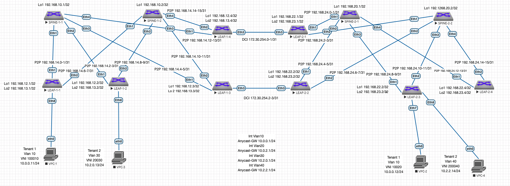

# Проектная работа "Построение растянутой L2 сети между датацентрами предприятия с использованием технологии VXLAN EVPN MultiSite."
## Описание принципа выделения адресного пространства Underlay сети:
Порядковый номер Датацентра - DC N (Нумерация начинается с 1. "0" зарезервирован)

Loopback /32

P2P Subnets /31

loopbacks1 - Spine N-X 192.168.N0.X

loopbacks2 - Spine N-X 192.168.N1.X (зарезервирован для multicast или иных технических нужд)

loopbacks1 - Leaf N-X 192.168.N2.X

loopbacks2 - Leaf N-X 192.168.N3.X (для VTEP)

P2P 192.168.N[4-7].X/31 (Меньшее число всегда идет на Spine)

reserved 192.168.N[8-9] (зарезервированы для дальнейшего использования)

## Описание выбора номера AS для Датацентра:
Номер AS: 65<NNNN>,

где

NNNN - порядковый номер Датацентра.

## Описание VLAN, VNI, RD и RT:
VNI генерится на основе номера Влана в Датацентре: N0<VLAN ID в 4 значном формате>, где N это порядковый номер подразделения.

RD VLAN генерится путем составления номера AS и VNI - AS:VNI

RT VLAN на импорт и экспорт по умолчанию генерится из номера AS и VNI - AS:VNI

VRF нумеруются в соответсвии с подразделениями по порядку начиная с 1.

Им присваивается VNI для L3 маршрутиазции по формуле 1<Номер подразделения дополненный до трехзначного значения>.

Например для подразделения 1 - L3 VNI 1001

RD VRF - 65000:1001

RT VRF - 65000:1001

## Описание адресного пространства Overlay сети:
Создан VRF TENANT1 и TENANT2.

Создан 1 Влан для серверов 1 Сервиса Tenant1 - Vlan 10 - Service1 - VNI 100010 10.0.0.0/24

Создан 2 Влан для серверов 2 Сервиса Tenant1 - Vlan 20 - Service2 - VNI 100020 10.0.2.0/24

Создан 3 Влан для серверов 1 Сервиса Tenant2 - Vlan 30 - Service1 - VNI 200030 10.2.0.0/24

Создан 4 Влан для серверов 1 Сервиса Tenant2 - Vlan 40 - Service2 - VNI 200040 10.4.0.0/24

Так как мы используем для Датацентра iBGP с номером AS 65000 получаем:

Для Датацентра 1 Tenant1:

RD - 65001:100010

RT - 65001:100010

Для Датацентра 2 Tenant1:

RD - 65002:100010

RT - 65002:100010

## Описание выбора виртуального MAC:

Чтобы избежать влияние смены MAC адреса шлюза при перемещении Любого устройства в сети, для всех LEAF с Anycast-gateway прописано использовать виртуальный MAC адрес.

Он взят с LEAF-1-1:
ip virtual-router mac-address c001.cafe.babe

## Описание DCI:

### Описание выбора BGW и схемы подключения:

Для целей связи между Датацентрами выбраны LEAF-1-3 и LEAF-1-4 в Датацентре 1 и LEAF-2-1 с LEAF-2-2 в Датацентре 2. Фактически они я являются Border Gateway Leaf. (BGW)

Связь обеспечивается прямыми линками между указанными коммутаторами попарно:
LEAF-1-3 - LEAF-2-2
LEAF-1-4 - LEAF-2-1

### Описание выбора адресации для связи между Датацентрами:

Решено использовать уникальную сеть 172.30.254.0/24 поделенную на /31 подсети.

Оставлен резерв для дальнейшего увеличения количества линков при возрастании тербований к отказоустойчивости или пропускной способности.

## Схема сети:



## Таблица адресов:
| Подсеть ipv4 | Device/Port|    Описание   |
|--------------|:----------:| -----------------:|
| 192.168.10.1/32  | Spine-1-1/Lo1 |     Loopback1     |
| 192.168.10.2/32  | Spine-1-2/Lo1 |     Loopback1     |
| 192.168.12.1/32  |  Leaf-1-1/Lo1 |     Loopback1     |
| 192.168.13.1/32  |  Leaf-1-1/Lo2 |     Loopback2     |
| 192.168.12.2/32  |  Leaf-1-2/Lo1 |     Loopback1     |
| 192.168.13.2/32  |  Leaf-1-2/Lo2 |     Loopback2     |
| 192.168.12.3/32  |  Leaf-1-3/Lo1 |     Loopback1     |
| 192.168.13.3/32  |  Leaf-1-3/Lo2 |     Loopback2     |
| 192.168.12.4/32  |  Leaf-1-4/Lo1 |     Loopback1     |
| 192.168.13.4/32  |  Leaf-1-4/Lo2 |     Loopback2     |
| 192.168.14.0/31  |  Spine-1-1 Eth1 |     P2P Spine 1-1 to Leaf 1-1    |
| 192.168.14.1/31  |  Leaf-1-1 Eth1 |     P2P Spine 1-1 to Leaf 1-1    |
| 192.168.14.2/31  |  Spine-1-1 Eth2 |     P2P Spine 1-1 to Leaf 1-2    |
| 192.168.14.3/31  |  Leaf-1-2 Eth1 |     P2P Spine 1-1 to Leaf 1-2    |
| 192.168.14.4/31  |  Spine-1-1 Eth3 |     P2P Spine 1-1 to Leaf 1-3    |
| 192.168.14.5/31  |  Leaf-1-3 Eth1 |     P2P Spine 1-1 to Leaf 1-3    |
| 192.168.14.6/31  |  Spine-1-2 Eth1 |     P2P Spine 1-2 to Leaf 1-1    |
| 192.168.14.7/31  |  Leaf-1-1 Eth2 |     P2P Spine 1-2 to Leaf 1-1    |
| 192.168.14.8/31  |  Spine-1-2 Eth2 |     P2P Spine 1-2 to Leaf 1-2    |
| 192.168.14.9/31  |  Leaf-1-2 Eth2 |     P2P Spine 1-2 to Leaf 1-2    |
| 192.168.14.10/31  |  Spine-1-2 Eth3 |     P2P Spine 1-2 to Leaf 1-3    |
| 192.168.14.11/31  |  Leaf-1-3 Eth2 |     P2P Spine 1-2 to Leaf 1-3    |
| 192.168.14.12/31  |  Spine-1-1 Eth4 |     P2P Spine 1-1 to Leaf 1-4    |
| 192.168.14.13/31  |  Leaf-1-4 Eth1 |     P2P Spine 1-1 to Leaf 1-4    |
| 192.168.14.14/31  |  Spine-1-2 Eth4 |     P2P Spine 1-2 to Leaf 1-4    |
| 192.168.14.15/31  |  Leaf-1-4 Eth2 |     P2P Spine 1-2 to Leaf 1-4    |
| 192.168.20.1/32  | Spine-2-1/Lo1 |     Loopback1     |
| 192.168.20.2/32  | Spine-2-2/Lo1 |     Loopback1     |
| 192.168.22.1/32  |  Leaf-2-1/Lo1 |     Loopback1     |
| 192.168.23.1/32  |  Leaf-2-1/Lo2 |     Loopback2     |
| 192.168.22.2/32  |  Leaf-2-2/Lo1 |     Loopback1     |
| 192.168.23.2/32  |  Leaf-2-2/Lo2 |     Loopback2     |
| 192.168.22.3/32  |  Leaf-2-3/Lo1 |     Loopback1     |
| 192.168.23.3/32  |  Leaf-2-3/Lo2 |     Loopback2     |
| 192.168.22.4/32  |  Leaf-2-4/Lo1 |     Loopback1     |
| 192.168.23.4/32  |  Leaf-2-4/Lo2 |     Loopback2     |
| 192.168.24.0/31  |  Spine-2-1 Eth1 |     P2P Spine 2-1 to Leaf 2-1    |
| 192.168.24.1/31  |  Leaf-2-1 Eth1 |     P2P Spine 2-1 to Leaf 2-1    |
| 192.168.24.2/31  |  Spine-2-1 Eth1 |     P2P Spine 2-2 to Leaf 2-1    |
| 192.168.24.3/31  |  Leaf-2-1 Eth2 |     P2P Spine 2-2 to Leaf 2-1    |
| 192.168.24.4/31  |  Spine-2-1 Eth2 |     P2P Spine 2-1 to Leaf 2-2    |
| 192.168.24.5/31  |  Leaf-2-2 Eth1 |     P2P Spine 2-1 to Leaf 2-2    |
| 192.168.24.6/31  |  Spine-2-2 Eth1 |     P2P Spine 2-2 to Leaf 2-2    |
| 192.168.24.7/31  |  Leaf-2-2 Eth2 |     P2P Spine 2-2 to Leaf 2-2    |
| 192.168.24.8/31  |  Spine-2-1 Eth3 |     P2P Spine 2-1 to Leaf 2-3    |
| 192.168.24.9/31  |  Leaf-2-3 Eth1 |     P2P Spine 2-1 to Leaf 2-3    |
| 192.168.24.10/31  |  Spine-2-2 Eth3 |     P2P Spine 2-2 to Leaf 2-3    |
| 192.168.24.11/31  |  Leaf-2-3 Eth2 |     P2P Spine 2-2 to Leaf 2-3    |
| 192.168.24.12/31  |  Spine-2-1 Eth4 |     P2P Spine 2-1 to Leaf 2-4    |
| 192.168.24.13/31  |  Leaf-2-4 Eth1 |     P2P Spine 2-1 to Leaf 2-4    |
| 192.168.24.14/31  |  Spine-2-2 Eth4 |     P2P Spine 2-2 to Leaf 2-4    |
| 192.168.24.15/31  |  Leaf-2-4 Eth2 |     P2P Spine 2-2 to Leaf 2-4    |
| 172.30.254.0/31  |  Leaf-1-4 Eth3 |     DCI P2P Leaf-1-4 to Leaf 2-1    |
| 172.30.254.1/31  |  Leaf-2-1 Eth3 |     DCI P2P Leaf-1-4 to Leaf 2-1    |
| 172.30.254.2/31  |  Leaf-1-3 Eth3 |     DCI P2P Leaf-1-3 to Leaf 2-2    |
| 172.30.254.3/31  |  Leaf-2-2 Eth3 |     DCI P2P Leaf-1-3 to Leaf 2-2    |

## Настройки коммутаторов:
Использованы шаблоны для ускорения настройки:

SPINE - Underlay BGP на LEAF в сторону SPINE.

LEAFS - Underlay BGP на SPINE в торону LEAF.

OVERLAY - на LEAF и SPINE для настройки EVPN.

BGW - На Border LEAF в сторону LEAF соседнего DC для настройки EVPN.

Для упрощения настройки SPINE использованы комманды bgp listen range. 
Что позволяет уйти от ручного указания IP всех соседствующих LEAF.

### Типовая конфигурация процесса BGP Spine UNDERLAY:
```console
router bgp 65XXXX
   router-id <IP Loopback1>
   no bgp default ipv4-unicast
   distance bgp 20 200 200
   bgp listen range 192.168.X4.0/24 peer-group LEAFS remote-as 65XXXX
   neighbor LEAFS peer group
   neighbor LEAFS next-hop-self
   neighbor LEAFS bfd
   neighbor LEAFS rib-in pre-policy retain all
   neighbor LEAFS route-reflector-client
   neighbor LEAFS password 7 1RuAvIkzlaIS2dTpf+q14g==
   neighbor LEAFS send-community standard extended

   address-family ipv4
      neighbor LEAFS activate
      network <IP Loopback1>

```
### Типовая конфигурация процесса BGP Spine OVERLAY:
```console
service routing protocols model multi-agent

router bgp 65XXXX
   bgp listen range 192.168.X2.0/24 peer-group OVERLAY remote-as 65XXXX
   neighbor OVERLAY peer group
   neighbor OVERLAY update-source Loopback1
   neighbor OVERLAY route-reflector-client
   neighbor OVERLAY password 123test
   neighbor OVERLAY send-community extended

   address-family evpn
      neighbor OVERLAY activate
   
```
### Типовая конфигурация процесса BGP Leaf UNDERLAY:
```console
router bgp 65XXXX
   router-id <IP Loopback1>
   no bgp default ipv4-unicast
   distance bgp 20 200 200
   maximum-paths 4 ecmp 4
   neighbor SPINE peer group
   neighbor SPINE remote-as 65XXXX
   neighbor SPINE next-hop-self
   neighbor SPINE bfd
   neighbor SPINE rib-in pre-policy retain all
   neighbor SPINE password 123test
   neighbor SPINE send-community standard extended

   neighbor <SPINE1 PtP IP> peer group SPINE
   neighbor <SPINE2 PtP IP> peer group SPINE

   address-family ipv4
      neighbor SPINE activate
      network <IP Loopback1>
      network <IP Loopback2>
```

### Типовая конфигурация процесса BGP Leaf OVERLAY:
```console
service routing protocols model multi-agent

router bgp 65XXXX
   neighbor OVERLAY peer group
   neighbor OVERLAY remote-as 65XXXX
   neighbor OVERLAY update-source Loopback1
   neighbor OVERLAY password 123test
   neighbor OVERLAY send-community extended

   neighbor <SPINE1 IP Loopback1> peer group OVERLAY
   neighbor <SPINE2 IP Loopback1> peer group OVERLAY

   address-family evpn
      neighbor OVERLAY activate

```
### Типовая конфигурация процесса BGP Leaf BGW:
```console
service routing protocols model multi-agent

router bgp 65XXXX
   neighbor BGW peer group
   neighbor BGW remote-as 65XXXX
   neighbor BGW password 123test
   neighbor BGW send-community extended

   neighbor <BGW PtP IP> peer group BGW

   address-family evpn
      neighbor BGW activate
      neighbor BGW domain remote

```
### Типовая конфигурация процесса BGP Leaf VXLAN:
```console
interface Vxlan1
   vxlan source-interface Loopback2
   vxlan udp-port 4789
   vxlan vlan <VLAN ID> vni <VNI ID>
   vxlan learn-restrict any

router bgp 65XXXX
  vlan <VLAN ID>
      rd <AS:VNI>
      route-target both <AS:VNI>
      redistribute learned

```
### Типовая конфигурация VRF и SVI под Подразделение:
```console
!
vrf instance <TENANT1>
!
ip routing vrf <TENANT1>
!
interface Vxlan1
   vxlan vrf <TENANT1> vni <номер VNI>
!
router bgp 65XXXX
   vrf <TENANT1>
      rd <AS:VNI>
      route-target import evpn <AS:VNI>
      route-target export evpn <AS:VNI>
      redistribute connected
!
interface Vlan <Номер VLAN>
   description <TENANT1_SERVICE1>
   vrf <TENANT1>
   ip address virtual <IP>

```

### Типовая конфигурация PREFIX-LIST, ROUTE-MAP и BGP в VRF:
```console
ip prefix-list TENANT1 seq 10 permit 10.0.0.0/16 eq 24
ip prefix-list TENANT2 seq 10 permit 10.2.0.0/16 eq 24
ip prefix-list default seq 10 permit 0.0.0.0/0
!
route-map TENANT1-in permit 10
   match ip address prefix-list default
!
route-map TENANT1-in permit 20
   match ip address prefix-list TENANT2
!
route-map TENANT1-in deny 30
!
route-map TENANT1-out permit 10
   match ip address prefix-list TENANT1
!
route-map TENANT1-out deny 20
!
router bgp <ASN>
vrf <TENANT1>
      neighbor <EXTERNAL_ROUTER_IP> remote-as <ASN>
      neighbor <EXTERNAL_ROUTER_IP> send-community standard extended
      redistribute connected
      !
      address-family ipv4
         neighbor <EXTERNAL_ROUTER_IP> activate
         neighbor <EXTERNAL_ROUTER_IP> route-map TENANT1-in in
         neighbor <EXTERNAL_ROUTER_IP> route-map TENANT1-out out
   !
!
```

### Конфиги коммутаторов:

#### Датацентр1:
#### Датацентр2:


## Вывод комманд маршрутизации
### SPINE-1-1:
```console
sh bgp evpn summary 
BGP summary information for VRF default
Router identifier 192.168.10.1, local AS number 65000
Neighbor Status Codes: m - Under maintenance
  Neighbor     V AS           MsgRcvd   MsgSent  InQ OutQ  Up/Down State   PfxRcd PfxAcc
  192.168.12.1 4 65000           3024      2022    0    0 02:39:37 Estab   18     18
  192.168.12.2 4 65000           1971      3007    0    0 02:38:58 Estab   20     20
  192.168.12.3 4 65000            196      4243    0    0 02:39:29 Estab   10     10
```
### SPINE-1-2:
```console
sh bgp evp summary 
BGP summary information for VRF default
Router identifier 192.168.10.2, local AS number 65000
Neighbor Status Codes: m - Under maintenance
  Neighbor     V AS           MsgRcvd   MsgSent  InQ OutQ  Up/Down State   PfxRcd PfxAcc
  192.168.12.1 4 65000           3033      2007    0    0 02:39:55 Estab   18     18
  192.168.12.2 4 65000           1975      3004    0    0 02:39:17 Estab   20     20
  192.168.12.3 4 65000            197      4226    0    0 02:39:52 Estab   10     10
```
### LEAF-1-1:
```console
sh vxlan address-table 
          Vxlan Mac Address Table
----------------------------------------------------------------------

VLAN  Mac Address     Type      Prt  VTEP             Moves   Last Move
----  -----------     ----      ---  ----             -----   ---------
  20  0050.7966.6807  EVPN      Vx1  192.168.13.2     1       2:14:18 ago
  30  0050.7966.6808  EVPN      Vx1  192.168.13.2     1       2:08:21 ago
4093  5000.0003.3766  EVPN      Vx1  192.168.13.2     1       0:44:53 ago
4093  5000.0015.f4e8  EVPN      Vx1  192.168.13.3     1       1:57:00 ago
4094  5000.0003.3766  EVPN      Vx1  192.168.13.2     1       0:48:16 ago
Total Remote Mac Addresses for this criterion: 5
!
sh bgp evpn route-type ip-prefix ipv4
BGP routing table information for VRF default
Router identifier 192.168.12.1, local AS number 65000
Route status codes: * - valid, > - active, S - Stale, E - ECMP head, e - ECMP
                    c - Contributing to ECMP, % - Pending BGP convergence
Origin codes: i - IGP, e - EGP, ? - incomplete
AS Path Attributes: Or-ID - Originator ID, C-LST - Cluster List, LL Nexthop - Link Local Nexthop

          Network                Next Hop              Metric  LocPref Weight  Path
 * >      RD: 65000:1001 ip-prefix 0.0.0.0/0
                                 -                     -       100     0       65500 ?
 * >      RD: 65000:1002 ip-prefix 0.0.0.0/0
                                 -                     -       100     0       65500 ?
 * >      RD: 65000:1001 ip-prefix 10.0.0.0/24
                                 -                     -       -       0       i
 * >      RD: 65000:1002 ip-prefix 10.0.0.0/24
                                 -                     -       100     0       65500 65500 i
 * >      RD: 65000:1001 ip-prefix 10.0.2.0/24
                                 -                     -       -       0       i
 * >      RD: 65000:1002 ip-prefix 10.0.2.0/24
                                 -                     -       100     0       65500 65500 i
 * >      RD: 65000:1001 ip-prefix 10.0.255.0/29
                                 -                     -       -       0       i
 * >      RD: 65000:1001 ip-prefix 10.2.0.0/24
                                 -                     -       100     0       65500 65500 i
 * >      RD: 65000:1002 ip-prefix 10.2.0.0/24
                                 -                     -       -       0       i
 * >      RD: 65000:1001 ip-prefix 10.2.2.0/24
                                 -                     -       100     0       65500 65500 i
 * >      RD: 65000:1002 ip-prefix 10.2.2.0/24
                                 -                     -       -       0       i
 * >      RD: 65000:1002 ip-prefix 10.2.255.0/29
                                 -                     -       -       0       i                       
!
sh ip route vrf TENANT1
VRF: TENANT1
Gateway of last resort:
 B E      0.0.0.0/0 [20/0] via 10.0.255.3, Vlan901

 C        10.0.0.0/24 is directly connected, Vlan10
 B I      10.0.2.12/32 [200/0] via VTEP 192.168.13.2 VNI 1001 router-mac 50:00:00:03:37:66 local-interface Vxlan1
 C        10.0.2.0/24 is directly connected, Vlan20
 C        10.0.255.0/29 is directly connected, Vlan901
 B E      10.2.0.0/24 [20/0] via 10.0.255.3, Vlan901
 B E      10.2.2.0/24 [20/0] via 10.0.255.3, Vlan901
!
sh ip route vrf TENANT2
VRF: TENANT2
Gateway of last resort:
 B E      0.0.0.0/0 [20/0] via 10.2.255.3, Vlan902

 B E      10.0.0.0/24 [20/0] via 10.2.255.3, Vlan902
 B E      10.0.2.0/24 [20/0] via 10.2.255.3, Vlan902
 B I      10.2.0.13/32 [200/0] via VTEP 192.168.13.2 VNI 1002 router-mac 50:00:00:03:37:66 local-interface Vxlan1
 C        10.2.0.0/24 is directly connected, Vlan30
 B I      10.2.2.14/32 [200/0] via VTEP 192.168.13.3 VNI 1002 router-mac 50:00:00:15:f4:e8 local-interface Vxlan1
 C        10.2.2.0/24 is directly connected, Vlan40
 C        10.2.255.0/29 is directly connected, Vlan902
!
```
### LEAF-1-2:
```console
sh vxlan address-table 
          Vxlan Mac Address Table
----------------------------------------------------------------------

VLAN  Mac Address     Type      Prt  VTEP             Moves   Last Move
----  -----------     ----      ---  ----             -----   ---------
  10  0050.7966.6806  EVPN      Vx1  192.168.13.1     1       2:13:01 ago
4093  5000.0015.f4e8  EVPN      Vx1  192.168.13.3     1       2:00:52 ago
4093  5000.00d5.5dc0  EVPN      Vx1  192.168.13.1     1       2:24:50 ago
4094  5000.00d5.5dc0  EVPN      Vx1  192.168.13.1     1       2:43:49 ago
Total Remote Mac Addresses for this criterion: 4
!
sh bgp evpn route-type ip-prefix ipv4
BGP routing table information for VRF default
Router identifier 192.168.12.2, local AS number 65000
Route status codes: * - valid, > - active, S - Stale, E - ECMP head, e - ECMP
                    c - Contributing to ECMP, % - Pending BGP convergence
Origin codes: i - IGP, e - EGP, ? - incomplete
AS Path Attributes: Or-ID - Originator ID, C-LST - Cluster List, LL Nexthop - Link Local Nexthop

          Network                Next Hop              Metric  LocPref Weight  Path
 * >      RD: 65000:1001 ip-prefix 0.0.0.0/0
                                 -                     -       100     0       65500 ?
 *  Ec    RD: 65000:1001 ip-prefix 0.0.0.0/0
                                 192.168.13.1          -       100     0       65500 ? Or-ID: 192.168.12.1 C-LST: 192.168.10.2 
 *  ec    RD: 65000:1001 ip-prefix 0.0.0.0/0
                                 192.168.13.1          -       100     0       65500 ? Or-ID: 192.168.12.1 C-LST: 192.168.10.1 
 * >      RD: 65000:1002 ip-prefix 0.0.0.0/0
                                 -                     -       100     0       65500 ?
 *  Ec    RD: 65000:1002 ip-prefix 0.0.0.0/0
                                 192.168.13.1          -       100     0       65500 ? Or-ID: 192.168.12.1 C-LST: 192.168.10.2 
 *  ec    RD: 65000:1002 ip-prefix 0.0.0.0/0
                                 192.168.13.1          -       100     0       65500 ? Or-ID: 192.168.12.1 C-LST: 192.168.10.1 
 * >      RD: 65000:1001 ip-prefix 10.0.0.0/24
                                 -                     -       -       0       i
 *        RD: 65000:1001 ip-prefix 10.0.0.0/24
                                 192.168.13.1          -       100     0       i Or-ID: 192.168.12.1 C-LST: 192.168.10.2 
 *        RD: 65000:1001 ip-prefix 10.0.0.0/24
                                 192.168.13.1          -       100     0       i Or-ID: 192.168.12.1 C-LST: 192.168.10.1 
 * >      RD: 65000:1002 ip-prefix 10.0.0.0/24
                                 -                     -       100     0       65500 65500 i
 *  Ec    RD: 65000:1002 ip-prefix 10.0.0.0/24
                                 192.168.13.1          -       100     0       65500 65500 i Or-ID: 192.168.12.1 C-LST: 192.168.10.2 
 *  ec    RD: 65000:1002 ip-prefix 10.0.0.0/24
                                 192.168.13.1          -       100     0       65500 65500 i Or-ID: 192.168.12.1 C-LST: 192.168.10.1 
 * >      RD: 65000:1001 ip-prefix 10.0.2.0/24
                                 -                     -       -       0       i
 *        RD: 65000:1001 ip-prefix 10.0.2.0/24
                                 192.168.13.1          -       100     0       i Or-ID: 192.168.12.1 C-LST: 192.168.10.2 
 *        RD: 65000:1001 ip-prefix 10.0.2.0/24
                                 192.168.13.1          -       100     0       i Or-ID: 192.168.12.1 C-LST: 192.168.10.1 
 * >      RD: 65000:1002 ip-prefix 10.0.2.0/24
                                 -                     -       100     0       65500 65500 i
 *  Ec    RD: 65000:1002 ip-prefix 10.0.2.0/24
                                 192.168.13.1          -       100     0       65500 65500 i Or-ID: 192.168.12.1 C-LST: 192.168.10.2 
 *  ec    RD: 65000:1002 ip-prefix 10.0.2.0/24
                                 192.168.13.1          -       100     0       65500 65500 i Or-ID: 192.168.12.1 C-LST: 192.168.10.1 
 * >      RD: 65000:1001 ip-prefix 10.0.255.0/29
                                 -                     -       -       0       i
 *        RD: 65000:1001 ip-prefix 10.0.255.0/29
                                 192.168.13.1          -       100     0       i Or-ID: 192.168.12.1 C-LST: 192.168.10.2 
 *        RD: 65000:1001 ip-prefix 10.0.255.0/29
                                 192.168.13.1          -       100     0       i Or-ID: 192.168.12.1 C-LST: 192.168.10.1 
 * >      RD: 65000:1001 ip-prefix 10.2.0.0/24
                                 -                     -       100     0       65500 65500 i
 *  Ec    RD: 65000:1001 ip-prefix 10.2.0.0/24
                                 192.168.13.1          -       100     0       65500 65500 i Or-ID: 192.168.12.1 C-LST: 192.168.10.2 
 *  ec    RD: 65000:1001 ip-prefix 10.2.0.0/24
                                 192.168.13.1          -       100     0       65500 65500 i Or-ID: 192.168.12.1 C-LST: 192.168.10.1 
 * >      RD: 65000:1002 ip-prefix 10.2.0.0/24
                                 -                     -       -       0       i
 *        RD: 65000:1002 ip-prefix 10.2.0.0/24
                                 192.168.13.1          -       100     0       i Or-ID: 192.168.12.1 C-LST: 192.168.10.2 
 *        RD: 65000:1002 ip-prefix 10.2.0.0/24
                                 192.168.13.1          -       100     0       i Or-ID: 192.168.12.1 C-LST: 192.168.10.1 
 * >      RD: 65000:1001 ip-prefix 10.2.2.0/24
                                 -                     -       100     0       65500 65500 i
 *  Ec    RD: 65000:1001 ip-prefix 10.2.2.0/24
                                 192.168.13.1          -       100     0       65500 65500 i Or-ID: 192.168.12.1 C-LST: 192.168.10.2 
 *  ec    RD: 65000:1001 ip-prefix 10.2.2.0/24
                                 192.168.13.1          -       100     0       65500 65500 i Or-ID: 192.168.12.1 C-LST: 192.168.10.1 
 * >      RD: 65000:1002 ip-prefix 10.2.2.0/24
                                 -                     -       -       0       i
 *        RD: 65000:1002 ip-prefix 10.2.2.0/24
                                 192.168.13.1          -       100     0       i Or-ID: 192.168.12.1 C-LST: 192.168.10.2 
 *        RD: 65000:1002 ip-prefix 10.2.2.0/24
                                 192.168.13.1          -       100     0       i Or-ID: 192.168.12.1 C-LST: 192.168.10.1 
 * >      RD: 65000:1002 ip-prefix 10.2.255.0/29
                                 -                     -       -       0       i
 *        RD: 65000:1002 ip-prefix 10.2.255.0/29
                                 192.168.13.1          -       100     0       i Or-ID: 192.168.12.1 C-LST: 192.168.10.2 
 *        RD: 65000:1002 ip-prefix 10.2.255.0/29
                                 192.168.13.1          -       100     0       i Or-ID: 192.168.12.1 C-LST: 192.168.10.1 
!
sh ip route vrf TENANT1
VRF: TENANT1
Gateway of last resort:
 B E      0.0.0.0/0 [20/0] via 10.0.255.3, Vlan901

 B I      10.0.0.11/32 [200/0] via VTEP 192.168.13.1 VNI 1001 router-mac 50:00:00:d5:5d:c0 local-interface Vxlan1
 C        10.0.0.0/24 is directly connected, Vlan10
 C        10.0.2.0/24 is directly connected, Vlan20
 C        10.0.255.0/29 is directly connected, Vlan901
 B E      10.2.0.0/24 [20/0] via 10.0.255.3, Vlan901
 B E      10.2.2.0/24 [20/0] via 10.0.255.3, Vlan901
!
sh ip route vrf TENANT2
VRF: TENANT2
Gateway of last resort:
 B E      0.0.0.0/0 [20/0] via 10.2.255.3, Vlan902

 B E      10.0.0.0/24 [20/0] via 10.2.255.3, Vlan902
 B E      10.0.2.0/24 [20/0] via 10.2.255.3, Vlan902
 C        10.2.0.0/24 is directly connected, Vlan30
 B I      10.2.2.14/32 [200/0] via VTEP 192.168.13.3 VNI 1002 router-mac 50:00:00:15:f4:e8 local-interface Vxlan1
 C        10.2.2.0/24 is directly connected, Vlan40
 C        10.2.255.0/29 is directly connected, Vlan902
!
```
### LEAF-1-3:
```console
sh vxlan address-table 
          Vxlan Mac Address Table
----------------------------------------------------------------------

VLAN  Mac Address     Type      Prt  VTEP             Moves   Last Move
----  -----------     ----      ---  ----             -----   ---------
  10  0050.7966.6806  EVPN      Vx1  192.168.13.1     1       1:00:50 ago
  20  0050.7966.6807  EVPN      Vx1  192.168.13.2     1       2:22:44 ago
  30  0050.7966.6808  EVPN      Vx1  192.168.13.2     1       2:07:59 ago
4093  5000.0003.3766  EVPN      Vx1  192.168.13.2     1       0:53:19 ago
4093  5000.00d5.5dc0  EVPN      Vx1  192.168.13.1     1       2:29:25 ago
4094  5000.0003.3766  EVPN      Vx1  192.168.13.2     1       0:56:38 ago
4094  5000.00d5.5dc0  EVPN      Vx1  192.168.13.1     1       2:48:48 ago
Total Remote Mac Addresses for this criterion: 7
!
sh bgp evpn route-type ip-prefix ipv4
BGP routing table information for VRF default
Router identifier 192.168.12.3, local AS number 65000
Route status codes: * - valid, > - active, S - Stale, E - ECMP head, e - ECMP
                    c - Contributing to ECMP, % - Pending BGP convergence
Origin codes: i - IGP, e - EGP, ? - incomplete
AS Path Attributes: Or-ID - Originator ID, C-LST - Cluster List, LL Nexthop - Link Local Nexthop

          Network                Next Hop              Metric  LocPref Weight  Path
 * >Ec    RD: 65000:1001 ip-prefix 0.0.0.0/0
                                 192.168.13.1          -       100     0       65500 ? Or-ID: 192.168.12.1 C-LST: 192.168.10.2 
 *  ec    RD: 65000:1001 ip-prefix 0.0.0.0/0
                                 192.168.13.1          -       100     0       65500 ? Or-ID: 192.168.12.1 C-LST: 192.168.10.1 
 * >Ec    RD: 65000:1002 ip-prefix 0.0.0.0/0
                                 192.168.13.1          -       100     0       65500 ? Or-ID: 192.168.12.1 C-LST: 192.168.10.2 
 *  ec    RD: 65000:1002 ip-prefix 0.0.0.0/0
                                 192.168.13.1          -       100     0       65500 ? Or-ID: 192.168.12.1 C-LST: 192.168.10.1 
 * >      RD: 65000:1001 ip-prefix 10.0.0.0/24
                                 -                     -       -       0       i
 *        RD: 65000:1001 ip-prefix 10.0.0.0/24
                                 192.168.13.1          -       100     0       i Or-ID: 192.168.12.1 C-LST: 192.168.10.2 
 *        RD: 65000:1001 ip-prefix 10.0.0.0/24
                                 192.168.13.1          -       100     0       i Or-ID: 192.168.12.1 C-LST: 192.168.10.1 
 * >Ec    RD: 65000:1002 ip-prefix 10.0.0.0/24
                                 192.168.13.1          -       100     0       65500 65500 i Or-ID: 192.168.12.1 C-LST: 192.168.10.2 
 *  ec    RD: 65000:1002 ip-prefix 10.0.0.0/24
                                 192.168.13.1          -       100     0       65500 65500 i Or-ID: 192.168.12.1 C-LST: 192.168.10.1 
 * >      RD: 65000:1001 ip-prefix 10.0.2.0/24
                                 -                     -       -       0       i
 *        RD: 65000:1001 ip-prefix 10.0.2.0/24
                                 192.168.13.1          -       100     0       i Or-ID: 192.168.12.1 C-LST: 192.168.10.2 
 *        RD: 65000:1001 ip-prefix 10.0.2.0/24
                                 192.168.13.1          -       100     0       i Or-ID: 192.168.12.1 C-LST: 192.168.10.1 
 * >Ec    RD: 65000:1002 ip-prefix 10.0.2.0/24
                                 192.168.13.1          -       100     0       65500 65500 i Or-ID: 192.168.12.1 C-LST: 192.168.10.2 
 *  ec    RD: 65000:1002 ip-prefix 10.0.2.0/24
                                 192.168.13.1          -       100     0       65500 65500 i Or-ID: 192.168.12.1 C-LST: 192.168.10.1 
 * >Ec    RD: 65000:1001 ip-prefix 10.0.255.0/29
                                 192.168.13.1          -       100     0       i Or-ID: 192.168.12.1 C-LST: 192.168.10.1 
 *  ec    RD: 65000:1001 ip-prefix 10.0.255.0/29
                                 192.168.13.1          -       100     0       i Or-ID: 192.168.12.1 C-LST: 192.168.10.2 
 * >Ec    RD: 65000:1001 ip-prefix 10.2.0.0/24
                                 192.168.13.1          -       100     0       65500 65500 i Or-ID: 192.168.12.1 C-LST: 192.168.10.2 
 *  ec    RD: 65000:1001 ip-prefix 10.2.0.0/24
                                 192.168.13.1          -       100     0       65500 65500 i Or-ID: 192.168.12.1 C-LST: 192.168.10.1 
 * >      RD: 65000:1002 ip-prefix 10.2.0.0/24
                                 -                     -       -       0       i
*        RD: 65000:1002 ip-prefix 10.2.0.0/24
                                 192.168.13.1          -       100     0       i Or-ID: 192.168.12.1 C-LST: 192.168.10.2 
 *        RD: 65000:1002 ip-prefix 10.2.0.0/24
                                 192.168.13.1          -       100     0       i Or-ID: 192.168.12.1 C-LST: 192.168.10.1 
 * >Ec    RD: 65000:1001 ip-prefix 10.2.2.0/24
                                 192.168.13.1          -       100     0       65500 65500 i Or-ID: 192.168.12.1 C-LST: 192.168.10.2 
 *  ec    RD: 65000:1001 ip-prefix 10.2.2.0/24
                                 192.168.13.1          -       100     0       65500 65500 i Or-ID: 192.168.12.1 C-LST: 192.168.10.1 
 * >      RD: 65000:1002 ip-prefix 10.2.2.0/24
                                 -                     -       -       0       i
 *        RD: 65000:1002 ip-prefix 10.2.2.0/24
                                 192.168.13.1          -       100     0       i Or-ID: 192.168.12.1 C-LST: 192.168.10.2 
 *        RD: 65000:1002 ip-prefix 10.2.2.0/24
                                 192.168.13.1          -       100     0       i Or-ID: 192.168.12.1 C-LST: 192.168.10.1 
 * >Ec    RD: 65000:1002 ip-prefix 10.2.255.0/29
                                 192.168.13.1          -       100     0       i Or-ID: 192.168.12.1 C-LST: 192.168.10.1 
 *  ec    RD: 65000:1002 ip-prefix 10.2.255.0/29
                                 192.168.13.1          -       100     0       i Or-ID: 192.168.12.1 C-LST: 192.168.10.2 
!
sh ip route vrf TENANT1
VRF: TENANT1
Gateway of last resort:
 B I      0.0.0.0/0 [200/0] via VTEP 192.168.13.1 VNI 1001 router-mac 50:00:00:d5:5d:c0 local-interface Vxlan1

 B I      10.0.0.11/32 [200/0] via VTEP 192.168.13.1 VNI 1001 router-mac 50:00:00:d5:5d:c0 local-interface Vxlan1
 C        10.0.0.0/24 is directly connected, Vlan10
 B I      10.0.2.12/32 [200/0] via VTEP 192.168.13.2 VNI 1001 router-mac 50:00:00:03:37:66 local-interface Vxlan1
 C        10.0.2.0/24 is directly connected, Vlan20
 B I      10.0.255.0/29 [200/0] via VTEP 192.168.13.1 VNI 1001 router-mac 50:00:00:d5:5d:c0 local-interface Vxlan1
 B I      10.2.0.0/24 [200/0] via VTEP 192.168.13.1 VNI 1001 router-mac 50:00:00:d5:5d:c0 local-interface Vxlan1
 B I      10.2.2.0/24 [200/0] via VTEP 192.168.13.1 VNI 1001 router-mac 50:00:00:d5:5d:c0 local-interface Vxlan1
!
sh ip route vrf TENANT2
VRF: TENANT2
Gateway of last resort:
 B I      0.0.0.0/0 [200/0] via VTEP 192.168.13.1 VNI 1002 router-mac 50:00:00:d5:5d:c0 local-interface Vxlan1

 B I      10.0.0.0/24 [200/0] via VTEP 192.168.13.1 VNI 1002 router-mac 50:00:00:d5:5d:c0 local-interface Vxlan1
 B I      10.0.2.0/24 [200/0] via VTEP 192.168.13.1 VNI 1002 router-mac 50:00:00:d5:5d:c0 local-interface Vxlan1
 B I      10.2.0.13/32 [200/0] via VTEP 192.168.13.2 VNI 1002 router-mac 50:00:00:03:37:66 local-interface Vxlan1
 C        10.2.0.0/24 is directly connected, Vlan30
 C        10.2.2.0/24 is directly connected, Vlan40
 B I      10.2.255.0/29 [200/0] via VTEP 192.168.13.1 VNI 1002 router-mac 50:00:00:d5:5d:c0 local-interface Vxlan1
!
```
### FW01:
```console
!
sh ip bgp summary 
BGP summary information for VRF default
Router identifier 91.201.200.2, local AS number 65500
Neighbor Status Codes: m - Under maintenance
  Neighbor         V  AS           MsgRcvd   MsgSent  InQ OutQ  Up/Down State   PfxRcd PfxAcc
  10.0.255.1       4  65000            389      1090    0    0 00:39:48 Estab   2      2
  10.0.255.2       4  65000           1332       419    0    0 00:39:48 Estab   2      2
  10.2.255.1       4  65000            553      1149    0    0 00:39:47 Estab   2      2
  10.2.255.2       4  65000           1134      1266    0    0 00:39:47 Estab   2      2
  91.201.200.1     4  10                97      1294    0    0 00:39:45 Estab   1      1
!
sh ip route
VRF: default
Gateway of last resort is not set

 B E      8.8.8.8/32 [200/0] via 91.201.200.1, Ethernet3
 B E      10.0.0.0/24 [200/0] via 10.0.255.1, Vlan901
 B E      10.0.2.0/24 [200/0] via 10.0.255.1, Vlan901
 C        10.0.255.0/29 is directly connected, Vlan901
 B E      10.2.0.0/24 [200/0] via 10.2.255.1, Vlan902
 B E      10.2.2.0/24 [200/0] via 10.2.255.1, Vlan902
 C        10.2.255.0/29 is directly connected, Vlan902
 C        91.201.200.0/24 is directly connected, Ethernet3
!
```
### VPC1:
```console
VPC-1> ping 10.2.0.13   

84 bytes from 10.2.0.13 icmp_seq=1 ttl=61 time=68.013 ms
84 bytes from 10.2.0.13 icmp_seq=2 ttl=61 time=56.007 ms
84 bytes from 10.2.0.13 icmp_seq=3 ttl=61 time=61.127 ms
84 bytes from 10.2.0.13 icmp_seq=4 ttl=61 time=106.785 ms
84 bytes from 10.2.0.13 icmp_seq=5 ttl=61 time=55.017 ms

VPC-1> ping 10.2.2.14

84 bytes from 10.2.2.14 icmp_seq=1 ttl=60 time=83.123 ms
84 bytes from 10.2.2.14 icmp_seq=2 ttl=60 time=66.661 ms
84 bytes from 10.2.2.14 icmp_seq=3 ttl=60 time=84.275 ms
84 bytes from 10.2.2.14 icmp_seq=4 ttl=60 time=74.342 ms
84 bytes from 10.2.2.14 icmp_seq=5 ttl=60 time=94.071 ms

VPC-1> ping 8.8.8.8

84 bytes from 8.8.8.8 icmp_seq=1 ttl=62 time=36.870 ms
84 bytes from 8.8.8.8 icmp_seq=2 ttl=62 time=41.248 ms
84 bytes from 8.8.8.8 icmp_seq=3 ttl=62 time=32.755 ms
84 bytes from 8.8.8.8 icmp_seq=4 ttl=62 time=34.162 ms
84 bytes from 8.8.8.8 icmp_seq=5 ttl=62 time=43.792 ms

```

### VPC2:
```console
VPC-2> ping 10.2.0.13

84 bytes from 10.2.0.13 icmp_seq=1 ttl=60 time=118.229 ms
84 bytes from 10.2.0.13 icmp_seq=2 ttl=60 time=79.363 ms
84 bytes from 10.2.0.13 icmp_seq=3 ttl=60 time=120.570 ms
84 bytes from 10.2.0.13 icmp_seq=4 ttl=60 time=84.928 ms
84 bytes from 10.2.0.13 icmp_seq=5 ttl=60 time=77.286 ms

VPC-2> ping 10.2.2.14

84 bytes from 10.2.2.14 icmp_seq=1 ttl=59 time=245.467 ms
84 bytes from 10.2.2.14 icmp_seq=2 ttl=59 time=103.980 ms
84 bytes from 10.2.2.14 icmp_seq=3 ttl=59 time=101.037 ms
84 bytes from 10.2.2.14 icmp_seq=4 ttl=59 time=97.699 ms
84 bytes from 10.2.2.14 icmp_seq=5 ttl=59 time=92.077 ms

VPC-2> ping 8.8.8.8

84 bytes from 8.8.8.8 icmp_seq=1 ttl=61 time=72.143 ms
84 bytes from 8.8.8.8 icmp_seq=2 ttl=61 time=70.893 ms
84 bytes from 8.8.8.8 icmp_seq=3 ttl=61 time=52.804 ms
84 bytes from 8.8.8.8 icmp_seq=4 ttl=61 time=57.568 ms
84 bytes from 8.8.8.8 icmp_seq=5 ttl=61 time=59.686 ms

```

### VPC3:
```console
VPC-3> ping 10.0.0.11

84 bytes from 10.0.0.11 icmp_seq=1 ttl=60 time=93.078 ms
84 bytes from 10.0.0.11 icmp_seq=2 ttl=60 time=121.783 ms
84 bytes from 10.0.0.11 icmp_seq=3 ttl=60 time=144.184 ms
84 bytes from 10.0.0.11 icmp_seq=4 ttl=60 time=75.881 ms
84 bytes from 10.0.0.11 icmp_seq=5 ttl=60 time=73.637 ms

VPC-3> ping 10.0.2.12

84 bytes from 10.0.2.12 icmp_seq=1 ttl=60 time=84.773 ms
84 bytes from 10.0.2.12 icmp_seq=2 ttl=60 time=80.445 ms
84 bytes from 10.0.2.12 icmp_seq=3 ttl=60 time=67.124 ms
84 bytes from 10.0.2.12 icmp_seq=4 ttl=60 time=75.802 ms
84 bytes from 10.0.2.12 icmp_seq=5 ttl=60 time=105.158 ms

VPC-3> ping 8.8.8.8  

84 bytes from 8.8.8.8 icmp_seq=1 ttl=61 time=52.117 ms
84 bytes from 8.8.8.8 icmp_seq=2 ttl=61 time=51.368 ms
84 bytes from 8.8.8.8 icmp_seq=3 ttl=61 time=47.047 ms
84 bytes from 8.8.8.8 icmp_seq=4 ttl=61 time=42.463 ms
84 bytes from 8.8.8.8 icmp_seq=5 ttl=61 time=40.725 ms
```
### VPC4:
```console
VPC-4> ping 10.0.0.11   

84 bytes from 10.0.0.11 icmp_seq=1 ttl=60 time=59.551 ms
84 bytes from 10.0.0.11 icmp_seq=2 ttl=60 time=87.038 ms
84 bytes from 10.0.0.11 icmp_seq=3 ttl=60 time=71.632 ms
84 bytes from 10.0.0.11 icmp_seq=4 ttl=60 time=76.914 ms
84 bytes from 10.0.0.11 icmp_seq=5 ttl=60 time=79.021 ms

VPC-4> ping 10.0.2.12

84 bytes from 10.0.2.12 icmp_seq=1 ttl=60 time=82.262 ms
84 bytes from 10.0.2.12 icmp_seq=2 ttl=60 time=98.333 ms
84 bytes from 10.0.2.12 icmp_seq=3 ttl=60 time=106.178 ms
84 bytes from 10.0.2.12 icmp_seq=4 ttl=60 time=87.766 ms
84 bytes from 10.0.2.12 icmp_seq=5 ttl=60 time=77.867 ms

VPC-4> ping 8.8.8.8

84 bytes from 8.8.8.8 icmp_seq=1 ttl=61 time=53.309 ms
84 bytes from 8.8.8.8 icmp_seq=2 ttl=61 time=50.512 ms
84 bytes from 8.8.8.8 icmp_seq=3 ttl=61 time=116.294 ms
84 bytes from 8.8.8.8 icmp_seq=4 ttl=61 time=71.681 ms
84 bytes from 8.8.8.8 icmp_seq=5 ttl=61 time=48.784 ms
```